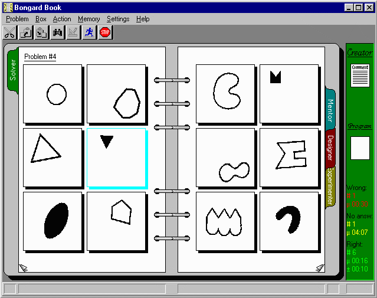

# FARGonautica

[**Hofstadter, D., and FARG (1995) Fluid Concepts and Creative Analogies, Basic Books.**](https://cogsci.indiana.edu/book.html)

**Repository News: Letter Spirit sourcecode just added, Seek-Whence coming soon!**

Research carried out at CRCC has been described in detail in the book Fluid Concepts and Creative Analogies: Computer Models of the Fundamental Mechanisms of Thought, written by Douglas Hofstadter and members of the Fluid Analogies Research Group. Hofstadter's first two books, Goedel, Escher, Bach and Metamagical Themas discussed a number of ideas relevant to artificial intelligence and cognitive science, such as recursivity and emergent behavior, but this new book looks back from the perspective of having grappled with those ideas in the course of implementing actual computer models. Programs that model creativity and analogy-making have been designed by Hofstadter and his graduate students, and the story of their past, present and future development is the subject of the book, co-authored by the students in the Fluid Analogies Research Group (FARG). There is an incredible wealth of information in this book.

This repository has a number of goals:  

    i) we want to collect all the (open-source) computational architectures that have been developed in
    Douglas Hofstadter's group's research in Fluid Concepts & Creative Analogies; from Numbo to Copycat to
    Tabletop to Letter Spirit, Metacat, Musicat, etc, alongside the info on how to install and run it;
    ii) we want to collect all the literature:
     - unpublished papers,
     - CRCC reports related to FARG architectures,
     - published papers,
     - Theses, etc
    iii) we want to archive all materials for an online course on Fluid Concepts & Creative Analogies
    (also called "Fluid Concepts", "FARG architectures", "Copycat Architecture", "Hofstadter School",
    "Active Symbols", etc).  By proposing this course, ideally, **every single undergraduate program**
    would be able to study the principles of this school of thought, **see those principles in action**,
    and **compare those principles with different approaches**.   Moving to more advanced stuff,
    Graduate students, now with easy access to the code, could have a complete course on the computer
    science of building these architectures; they could, for instance, play with their own ideas, and
    find out whether or not they make sense.  (Linhares is going to try to teach 5 classes in 2017; if
    "reasonably successful", these classes will be posted here).

We hope that, after this repository is complete (or close to), it will be cloned and hosted at a [Indiana University Github:IU page](https://kb.iu.edu/d/bagk), where it will be easily found by the interested community.

Welcome!  Join us.  This will be insanely fun.  

REPOSITORY VERSION & HOW YOU CAN CONTRIBUTE
---

As of right now, this repo is considered, in open-source fashion, to be in version **0.2.0**:

**Goals for version 1.0.0**:
- Each project should contain:
    - **Source code** of all major projects, complete and running
    - **Literature** of all major projects, complete with links to books
    - **Exercises** for undergraduate courses
    - **Programming challenges** large or small
    - **Research challenges** for graduate students (each challenge being able to lead to a publication, in principle)

This repo can not only be a library but also a source for undergraduate courses and a set of research questions... don't you wish your teachers at university (or even high school) had something like this?  [Here's where we are and here's where we're going!](repo-version.md)

Long ways to go to get there, hah?  Not really, as contributors can speed things up. If you would like to contribute please see [how you can contribute to this repository](contributing.md). You do **not** necessarily have to be someone who has earned the Ph.D. working with Hofstadter. If you have ideas for undergraduate exercises, research questions, programming challenges, or something else altogether... please get in [here](contributing.md)!  

PROJECTS TO JOIN HERE (desiderata)
---

The ambition is to catalogue and archive the sourcecode and literature involved in building new Fluid Concepts Architectures to new domains.  Eventually we hope to have a complete set of archived projects (or linked from here when being maintained).

 | Project | Author | Language | Available? |
 |---------| --------- | ----------| ----------|
 | Seek-Whence | [Marsha Meredith](https://scholar.google.com.br/scholar?hl=en&q=marsha+meredith&btnG=&as_sdt=1%2C5&as_sdtp=) | Franz Lisp | **Yes  (coming soon)** |
 | Numbo | [Daniel Defays](http://www.ulg.ac.be/cms/c_6099593/fr/repertoires?uid=U011369) | Lisp | **Yes (coming soon)** |
 | Copycat | [Melanie Mitchell](http://web.cecs.pdx.edu/~mm/) | Lisp (also Java & Python) | **Yes** |  
 | Tabletop | [Robert M. French](http://leadserv.u-bourgogne.fr/en/members/robert-m-french) | ?? |  Not yet (email sent 2017-08-29) |
 | Letter Spirit | [Gary McGraw](https://www.garymcgraw.com/) | Scheme |  **Yes** (McGraw's work was extended by Rehling) |
 | Letter Spirit | [John Rehling](https://scholar.google.com.br/scholar?hl=en&q=john+rehling&btnG=&as_sdt=1%2C5&as_sdtp=) | Chez Scheme |  **Yes** |
 | Metacat | [James Marshall](https://www.sarahlawrence.edu/faculty/marshall-james.html) | Chez Scheme |  **Yes** |
 | Phaeaco | [Harry Foundalis](http://www.foundalis.com/) | C++ | Closed-source |
 | Musicat | [Eric Nichols](https://github.com/eraoul) | C# | **Yes** |
 | Capyblanca | [Alex Linhares](https://github.com/Alex-Linhares) | Delphi | **Yes** |
 | George | [Francisco Lara-Dammer](https://www.linkedin.com/in/francisco-lara-dammer-ba5a3ab2/) | Java | **(asap)** Dr. Lara-Dammer desires to clean up the code prior to release (2017-08-29) |
 | SeqSee | [Abhijit Mahabal](https://github.com/amahabal) | Perl | **Yes** |

PROJECT: COPYCAT
---

[Melanie Mitchell](http://web.cecs.pdx.edu/~mm/) & [Douglas Hofstadter](http://www.cogs.indiana.edu/people/profile.php?u=dughof)

Find Dr. Mitchell in  [Homepage](http://web.cecs.pdx.edu/~mm/)  |  [Wikipedia](https://en.wikipedia.org/wiki/Melanie_Mitchell)  |  [Google Scholar](https://scholar.google.com.br/citations?user=k4gbv2AAAAAJ&hl=en&oi=ao)  |  [Academia.edu](https://pdx.academia.edu/MelanieMitchell)

Copycat is a model of analogy making and human cognition based on the concept of the parallel terraced scan, developed in 1988 by Douglas Hofstadter, Melanie Mitchell, and others at the Center for Research on Concepts and Cognition, Indiana University Bloomington.

Copycat produces answers to such problems as "abc is to abd as ijk is to what?" (abc:abd :: ijk:?). Hofstadter and Mitchell consider analogy making as the core of high-level cognition, or high-level perception, as Hofstadter calls it, basic to recognition and categorization. High-level perception emerges from the spreading activity of many independent processes, called codelets, running in parallel, competing or cooperating. They create and destroy temporary perceptual constructs, probabilistically trying out variations to eventually produce an answer. The codelets rely on an associative
network, slipnet, built on pre-programmed concepts and their associations (a long-term memory). The changing activation levels of the concepts make a conceptual overlap with neighboring concepts.

Copycat's architecture is tripartite, consisting of a slipnet, a working area (also called workspace, similar to blackboard systems), and the coderack (with the codelets). The slipnet is a network composed of nodes, which represent permanent concepts, and weighted links, which are relations, between them. It differs from traditional semantic networks as the effective weight associated with a particular link may vary through time according to the activation level of specific concepts (nodes). The codelets build structures in the working area and modify activations in the slipnet accordingly (bottom-up processes), and the current state of slipnet determines probabilistically which codelets must be run (top-down influences).

**Implementations of the Copycat project:**

| Author  |  Language/Sourcecode |  Note  |
|--------|------------------------|-------|
| Melanie Mitchell |  [LISP](http://web.cecs.pdx.edu/~mm/how-to-get-copycat.html) | Bitrotten |  
| Scott Boland  | [Java](/Software/Copycat/Scott-Boland-implementation%20in%20JAVA/JavaCopycat.zip) | (SB's email lost?) |
| ["speakeasy"](https://github.com/speakeasy)  |  [Java](https://github.com/speakeasy/CopyCat)  |  fork of Scott Boland's code |
| [Greg Detre](https://github.com/gregdetre) | [Clojure](https://github.com/gregdetre/copycat-clojure)  | Not tested  |
| [Arthur O'Dwyer](https://github.com/Quuxplusone), [J Alan Brogan](https://github.com/jalanb),others | [Python 2](https://github.com/Quuxplusone/co.py.cat)  | Multiple forks, no graphics  |
| [Lucas Saldyt](https://github.com/LSaldyt) | [Python 3](https://github.com/LSaldyt/copycat/commit/bc848e8f2d7dd922b96bd0118ba4adf2fc033e55)  | Above repo patch to Python 3  |
| [Joseph Aaron Hager](https://github.com/ajhager) | [Python 3](https://github.com/ajhager/copycat) | [OpenGL graphics](https://youtu.be/v7Eotp-XKVA) |

Please see [Mitchell](http://web.cecs.pdx.edu/~mm/)'s [Copycat page](http://web.cecs.pdx.edu/~mm/how-to-get-copycat.html). Scott Boland's re-implementation in Java is 404'ing at The University of Queensland, but it is available [here in this repo](/Software/Copycat/Scott-Boland-implementation%20in%20JAVA/JavaCopycat.zip) and in [archive.org](https://archive.org/details/JavaCopycat).

Selected publications regarding Copycat:
 - FCCA (see above)
 - [**Mitchell, M. (1992) Analogy-Making as Perception. MIT Press.**](http://web.cecs.pdx.edu/~mm/books.html)
 - Mitchell, M. and Hofstadter, D. R. (1990). [The emergence of understanding in a computer model of concepts and analogy-making](/Literature/Copycat-Mitchell.and.Hofstadter-1990-Physica%20D%20Nonlinear%20Phenomena.pdf). Physica D, 42, 322--334, https://doi.org/10.1016/0167-2789(90)90086-5.
 - Chalmers, French, and Hofstadter (1992) [High-level perception, representation, and analogy: a critique of artificial intelligence methodology](/Literature/Foundations-Chalmers.French.and.Hofstadter-1992-Journal%20of%20Experimental%20and%20Theoretical%20Artificial%20Intelligence.pdf), Journal of Experimental and Theoretical Artificial Intelligence 4  185--211.

**Undergraduate exercises**:
1. Install Copycat on your machine and run some of the examples discussed in the literature.
1. Create three copycat problems that are not discussed in the above literature
1. Consider the SME (Structure-Mapping Engine) discussed in the literature.  Could it solve the following problems? If so, how? If not, why not?
    - **abc : abd  ::  ijk : ?**
    - **abc : abd  ::  iijjkk : ?**
    - **abc : abd  ::  rppkkk : ?**
    - **abc : abd  ::  ijkl : ?**
    - **abc : abd  ::  xyz : ?**
1. Why is it claimed that analogy-making is part of perception?
1. How do analogy-making and perception interact in Copycat?  Are they different modules? If so, why?  If not, Why not?
1. What does the slipnet do?  Why the term "*slip*"?
1. What does the temperature do?  Do codelets regulate the temperature? Does temperature regulate the codelets?

**Programming challenges**:
1. Make the code in Python **robust**: can it solve a large number of interesting problems, with different random seeds, without breaking?
1. Design a GUI for the project co.py.cat.. maybe taking from Joseph Aaron Hager's project?
1. Integrate the best implementation ideas from Joseph Aaron Hager's project and co.py.cat.  

**Open Research Projects**:
1. Implement Copycat in Dr. [Abhijit Mahabal's Fluid Concepts framework](https://github.com/amahabal/Pyseqsee).
     - document how the implementation is done
     - document how others may use the framework in their own projects
     - document what, if anything, becomes easier/simpler under the framework
     - document necessary changes *to the framework itself* to accommodate *both* Copycat and SeqSee
     - Write up a paper, and teach us how to make the development of a FARG architecture easier.

PROJECT: METACAT
---

[James Marshall](https://www.sarahlawrence.edu/faculty/marshall-james.html) & [Douglas Hofstadter](http://www.cogs.indiana.edu/people/profile.php?u=dughof)

Find Dr. Marshall in [Sarah Lawrence College](https://www.sarahlawrence.edu/faculty/marshall-james.html)  |  [Personal Website](http://science.slc.edu/~jmarshall/)  |  [Google Scholar](https://scholar.google.com.br/scholar?q=james+marshall+metacat&btnG=&hl=en&as_sdt=0%2C5&oq=james+marshall+)

Dr. Marshall is maintaining [the Metacat Project page](http://science.slc.edu/~jmarshall/metacat/).

PROJECT: NUMBO
---

Find Dr. Defays in [Homepage](http://www.ulg.ac.be/cms/c_6099593/fr/repertoires?uid=U011369)  |  [Google Scholar](https://scholar.google.com.br/scholar?hl=en&q=daniel+defays&btnG=&as_sdt=1%2C5&as_sdtp=)

Daniel Defays sent in 2006 a printed version of the sourcecode to Alex Linhares.  This will be scanned
and archived in this repo---eventually.  Moreover, a port to python 3 and a [port to Abhijit Mahabal's Fluid Concepts Frameowrk](https://github.com/amahabal/Pyseqsee) will be gradually appearing [here](https://github.com/Alex-Linhares/Capyblanca/).

PROJECT: SEQSEE
---
A Concept-centered Architecture for Sequence Perception

[Abhijit A. Mahabal](https://github.com/amahabal) & [Douglas Hofstadter](http://www.cogs.indiana.edu/people/profile.php?u=dughof)

Find Dr. Mahabal in  [Google Scholar](https://scholar.google.com.br/citations?user=67MnndUAAAAJ&hl=en&oi=ao)  |  [Academia.edu](https://google.academia.edu/AbhijitMahabal)

One of the goals of this project is to design and implement a computer program that can extend integer sequences intelligently, and the project has resulted in the creation of the program named ―Seqsee‖ (pronounced ―sexy‖). Seqsee can extend a wide range of cognitively interesting sequences, including the following sequence (Seqsee is presented the sequence without the groupings indicated by the parentheses):

    ( (1) ) ( (1) (1 2) ) ( (1) (1 2) (1 2 3) )

If people are shown this sequence (without the parentheses), they quickly form a group consisting of the three initial ―1‖s, but then realize that each plays a slightly different role in the sequence. Like people, Seqsee is initially distracted by the three consecutive ―1‖s, but gradually figures out that the second ―1‖ is an ascending group, and that the initial ―1‖ is an ascending group made up of one ascending group.

Architecturally, Seqsee is a descendant of Hofstadter & Mitchell‘s computer program Copycat, and adds several novel features that allow it to easily modify behavior in response to its recent perceptions, to form specific expectations such as an ascending group is likely to be located here, to more quickly understand sequences having previously seen similar sequences, to see an entity as something else, and to do all this without the use of brute force.

Seqsee uses several ideas in achieving its goals: William James‘ notions of the fringe and the stream of thought; analogies between objects; categorization and labeling of objects and of situations, and the detection of categories without using brute-force
tests for all sorts of categories; the notion of context which influences and is influenced by perception; the notion, similar to affordances, of the action fringe of an object; and a category-based long-term memory.

The dissertation (Available [here](/Literature) and in [Dr. Mahabal's website](http://www.amahabal.com/files/Seqsee--doublesided.pdf)
describes the program and its principles, which are much more general than integer-sequence extrapolation, and compares its performance with human
performance.

Seqsee is written in Perl and a new version is written in Python and the code is maintained by Dr. Mahabal---which is why we do not provide the code in this git repo.  For the latest versions, see:

[Perl version, original project](https://github.com/amahabal/Seqsee)

[Python version being rewritten](https://github.com/amahabal/Pyhttps://scholar.google.com.br/scholar?hl=en&q=Francisco+Lara-Dammer&btnG=&as_sdt=1%2C5&as_sdtp=&oq=francisco+Seqsee)

PROJECT: George
---
Modeling Human Discoverativity in Geometry

[Francisco Lara-Dammer](https://www.linkedin.com/in/francisco-lara-dammer-ba5a3ab2/) &  [Douglas Hofstadter](http://www.cogs.indiana.edu/people/profile.php?u=dughof)

Find Dr. Lara-Dammer at [LinkedIn](https://www.linkedin.com/in/francisco-lara-dammer-ba5a3ab2/)  |  [Homepage at IU](https://www.cs.indiana.edu/~flaradam/)  |  [Google Scholar](https://scholar.google.com.br/scholar?hl=en&q=Francisco+Lara-Dammer&btnG=&as_sdt=1%2C5&as_sdtp=&oq=francisco+)  |  [Academia.edu (?)](https://independent.academia.edu/FranciscoLaraDammer)

I propose a psychologically plausible mental representation of simple geometric entities such as points, lines, and circles as they are imagined by people (as opposed to being drawn on an external medium such as paper). The representation is simulated with a computer program whose purpose is to model geometric discovery. A consequence of the construction of mental figures is that it facilitates some tasks (such as analogy-making and remembering) while making other tasks difficult (it makes humans susceptible to illusions, errors, and uncertainty). The mental plane, as I call the place in the brain where this imagery occurs, has some similarities to other systems of the brain, such as the auditory system and the tactile system.
I have exploited these similarities in my attempt to model the mental plane computationally. Also, I propose that much of geometric discovery takes place in the mental plane, and I have described mechanisms, based on analogy-making and on a sense of symmetry and esthetics, which underlie human mathematical curiosity and the propensity to make geometrical discoveries.

Publications:
- Lara-Dammer, F. (2009) Modeling Human Discoverativity in Geometry, PhD Thesis, Indiana University,
- Lara-Dammer & Hofstadter, [*Perception of Direction and its Influence on Geometric Discoveries*](https://cogsci.indiana.edu/pub/lara-dammer.perception-of-direction-2006.pdf)
- [Lara-Dammer, Hofstadter & Goldstone (2017) A computer model of context-dependent perception in a very simple world, *Journal of Experimental and Theoretical Artificial Intelligence* 1--36](http://www.tandfonline.com/eprint/hNcJzAjrviqTaWjzR235/full)

2017-08-29. Dr. Lara-Dammer's Thesis is not available here as he is working on a book on the subject.  We'll stay tuned and link to it as soon as more information is available.

2017-08-29. Dr. Lara-Dammer desires to clean up the code before a wider release.  

PROJECT: CAPYBLANCA
---

[Alex Linhares](https://github.com/Alex-Linhares) & [Douglas Hofstadter](http://www.cogs.indiana.edu/people/profile.php?u=dughof)

Find Linhares in  [Homepage](http://ebape.fgv.br/en/faculty/alexandre-linhares) |  [Academia.edu](https://fgv.academia.edu/AlexandreLinhares)  |  [Google Scholar](https://scholar.google.com.br/citations?user=jzP1_8QAAAAJ&hl=en&oi=sra)  

A chess system based on Active Symbols / Fluid Concepts.  [Here](https://youtu.be/5h67WwfuQDg) is the sample run of it described in the [Information Sciences paper](https://github.com/Alex-Linhares/Fluid-Concepts-and-Creative-Analogies/blob/master/Literature/Chess-Capyblanca-2014-Linhares-Information%20Sciences.pdf).

Most chess programs consist of nothing but tree search. Can a program have ideas; perceive abstractions;
and grasp a very simple, but high-level understanding of situations? If so, how?

Capyblanca has been developed in Delphi. As of May 7th, 2008, the codebase compiles and runs in free (as in beer)
turbodelphi for windows.

Sourcecode:
 - previously on https://code.google.com/archive/p/capyblanca/
 - now available here, in the [Software folder](/Software/Capyblanca).

 Publications in Capyblanca & Analogies in Chess:
  - [Linhares, A. (2005) An Active Symbols Theory of Chess Intuition.  *Minds and Machines* 15 131--181.](/Literature/Chess-Capyblanca-2005-Linhares-Minds_and_Machines.pdf)
  - [Linhares, A., & Brum, P. (2007) Understanding our understanding of strategic scenarios: What roles do chunks play?  *Cognitive Science* 31 989--1007](/Literature/Chess-Capyblanca-Linhares.and.Brum-2007-Cognitive%20Science.pdf)
  - [Linhares, A., & Brum, P. (2009) How can experts see the invisible? Reply to Bilali & Gobet, *Cognitive Science* 33 748--751](/Literature/Chess-Capyblanca-Linhares.and.Brum-2009-Cognitive%20Science.pdf)
  - [Linhares, A. & A.E.T.A. Freitas (2010) Questioning Chase and Simon's (1973) "Perception in Chess": The "experience recognition" hypothesis, *New Ideas in Psychology* 28 64--78](/Literature/Chess-Capyblanca-Linhares.and.Freitas-2010-New%20Ideas%20in%20Psychology.pdf)
  - [Linhares, A., A.E.T.A. Freitas, A. Mendes, & J.S. Silva (2012) Entanglement of Perception and Reasoning in Chess: differential errors of strategic reconstruction *Cognitive Systems Research* 13 72--86](/Literature/Chess-Capyblanca-Linhares%20et%20al-2012-Cognitive%20Systems%20Research.pdf)
  - [Linhares, A., and Chada, D. (2013) What is the nature of the mind's pattern recognition in chess? *New Ideas in Psychology* 31 108--121](/Literature/Chess-Capyblanca-Linhares.Chada-2013-New%20Ideas%20in%20Psychology.pdf)
  - [Linhares, A. (2014) The Emergence of Choice: decision-making and strategic thinking through analogies, *Information Sciences* 259 36--56](/Literature/Chess-Capyblanca-2014-Linhares-Information%20Sciences.pdf)

Future and ongoing activities:
  - A review paper, containing the major findings in analogies in chess and of the Capyblanca architecture, is being written--perhaps for publication as a chapter in the sequel of *Fluid Concepts and Creative Analogies*.
  - Linhares plans to rewrite a number of AI/cogsci projects that may be of relevance to a future architecture, such as [ENTROPICA](https://www.ted.com/talks/alex_wissner_gross_a_new_equation_for_intelligence), [KT-Forms](http://www.pnas.org/content/105/31/10687), and complex Clusterings.
  - A rewrite of Daniel Defays "Numbo" in [Dr. Mahabal's Fluid Concepts framework](https://github.com/amahabal/PySeqsee) is in the plans
  - A rewrite of Capyblanca in [Dr. Mahabal's Fluid Concepts framework](https://github.com/amahabal/PySeqsee) is in the plans
  - An original, Fluid-Concepts-based, re-write of Kemp and Tenembaum's Forms in Mahabal's Framework is in the plans
  - ...as is the idea of a book/(free e-book) on the computer science of building Fluid concepts architectures
  - The long-term goal is to create a computational architecture that, without knowing the rules or goals of a game, can come to understand and play combinatorics games like checkers, chess, or go.
  - Another long-term goal is to create a computational architecture that is able to solve Bongard problems and Raven's matrices. Extending Phaeaco beyond what is currently possible.
  - A paper on a "measure of human intuition" is in the plans, after Dr. Eric Nichols agreed that the idea and the methodology seems to make sense.
  - Some ideas on a technical, mathematical, definition of what is commonly called *strong AI* or *AI-Complete* are being sketched. They use mostly combinatorics and information theory... but they stem from the solving of Bongard problems.

If you are interested in joining these future activities, please get in touch!

**Undergraduate exercises**:
1. Computer chess programs basically expand the decision tree.  Explain why people play in a fundamentally different form.  Cite the evidence for the human approach.
1. Consider the model of chunking proposed by the computational cognitive science CHREST.  What are the arguments that it falls short?
1. How can Capyblanca "see abstractions"?  Can CHREST do the same?
1. Why is it claimed that Chase and Simon did a mistake in their classic paper "Perception in chess"?  What is the evidence for that claim?
1. A master chess player made loads of mistakes in reconstructing the board (after seeing it twice for 5 seconds only). Why does Linhares claim that Figure 4 of [this paper](/Literature/Chess-Capyblanca-Linhares%20et%20al-2012-Cognitive%20Systems%20Research.pdf) is "remarkable"?
1. What is meant by "strategically equivalent" chess positions?
1. What is meant by "abstract representational invariance"?
1. What is meant by "the abstraction is the *most efficent* level of description"?

**Programming challenges**
1. Port to python 3.  To be started soon. [Progress will be posted on this repo](https://github.com/Alex-Linhares/Capyblanca).  
1. Afterwards, a port to [Abhijit Mahabal's Fluid Concepts Framework](https://github.com/amahabal/Pyseqsee).

**Open research problems**
1. How can Capyblanca learn by observing?  What kinds of new architectural elements are needed?

PROJECT: MUSICAT
---

[Eric Paul Nichols](https://github.com/eraoul) & [Douglas Hofstadter](http://www.cogs.indiana.edu/people/profile.php?u=dughof)

Find Nichols in  [Google Scholar](https://scholar.google.com.br/citations?user=Q37xBqwAAAAJ&hl=en)  |  [Academia.edu](https://indiana.academia.edu/EricNichols)

What happens when people listen to music? What sorts of mental structures are formed? How do we make sense of a melody
as its notes fly by in rapid succession? Can we model the experience of listening to music in real time?

Musicat is a model of real-time melody perception by people. The program “listens” to monophonic Western
tonal melodies one note at a time (presented not as audio recordings, but rather in a symbolic form much like sheet
music) and generates an internal representation of the musical structures it “hears”. These structures include groups of
adjacent notes, meta-groups comprised of smaller groups, expectations for upcoming structures, and, most importantly,
analogies between groups (and meta-groups) of various sizes. In the model, listening is not a passive process; instead,
it is an active, dynamic process of creating mental structures. Thus when Musicat listens to a melody, I consider such
an act to be creative, and I call it a “listening performance”.

PhD Thesis of Dr. Eric Paul Nichols is available here: http://ericpnichols.com/musicat/pdf/MusicatDissertation.pdf, and
the sourcecode is available at http://ericpnichols.com/musicat/ (and also archived here).  

PROJECT: PHAEACO
---

[Harry Foundalis](http://www.foundalis.com/) & [Douglas Hofstadter](http://www.cogs.indiana.edu/people/profile.php?u=dughof)

Find Dr. Foundalis in [homepage](http://www.foundalis.com/)  |  [Google Scholar](https://scholar.google.com.br/scholar?hl=en&q=foundalis+harry&btnG=&as_sdt=1%2C5&as_sdtp=&oq=harr)

Phaeaco is an architecture that is able to solve some Bongard-problems in a psychologically plausible way.  Numerous
people believe that Bongard problems are one of the quintessential challenges of AI and Cognitive Science.  Here is what
Dr. Foundalis said about them:

    "I see Bongard problems not as a mere collection of cute visual puzzles, but as a gateway that
    allows us to get a glimpse at the foundations of cognition: a set of principles that are as
    fundamental for cognitive science as Newton’s laws are for physics. Bongard problems themselves
    are solved primarily as a consequence of following some fundamental principles of cognition."

Dr. Foundalis is not sharing the code at this time, but his thesis is found in [the Software Folder](/Software).

PROJECT: LETTER SPIRIT
---
The Letter Spirit project is an attempt to model central aspects of human high-level perception and creativity on a computer. It is based on the belief that creativity is an automatic outcome of the existence of sufficiently flexible and context-sensitive concepts --- what we call fluid concepts. Accordingly, our goal is to implement a model of fluid concepts in a challenging domain. Not surprisingly, the Letter Spirit project is a very complex undertaking and requires complex dynamic memory structures, as well as a sophisticated control structure based on the principles of emergent computation, wherein complex high-level behavior emerges as a statistical consequence of many small computational actions. The full realization of such a model will, we believe, shed light on the mechanisms of human creativity.
The specific focus of Letter Spirit is the creative act of artistic letter-design. The aim is to model how the 26 lowercase letters of the roman alphabet can be rendered in many different but internally coherent styles. The program addresses two important aspects of letterforms: the categorical sameness possessed by letters belonging to a given category (e.g., "a") and the stylistic sameness possessed by letters belonging to a given style ( e.g., Helvetica). Starting with one or more seed letters representing the beginnings of a style, the program will attempt to create the rest of the alphabet in such a way that all 26 letters share that same style, or spirit.

PART I

[Gary McGraw](https://www.garymcgraw.com/) & [Douglas Hofstadter](http://www.cogs.indiana.edu/people/profile.php?u=dughof)

Dr. McGraw implemented Letter Spirit's gridletter recognizer (the Examiner also called the "role model") for his PhD. Gary's thesis is available [here](http://goosie.cogsci.indiana.edu/farg/mcgrawg/thesis.html).  Letter Spirit was later extended by Dr. John Rehling (see below).

Find Dr. McGraw in  [Personal page](https://www.garymcgraw.com/)  |  [Google Scholar](https://scholar.google.com.br/scholar?q=mcgraw+letter+spirit&btnG=&hl=en&as_sdt=0%2C5)  |  [Amazon Author's page](https://www.amazon.com/Gary-McGraw/e/B000APFZ2S/ref=sr_ntt_srch_lnk_1?qid=1503736392&sr=8-1)  

LETTER SPIRIT, PART II
---

John Rehling & [Douglas Hofstadter](http://www.cogs.indiana.edu/people/profile.php?u=dughof)

Find Dr. Rehling in  [Google Scholar](https://scholar.google.com.br/scholar?hl=en&q=john+rehling&btnG=&as_sdt=1%2C5&as_sdtp=).

Dr. Rehling's thesis is available [here](http://goosie.cogsci.indiana.edu/farg/mcgrawg/thesis.html) and his sourcecode is available in the [/Software/Letter-Spirit folder](/Software/Letter-Spirit).
