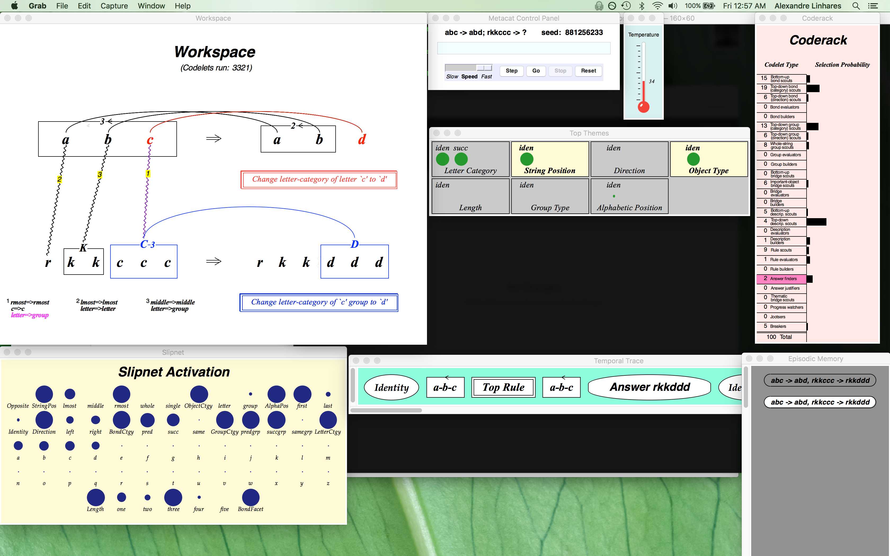
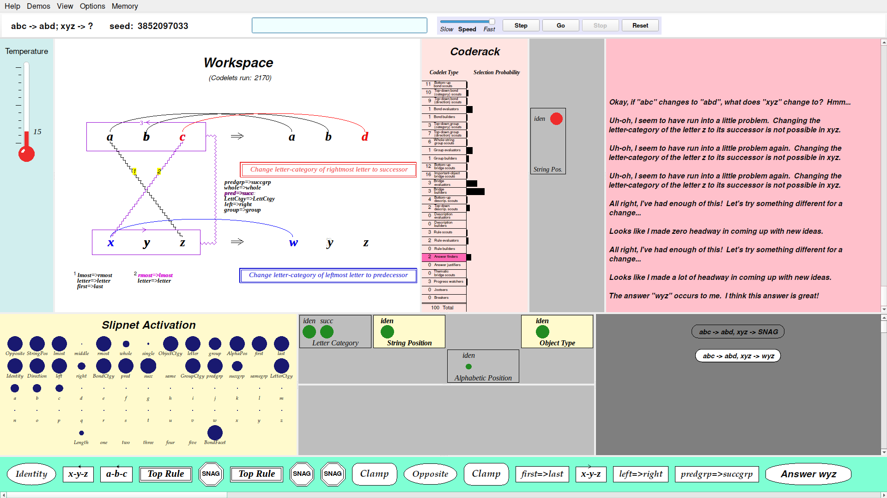
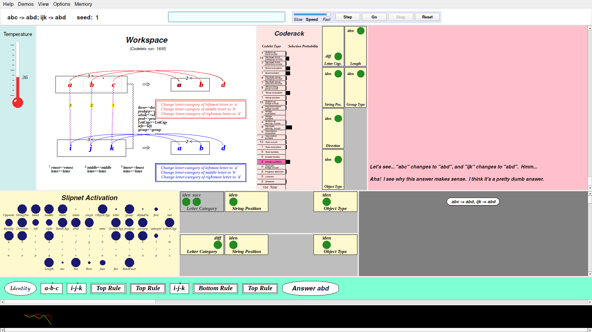
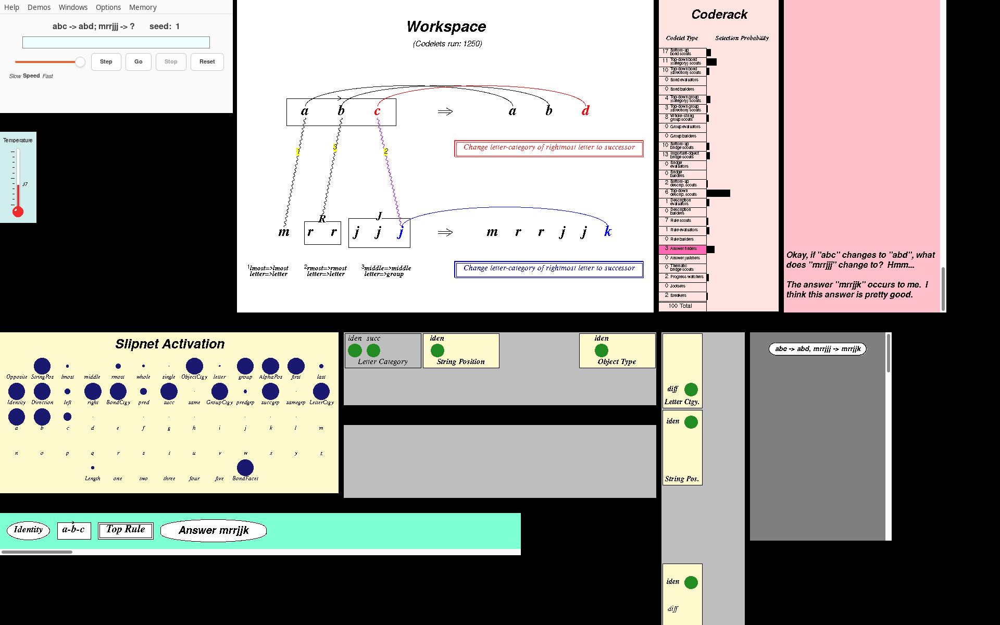
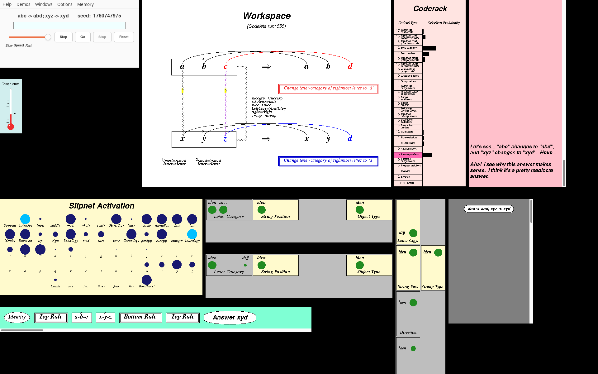

# Metacat, in Racket and Python

Two faithful ports of **Metacat 1.2**, James B. Marshall's model of analogy-making and
self-watching perception. One is in [Racket](https://racket-lang.org), with a native
`racket/gui` interface. The other is in Python 3, using only the standard library, with a
tkinter interface, plus an optional Qt interface that shows every window at once in a
single window. Both reproduce the original program's runs **event for event**, checked
against the original itself running headless under Chez Scheme 10.

**Metacat home page:** <https://science.slc.edu/~jmarshall/metacat/>


*The Racket port on Run 7 of Marshall's dissertation, `abc → abd; xyz → ?` with seed
3852097033. The `c → d` rule can't be applied to `z`, which has no successor. After several
snags ("All right, I've had enough of this!") Metacat sees `abc` and `xyz` as mirror images
and answers **`wyz`**: "I think this answer is great!" More screenshots are in the
[gallery](docs/screenshots/README.md).*

## In this folder of FARGonautica

This folder keeps the **classic Metacat** that FARGonautica has always had, next to the
modern ports. All of it is James Marshall's work, under the GPL.

| | What |
|---|---|
| [`Metacat/`](Metacat/) | the classic source, **Metacat 1.0** (December 2003), with Marshall's [`README.html`](Metacat/README.html) |
| [`Metacat-1.0.zip`](Metacat-1.0.zip) | the same release, zipped |
| `pcsv69b.exe`, `swl09x69b.exe` | Windows installers for Petite Chez Scheme 6.9b and the Scheme Widget Library (SWL) 0.9x, which the classic program needs |
| [`metacat.png`](metacat.png) | the classic GUI, below |
| [`chez_scheme/original/`](chez_scheme/README.md) | **Metacat 1.2** (2020), Marshall's last release, unchanged: the specification both ports are checked against |
| [`chez_scheme/oracle/`](chez_scheme/oracle/README.md) | 1.2 running headless under a modern Chez Scheme 10 |
| [`racket/`](racket/README.md) | the Racket port (multi-window and one-window GUIs) |
| [`python/`](python/README.md) | the Python port (tkinter GUI, and the one-window Qt GUI) |
| [`tests/`](tests/README.md), [`docs/`](docs/README.md), [`ralph_loops/`](ralph_loops/README.md) | tests, documentation, and the logs of the loops that built the ports |

**The classic GUI**, Metacat on Chez Scheme and SWL (macOS), answering `abc → abd; rkkccc → ?`
with `rkkddd`:



**The same program today**, in one window (the Python port's Qt GUI), on Run 7 of the
dissertation:



> **Large test data is not copied here.** To keep FARGonautica small, this copy leaves out
> the 109 golden traces (`tests/golden/`, 41 MB) and the Python port's frozen Chez outputs
> (`python/fixtures/`, 176 MB). Both are generated by the original running under Chez
> Scheme 10:
> `scheme --script chez_scheme/oracle/make-golden.ss` writes the goldens, and
> `python3 python/oracle/capture.py --all`, `capture_extra_seeds.py` and
> `capture_sgl_tcl.py` write the fixtures. The complete repository, with the data, is
> **[github.com/fargonauts/metacat](https://github.com/fargonauts/metacat)**.

## Contents

- [What Metacat is](#what-metacat-is)
- [Quick start](#quick-start)
- [Problems to try](#problems-to-try)
- [How the ports are checked](#how-the-ports-are-checked-an-oracle)
- [Repository map](#repository-map)
- [How it was made](#how-it-was-made)
- [Credits and license](#credits-and-license)

## What Metacat is

Metacat solves letter-string analogy problems: *if `abc` changes to `abd`, what does `xyz`
change to?* It builds an interpretation of a problem out of many small, partly random
actions called *codelets*. Codelets notice bonds between letters, group letters, map one
string onto another, describe the change as a rule, and apply the rule to the target string.
A network of concepts, the *Slipnet*, decides what seems relevant. A *temperature* measures
how coherent the current interpretation is: high when things are a mess, low when they hang
together.

Metacat is the successor to **Copycat**, by Melanie Mitchell and Douglas Hofstadter. What it
adds is *self-watching*:
- it keeps a **Temporal Trace** of its own processing;
- it notices when it keeps hitting the same snag, and "jumps out of the system" by clamping
  a pattern of concepts;
- it remembers its answers in an **Episodic Memory**, and can compare answers;
- it can **justify** an answer it is given;
- it says what it is doing in a running **Commentary**.

All of this is described in Marshall's dissertation,
[*Metacat: A Self-Watching Cognitive Architecture for Analogy-Making and High-Level
Perception*](https://science.slc.edu/~jmarshall/metacat/dissertation.pdf) (Indiana
University, 1999). A copy and its figures are in [`docs/reference/`](docs/reference/README.md).

The original Metacat 1.2 (released 2020) is written in Chez Scheme, with a GUI built on the
Scheme Widget Library (SWL), which is no longer maintained. Until now, the easy way to run it
was a VirtualBox image.

## Quick start

| | Racket port | Python port |
|---|---|---|
| Needs | Racket 8.x CS with `racket/gui` (`sudo apt install racket`) | Python 3.12, standard library + tkinter |
| GUI | `racket racket/main.rkt` | `cd python && python3 -m metacat.gui` |
| One-window GUI | `racket racket/one-window.rkt` | `cd python && python3 -m metacat.qt` (needs PySide6) |
| Headless | `racket racket/cli.rkt abc abd xyz --seed 3852097033` | `cd python && python3 -m metacat abc abd xyz --seed 3852097033` |
| Install | `bash make-dist.sh` builds a standalone program in `build/metacat/` | `pip install -e python` installs `metacat` and `metacat-gui`; `pip install -e 'python[qt]'` adds PySide6 and `metacat-qt` |
| More | [`racket/README.md`](racket/README.md) | [`python/README.md`](python/README.md) |

Chez Scheme 10 (`sudo apt install chezscheme`) is needed only to run the original and the
equivalence tests.

**Everything in one window.** The original, and both ports' main GUIs, open about ten
windows. The Python port's Qt GUI ([`python/metacat/qt/`](python/metacat/qt/README.md))
puts them all in one window, for a screen of 1920×1080 or larger, with the same pictures,
controls and menus. The panes can be resized, hidden and shown, and the layout is
remembered:

```bash
pip install -e 'python[qt]'
metacat-qt                     # Run 7 is already in the box: press Enter, then Go
```


> *"The answer "wyz" occurs to me. I think this answer is great!"*
>
> — Metacat, Run 7



> *"Aha! I see why this answer makes sense. I think it's a pretty dumb answer."*
>
> — Metacat, asked to justify `ijk → abd` for `abc → abd`

*Asked to justify the literal-minded answer `abd` (seed 1, codelet 1835), Metacat builds rules that turn each letter of `ijk` into `a`, `b` and `d`, sees why they work, and isn't impressed. Every pane is shown here, including the Bottom Themes and the EEG (bottom), which justify runs bring into play.*

**Using the GUI.** Type a problem into the control panel's box and press **Enter**. Enter
sets the problem up and waits; **Go** starts the run. Then:
- **Go** continues the run after a stop or a breakpoint;
- **Step** runs one step at a time (the step interval is under Options);
- **Stop** interrupts the run;
- **Reset** starts the problem again;
- the speed slider slows the run down so you can watch the structures being built.

When Metacat finds an answer it stops. Press **Go**, or click the Workspace, to have it look
for another. The **Demos** menu loads the runs from Marshall's dissertation with their
seeds; see [`docs/demos.md`](docs/demos.md) for which of them replay as documented.

The box accepts:
- `abc abd xyz` asks what `xyz` changes to;
- `abc abd xyz 7` does the same with random seed 7, so the run can be replayed exactly;
- `abc abd xyz wyz` asks Metacat to *justify* the answer `wyz`;
- `abc abd xyz wyz 7` justifies it with a seed.

**Headless**, a run prints its commentary and answers:

```
$ racket racket/cli.rkt abc abd xyz --seed 3852097033
...
Comment: The answer "wyz" occurs to me.  I think this answer is great!
Answer: wyz  quality 91  codelet 2170  temperature 15
```

The CLI's flags (`--max-codelets`, `--keep-going`, `--trace FILE`, `--verbose`) are the same
in both ports; see their READMEs.

## Problems to try

| Problem | What happens |
|---|---|
| `abc abd ijk` | the easy one: `ijl`, or the literal-minded `ijd` |
| `abc abd iijjkk` | letters or groups? `iijjkl` or `iijjll` |
| `abc abd mrrjjj` | `mrrjjk`, or, if Metacat sees the lengths 1-2-3, `mrrjjjj` |
| `abc abd xyz` | `z` has no successor: snags, then `xyd`, `wyz`, … |
| `eqe qeq abbbc` | a symmetry problem; seed 2302461154 finds `qcccb` ("really terrible") |
| `rst rsu xyz` | another end-of-the-alphabet problem |

<p>


</p>

*Left: `abc → abd; mrrjjj → ?` (seed 1) answered `mrrjjk`, with the `rr` and `jjj` groups
mapped onto `b` and `c`. Right: asked to justify `xyd`, Metacat builds both rules and
concludes "Aha! I see why this answer makes sense. I think it's a pretty mediocre answer."*

## How the ports are checked: an oracle

The aim is a *faithful* port, not a reinterpretation. Given the same seed, each port makes
the same run as the original: the same codelets in the same order, the same structures, the
same temperature, the same answers and the same commentary.

1. **The original is kept unchanged** in [`chez_scheme/original/`](chez_scheme/README.md). A
   gate checks its git tree hash against the import commit.
2. **The original runs headless as an oracle.** [`chez_scheme/oracle/`](chez_scheme/oracle/README.md)
   loads those 44 files, unmodified, into Chez Scheme 10 through a prelude. The prelude
   stubs out SWL, provides the old `extend-syntax` macros, and instruments the program from
   outside.
3. **Golden traces.** The oracle recorded 109 seeded runs of 36 problems as JSON-lines
   traces in `tests/golden/` ([`tests/README.md`](tests/README.md)). Every demo of the
   dissertation is included.
4. **Both ports reproduce them event for event**, byte for byte. So do **720 more runs** with
   seeds neither port was developed against, and so does the printed output. This takes
   Chez's random-number generator bit for bit, Chez's order of evaluating arguments where it
   matters, its `map` order, its `sort`, its exact arithmetic and its number printing.
5. **Differential tests, layer by layer.** Smaller Chez test batteries compare each layer
   with the original: utilities, coderack, slipnet, workspace, bonds and groups, bridges,
   rules, the SGL drawing language and the panels' graphics.
6. **The GUI only watches.** Neither engine depends on its GUI. With every window attached,
   the golden runs still match.

What the ports do differently, and why, is in [`docs/divergences.md`](docs/divergences.md).
Bugs and oddities found in the original along the way, including two crashes, a copy-paste
bug and Chez's surprising evaluation order, are in
[`docs/anomalies_and_quirks.md`](docs/anomalies_and_quirks.md).

```bash
bash tests/run-tests.sh                  # the Racket port and the Chez checks (about 10 min)
bash python/run-tests.sh                 # the Python port (about 7 min)
python3 ralph_loops/loop0001/gate.py     # Racket, plus the check that the original is untouched
python3 ralph_loops/loop0002/gate.py     # Python, plus the checks on the frozen references
```

GUI tests run on a virtual display and need `xvfb-run` (Xvfb) and `xwininfo` (x11-utils).

## Repository map

Every folder has a README.

| Folder | What's there |
|---|---|
| [`chez_scheme/`](chez_scheme/README.md) | the original Metacat 1.2 (read-only) and the headless [oracle](chez_scheme/oracle/README.md) |
| [`racket/`](racket/README.md) | the Racket port: [engine](racket/engine/README.md), [GUI](racket/gui/README.md), [tests](racket/tests/README.md) |
| [`python/`](python/README.md) | the Python port: [package](python/metacat/README.md), [GUI](python/metacat/gui/README.md), [oracle captures](python/oracle/README.md), [fixtures](python/fixtures/README.md), [tests](python/tests/README.md) |
| [`tests/`](tests/README.md) | shared test data: golden traces, problem list, Chez differential batteries |
| [`docs/`](docs/README.md) | code map, porting notes, trace format, anomalies, essays, the [dissertation](docs/reference/README.md), the [screenshot gallery](docs/screenshots/README.md) |
| [`ralph_loops/`](ralph_loops/README.md) | the loops that built the ports: [loop0001](ralph_loops/loop0001/README.md) (Racket), [loop0002](ralph_loops/loop0002/README.md) (Python) |
| `make-dist.sh` | builds the standalone Racket program |

## How it was made

Both ports were built by "Ralph loops". A driver (`loop.py`) runs one fresh Claude Code
session per work item. After each session it runs a regression gate, allows up to three fix
attempts, then commits and pushes. The Racket port took 18 iterations
([loop0001](ralph_loops/loop0001/README.md)). The Python port was a test-driven translation
that wrote every test before its code, with expected values frozen from Chez; it also took 18
iterations ([loop0002](ralph_loops/loop0002/README.md)). The method is in
[`ralph_loops/ralph_loop_guide.md`](ralph_loops/ralph_loop_guide.md).

Two essays in `docs/` place Metacat beside Numbo and Ganesalingam and Gowers's theorem prover:
[the similarities](docs/robotone_numbo_metacat_similarities.md) and
[a family resemblance](docs/robotone_numbo_metacat_family_resemblance.md).

## Credits and license

Metacat is © 1999, 2003 **James B. Marshall**. It is based on **Copycat**, originally written
in Common Lisp by **Melanie Mitchell**, from Douglas Hofstadter's Fluid Analogies Research
Group. Both ports keep Marshall's copyright headers on every translated file, with a line
saying what was ported.

The original and both ports are free software under the **GNU General Public License,
version 2 or later**; see [`chez_scheme/original/LICENSE`](chez_scheme/original/LICENSE).
Metacat comes with no warranty.
