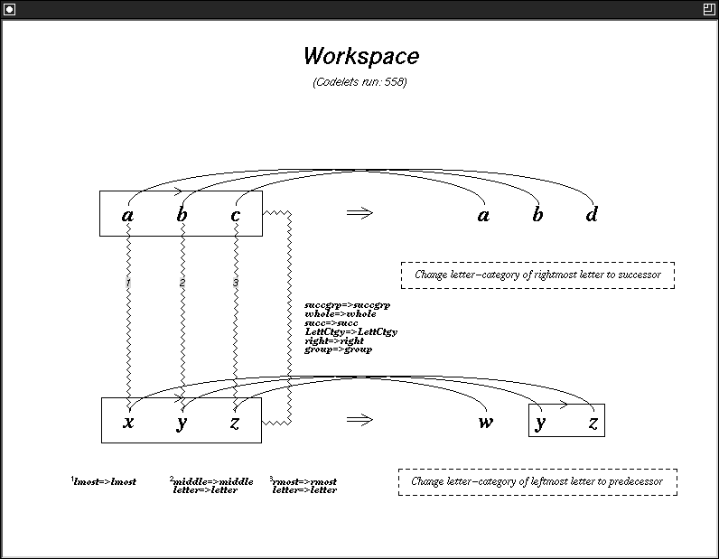

# chez_scheme/: the original Metacat and its headless oracle

This folder holds the reference that both ports are measured against. `original/` is
James B. Marshall's **Metacat 1.2** source exactly as distributed: 45 Chez Scheme files
(25,797 lines), the help text, a five-line README and the GPL. `oracle/` is a small
harness, written for this repository, that loads those files **unmodified** into
Chez Scheme 10. It runs them without a GUI and records what they do. Every golden trace in
[`tests/golden/`](../tests/) comes from the oracle, and the Racket port
([`racket/`](../racket/)) and the Python port ([`python/`](../python/README.md)) must
reproduce those traces byte for byte.

| Folder | What it is | Who may change it |
|---|---|---|
| [`original/`](original/) | Metacat 1.2 by James B. Marshall, as distributed (described below) | nobody: read-only, guarded by a git tree-hash check |
| [`oracle/`](oracle/README.md) | the headless harness: SWL stubs, the `run.ss` CLI, trace instrumentation, golden-trace generator, differential-battery evaluator, and its own checks | this project |

## The original's GUI, as the ports reproduce it


The SWL toolkit that the original's GUI needs is no longer maintained, so this picture
comes from the Racket port. It draws the original's own drawing commands (see
[SGL](#how-the-gui-was-built-swl-tk-and-sgl) below). It shows Run 7 of Marshall's
dissertation, `abc → abd; xyz → ?` with seed 3852097033, after the answer `wyz` (codelet
2170). In the top row are the Control Panel, the Temperature, the Workspace with its two
rules and crossed bridges, the Coderack and the Commentary. Below them are the Slipnet,
the three Themespace windows, the Episodic Memory and the Temporal Trace. To see how the
original itself looked in 1999, see the screenshots from the dissertation in
[`docs/reference/figures/`](../docs/reference/figures/), indexed by panel in
[`docs/reference/README.md`](../docs/reference/README.md). For example, Fig. 2.4 shows
the Workspace finding `wyz`:



## `original/`: Metacat 1.2 as distributed

**Never edit anything in `original/` and never add files to it** (not even a README).
The import commit `9f072c0` put the distribution in `Metacat/`. The regression gates
(`ralph_loops/loop0001/gate.py`, `ralph_loops/loop0002/gate.py`) compare the git tree
hash of `chez_scheme/original` in `HEAD` with `9f072c0:Metacat`. The loop0001 gate also
rejects uncommitted edits and untracked files there. You can check it yourself:

```bash
git rev-parse HEAD:chez_scheme/original 9f072c0:Metacat   # the two hashes must be equal
```

Everything the original needs in order to run on a modern Chez is supplied from outside,
by [`oracle/prelude.ss`](oracle/README.md#preludess-what-chez-10-lacks).

### Versions, README and license

The header of `metacat.ss` gives the history: release 1.0 (December 2003); 1.1, updated
for Petite Chez Scheme 8.4 (January 2014); 1.2, minor bug fixes to graphics-window
resizing and menus (August 2016, January 2017). The whole of `README.txt` is:

```
Metacat 1.2

Edit the settings in metacat.ss before running Metacat for the first time.

See http://science.slc.edu/~jmarshall/metacat for more info.
```

The settings are four definitions at the top of `metacat.ss`. Three of them ship
commented out: `*platform*` (`linux`, `macintosh` or `windows`), `*metacat-directory*`
(where the source lives) and `*file-dialog-directory*` (the default folder for "Save
commentary to file"). The fourth, `*tcl/tk-version*`, is set to 8.5. `metacat.ss` stops
with an error message if any of them is missing or wrong. The oracle's prelude defines
the first three.

Metacat is © 1999, 2003 James B. Marshall. It is based on Copycat, which Melanie Mitchell
originally wrote in Common Lisp. Every source file carries the GPL header, and `LICENSE`
is the text of the **GNU General Public License, version 2**. The headers allow "version 2
of the License, or (at your option) any later version". The ports keep the same license.

### Load order

`metacat.ss` is the loader. It imports the SWL modules (`swl:oop`, `swl:macros`,
`swl:generics`, `swl:option`, `swl:threads`), checks the settings, changes to
`*metacat-directory*` and `load`s the other 44 files into **one global top level**, in
this order:

```
syntactic-sugar  utilities  fonts  constants  setup
coderack  descriptions  bonds  groups  bridges  breakers
workspace  workspace-objects  workspace-structures  workspace-strings
concept-mappings  workspace-structure-formulas  run  formulas  slipnet
images  rules  answers  themes  justify  trace  jootsing  memory
sgl-interpreter  general-graphics  slipnet-graphics  workspace-graphics
temperature-graphics  group-graphics  bridge-graphics  rule-graphics
coderack-graphics  theme-graphics  trace-graphics  memory-graphics
commentary-graphics  eeg-graphics  demos  gui
```

Definitions refer to each other across files, often in both directions. This works
because a reference is only resolved when the code runs. When it has loaded everything,
the loader prints `Metacat loaded.` and asks the user to type `(setup)`, which creates
every window.

### The files, by group

[`docs/code-map.md`](../docs/code-map.md) has one paragraph per file: what it defines,
what it depends on, its line count, and whether it calls the toolkit. In outline:

| Group | Files | Lines | What it does |
|---|---|---:|---|
| Loader | `metacat.ss` | 129 | settings, SWL imports, loads the rest |
| Language and infrastructure | `syntactic-sugar.ss`, `utilities.ss`, `constants.ss`, `setup.ss` | 2,424 | all 22 `extend-syntax` macros (loops, `stochastic-if*`, `say`, the Slipnet definition language, `post-codelet*`, `define-codelet-procedure*`); the object system (closures that dispatch on a message, `tell`, `delegate`); exact `round`/`floor`/…; every random helper (`prob?`, `random-pick`, `stochastic-pick`, …); colours, sizes and other constants; global run state and mode switches |
| The model: perception | `coderack.ss`, `descriptions.ss`, `bonds.ss`, `groups.ss`, `bridges.ss`, `breakers.ss`, `workspace.ss`, `workspace-objects.ss`, `workspace-structures.ss`, `workspace-strings.ss`, `concept-mappings.ss`, `workspace-structure-formulas.ss`, `formulas.ss`, `slipnet.ss`, `images.ss` | 7,836 | the Coderack (codelets chosen by urgency and temperature); letters, descriptions, bonds, groups and bridges, with their scout / evaluator / builder codelets and the breaker; the Workspace and its strings; temperature; the Slipnet of concepts and links; images (what an object looks like after a rule changes it) |
| Rules and answers | `rules.ss`, `answers.ss`, `justify.ss` | 4,073 | rule scouts, evaluators and builders; translating a rule and applying it to the target; snags; answer reports, answer comparison and most of the Commentary; justify mode (explaining an answer it is given) |
| Self-watching | `themes.ss`, `trace.ss`, `jootsing.ss`, `memory.ss` | 3,837 | the Themespace (top, bottom and vertical bridge themes); the Temporal Trace of events; the jootser and progress-watcher codelets that clamp theme patterns to "jump out of the system"; the Episodic Memory of answers and snags |
| Run control | `run.ss` | 346 | `init-mcat` (which seeds the generator), `run-mcat`, `step-mcat`, the update cycle every 15 codelets, breakpoints and stepping (with first-class continuations), the REPL commands `go`, `ss`, `runtil`, … |
| Graphics | `fonts.ss`, `sgl-interpreter.ss`, `general-graphics.ss` and the 12 other `*-graphics.ss` files | 5,791 | fonts; the SGL interpreter; window construction and shape builders; one file per panel (Workspace and its groups, bridges and rules, Slipnet, Coderack, Temperature, Themespace, Temporal Trace, Memory, Commentary, EEG) |
| Demos and Control Panel | `demos.ss`, `gui.ss` | 1,361 | the dissertation's Chapter 5 problems with their seeds (`run1`…`run8`, `abc-xyd`, `fig5.10`, `misc1`…, run with `(demo run7)`); the Control Panel |
| Not code | `README.txt`, `help.txt`, `LICENSE` | | the README quoted above; the text the Control Panel's Help shows (version history, how to type a problem such as `abc cba pqrs 123456`, the buttons, menus and windows); the GPL v2 |

A few facts about this code decide how hard it is to reproduce exactly:

- **Randomness.** Every draw goes through Chez's global `random` and `random-seed`.
  In Chez 10, that generator turns out to be the same one Metacat was developed under,
  so the seeds in `demos.ss` still replay (see [`oracle/`](oracle/README.md#randomness)).
- **Order.** There are no hash tables. "Tables" are vectors of vectors and association
  lists. But Chez does not evaluate a call's arguments left to right, and its `map` visits
  elements in an unusual order. The ports have to copy both wherever a draw depends on
  them.
- **Halts.** When an object receives a message it does not understand,
  `report-error-and-halt` prints `Ooops: bad message ...` and returns to the REPL. Some
  seeded runs reach this point; the oracle records it as a `halt`.

Oddities and bugs found in the original are logged in
[`docs/anomalies_and_quirks.md`](../docs/anomalies_and_quirks.md).

### How the GUI was built: SWL, Tk and SGL

Metacat 1.2 ran inside **SWL**, the Scheme Widget Library. SWL is an object-oriented
Chez Scheme binding to Tcl/Tk with its own REPL window. The help text warns that the
"repl" and "Interaction" windows must not be closed. The original uses SWL in four ways:

- **Widgets**: `create <class> ... with (option: value ...)` makes a widget,
  `send obj message args...` talks to it, and `define-class` defines new classes. The
  Control Panel in `gui.ss` (command line, Step / Go / Stop / Reset, speed slider, the
  menus, dialogs, Help) is the largest user. `general-graphics.ss` builds `<toplevel>`
  windows with scrollable `<viewport>` canvases.
- **Threads**: the buttons and mouse clicks interrupt the running model with
  `thread-break *repl-thread*`. `utilities.ss`'s `pause` is `thread-sleep`. A resize
  listener thread passes messages to the windows.
- **Fonts and screen size**: `swl:font-families`, `swl:screen-width`/`-height`, and
  `create <font>` (in `fonts.ss` and `constants.ss`).
- **Raw Tk**: `swl:tcl-eval` for canvas options (`sgl-interpreter.ss` removes the ones
  that Tcl/Tk 8.0 lacked).

Above that layer, the panels do not draw directly. Marshall first wrote Metacat's
graphics in **SchemeXM/SGL**, a proprietary system built by John B. Zuckerman at
Motorola on Chez Scheme and X. SGL is a symbolic graphics language. To move to SWL
without rewriting the graphics, Marshall wrote an **SGL interpreter** in SWL
(`sgl-interpreter.ss`). Each panel builds picture expressions ("pexps") such as
`(rectangle (x1 y1) (x2 y2))`, `(arc ...)`, `(text (x y) "string")`, `(ring ...)`, and
`(let-sgl ((origin (x y)) (foreground-color "red") (font f) ...) ...)`. The interpreter
then turns them into Tk canvas items on a `<viewport>`, a subclass of SWL's `<canvas>`.
This is why the ports could keep the panels' code almost unchanged. Each port only
re-implements the interpreter: on `racket/draw` in Racket and on a tkinter canvas in
Python. Differential batteries compare every drawing message with the original's.

The model never needs the windows. It only *sends* to them (`*workspace-window*`,
`*trace-window*`, …), and switches such as `%workspace-graphics%` turn most drawing off.
That is what lets the oracle run it headless.

## `oracle/`: running the original headless

Chez Scheme 10 has neither SWL nor `extend-syntax`. The oracle loads `original/metacat.ss`
anyway, without changing a byte, through a prelude. The prelude supplies `extend-syntax`,
inert SWL stand-ins and the settings, and replaces the windows with null objects. The
prelude does **not** replace Chez's random-number generator: the model draws from Chez's
own generator, which the ports reimplement. From there:

```bash
scheme --script chez_scheme/oracle/run.ss abc abd xyz --seed 3852097033
```

runs Run 7 in under a second and prints the commentary, `Answer: wyz  quality 91  codelet
2170  temperature 15`, and a summary. With `--trace FILE` it also writes the JSON-lines
trace that the ports are compared against. [`oracle/README.md`](oracle/README.md)
describes each file, the flags, the output, the randomness and evaluation-order findings,
and how the golden traces are made. [`oracle/tests/README.md`](oracle/tests/README.md)
describes the oracle's own checks.

Requirements: Chez Scheme 10 (`scheme` or `chezscheme`; on Ubuntu,
`sudo apt install chezscheme`), and Python 3 for `validate-trace.py`.

## See also

- [`docs/code-map.md`](../docs/code-map.md): every original file, in load order.
- [`docs/trace-format.md`](../docs/trace-format.md): the generator specification and
  the trace format.
- [`docs/porting-notes.md`](../docs/porting-notes.md) and
  [`docs/divergences.md`](../docs/divergences.md): how and where the ports differ.
- [`tests/README.md`](../tests/README.md): the golden traces, the problem list and the
  differential batteries.
- The Metacat home page: <https://science.slc.edu/~jmarshall/metacat/>.
