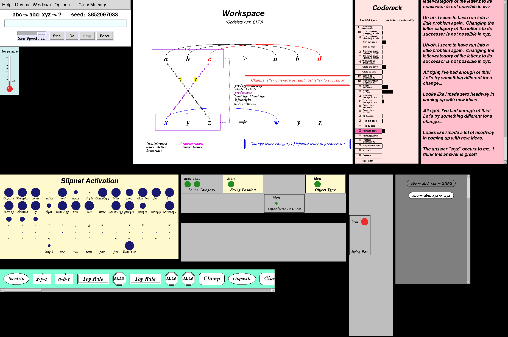
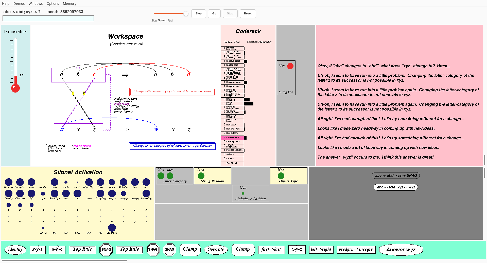
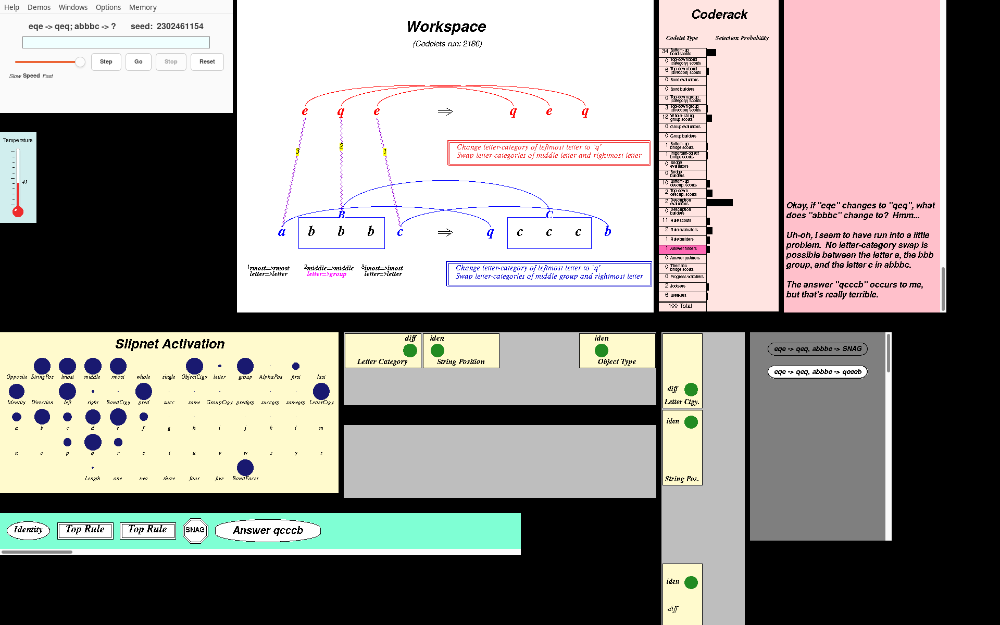
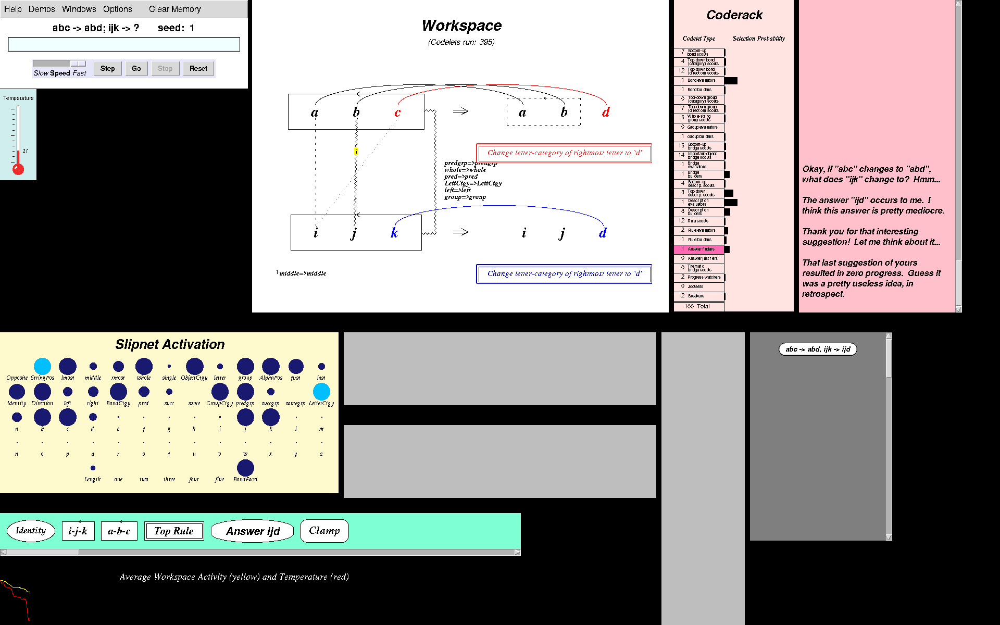
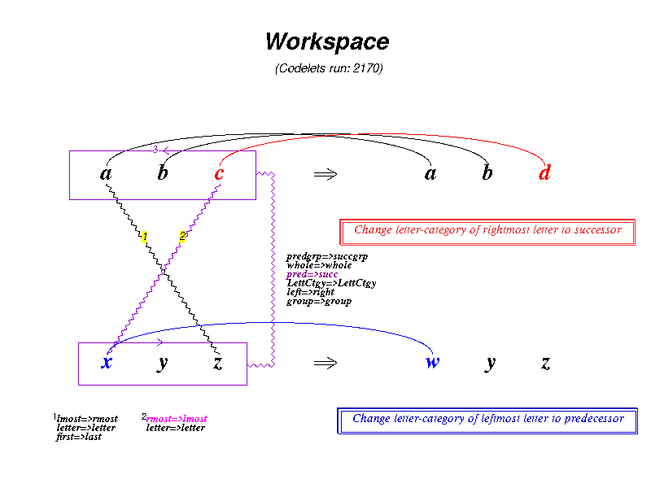
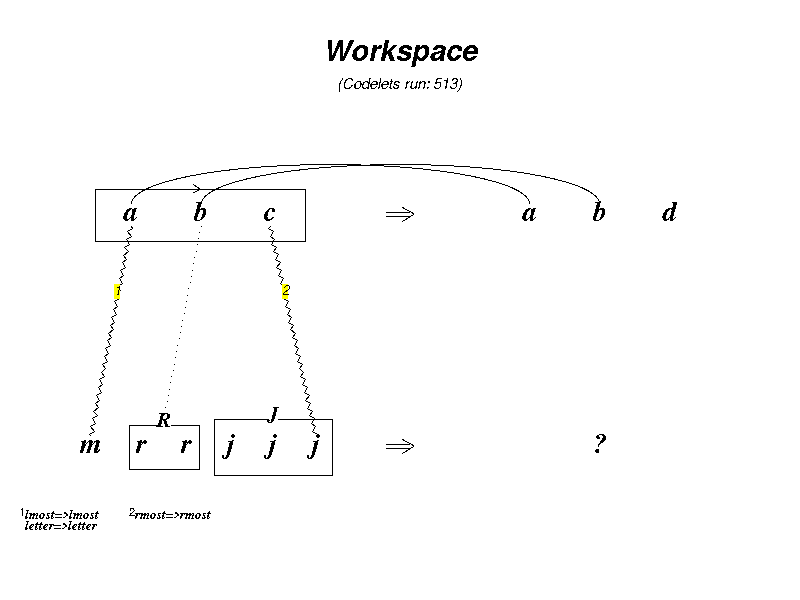
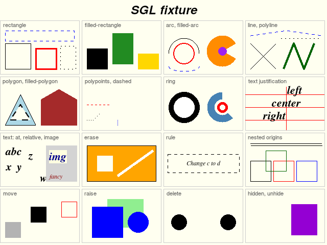
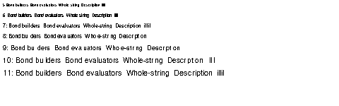
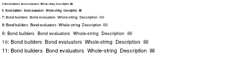

# Screenshots

This gallery shows the Racket port (`racket/`, drawn with racket/draw in racket/gui windows)
and the Python port (`python/`, drawn on tkinter canvases, or in one Qt window) running
real problems. The images are full screens of each port's GUI, crops of the Workspace, the Python port's
windows one by one, and the SGL drawing-language test fixture as each port draws it. Every
run shown is a seeded run from [`tests/problems.txt`](../../tests/problems.txt), so its
golden trace in `tests/golden/` shows codelet by codelet what happened. Both ports
reproduce those traces exactly, so the same run looks the same in both ports, apart from
fonts and widgets. All images were taken on a virtual X display (Xvfb), or for the Qt GUI
with Qt's offscreen platform, never on a real screen.

To compare these with Marshall's own 1999 screenshots, see
[`../reference/`](../reference/README.md).

## How the images were made

| Images | Port | Tool |
| --- | --- | --- |
| `run7-wyz.png`, `racket-*.png` (1920×1200) | Racket | [`tests/gui-screenshot.rkt`](../../tests/gui-screenshot.rkt). It opens the whole GUI (`setup`), types the problem into the control panel's command line, presses Go through the panel's own widgets, waits for the run to stop (at its first answer, or at `--break N`), and grabs the screen with PIL. It is not part of the test suite. Run it as `env -u WAYLAND_DISPLAY GDK_BACKEND=x11 xvfb-run -a -s "-screen 0 1920x1200x24" racket tests/gui-screenshot.rkt OUT.png PROBLEM... [--break N]`. |
| `run7-workspace.png`, `mrrjjj-513-workspace.png` (800×600) | Racket | Crops of the Workspace window from screenshots taken with `tests/gui-screenshot.rkt` (loop0001 item 16; see `docs/porting-notes.md`, "README and screenshots"). |
| `python-run7-wyz.png`, `python-ijk-clamp.png` | Python | Screens of the GUI that [`python/tests/drive_gui.py`](../../python/tests/drive_gui.py) drives under Xvfb. It builds the GUI as `python3 -m metacat.gui` does, then a driver thread presses buttons, types commands, opens menus and clicks on canvases. Each GUI run's trace is checked against its golden, and the screen is grabbed with Xlib's `XGetImage` through ctypes. The script's own grabs are 2560×1600 (`python/tests/snapshots/gui-run7.png`, `gui-final.png`). `python-run7-wyz.png` was cropped from `gui-run7.png` to the windows (loop0002 item 16). |
| `panels/*-run7-*.png`, `panels/EEG-run7-800.png` | Python | [`python/tests/render_views.py`](../../python/tests/render_views.py) (slow test tier, under `xvfb-run`). It replays a golden run with every window attached on real Tk canvases, then raises each window and grabs it with `XGetImage` into `WINDOW-SCENE.png`. These files are the same bytes as `python/tests/snapshots/views/`. |
| `qt-run7-wyz.png` (1920×1080), `qt-run7-wyz-1440p.png` (2560×1440) | Python (Qt) | [`python/tests/drive_qt_layout.py`](../../python/tests/drive_qt_layout.py) `OUTDIR run7 --screen 1920x1080` (and `2560x1440`), offscreen with no X server (loop0003 item 09). It opens the window as `python3 -m metacat.qt` does, on an offscreen screen of that size (the window maximised, default layout, with a throw-away settings file), types `abc abd xyz 3852097033` into the command line, presses Enter and Go with the slider at Fast, waits for the answer, checks the codelet count and random state against the golden (2170, 4089168737), and grabs the window with `QWidget.grab()` as `window-run7-WxH.png`. |
| `racket-one-window-run7.png` (1920×1040) | Racket | [`racket/gui-tests/one-window-test.rkt`](../../racket/gui-tests/one-window-test.rkt) under `xvfb-run` with `METACAT_SCREENSHOT_DIR` set (loop0003 item 10). It opens the one-window GUI in a 1920×1040 frame, types Run 7 into the command line, presses Go, waits for the answer and grabs the screen with PIL; the image is that grab cropped to the frame. |
| `panels/sgl-fixture-racket.png` | Racket | `racket/tests/sgl-test.rkt`'s pixel snapshot of `racket/tests/sgl-fixture.rkt` (the same file as `racket/tests/snapshots/sgl-fixture.png`). |
| `panels/sgl-fixture-python.png` | Python | [`python/tests/render_sgl_fixture.py`](../../python/tests/render_sgl_fixture.py). It draws `python/oracle/sgl-fixture.scm` on a 640×480 tkinter Canvas at a fixed 96 dpi and grabs it from the X server (the same file as `python/tests/snapshots/sgl-fixture.png`). |
| `panels/sgl-fixture-qt.png` | Python (Qt) | `python/tests/test_qt_canvas.py::test_sgl_fixture_renders_like_tk` (offscreen, no X server). It draws the same fixture through `metacat/gui/sgl.py` onto the Qt canvas (`metacat/qt/canvas.py`), with text measured on a Qt hidden canvas, and renders the `QGraphicsScene` into a 640×480 image (also written to `python/tests/screenshots-qt/`, which is not committed). |

GUI scripts in this repo always run under `xvfb-run` with `WAYLAND_DISPLAY` unset. On the
owner's Wayland desktop, GTK ignores Xvfb's `DISPLAY` otherwise and opens windows on the
real screen. See "GTK ignores Xvfb when `WAYLAND_DISPLAY` is set" in
[`../anomalies_and_quirks.md`](../anomalies_and_quirks.md).

> **Known rendering issue in the Python screenshots.** In the Python screens taken under
> Xvfb, the Coderack window's tiny codelet-type labels drop letters: "Bond bu ders",
> "Answer f nders", "Groupeva uators", "Rue scouts". The model is not affected (the runs
> match their goldens). Loop0003 item 03 found the cause: the tkinter GUI's Tk has no Xft
> and draws X core fonts as 1-bit bitmaps, which lose the thin letters at 8–10 pixels (see
> "Small text" below). The Qt GUI's screenshots keep them.

---

## Full screens

### Run 7: `abc → abd; xyz → ?` → `wyz` (Racket)

**Racket port.** Problem `abc abd xyz`, seed **3852097033**. This is Run 7 of Marshall's
dissertation (Chapter 5, p. 240) and one of the golden runs. The answer `wyz` comes at
codelet **2170**, exactly as the dissertation documents (see [`../demos.md`](../demos.md)).
What to look at:
- **Workspace:** the bridges *cross*, mapping `a`↔`z` and `c`↔`x` (`lmost=>rmost`,
  `rmost=>lmost`). The top rule, "Change letter-category of rightmost letter to
  successor", becomes the bottom rule "Change letter-category of leftmost letter to
  predecessor". That is the famous "wyz" insight.
- **Commentary:** three "Uh-oh, I seem to have run into a little problem… Changing the
  letter-category of the letter z to its successor is not possible in xyz", twice "All
  right, I've had enough of this! Let's try something different", then "The answer "wyz"
  occurs to me. I think this answer is great!"
- **Temporal Trace** (the green strip): Identity, x-y-z, a-b-c, Top Rule, three SNAGs and
  two Clamps. This is Metacat watching itself hit the `z` snag and "jumping out of the
  system".
- **Episodic Memory** (dark grey, right): the SNAG and the answer `wyz`. **Temperature:** 15.

### Run 7 again, drawn by the Python port

**Python port**, the same run (`abc abd xyz`, seed 3852097033, `wyz` at codelet 2170).
Item for item it is the same picture as the Racket one: the same bridges, rules,
concept-mapping list, Slipnet activations, codelet counts, commentary, Trace icons and
Memory icons. The differences are in rendering only. Tk's fonts come out a little larger,
so the concept-mapping list (`predgrp=>succgrp` …) touches the top rule's box. The control
panel has Tk's widgets and a "Clear Memory" entry in its menubar. The Coderack labels show
the dropped letters noted above. The image was cropped from the 2560×1600 grab, so it is
1850×1232.

### Run 7 in one window: the Python port's Qt GUI

**Python port, Qt GUI** (`python3 -m metacat.qt`), the same run at the same moment, in a
1920×1080 window. Every window of the pictures above is a pane here: the Temperature,
Workspace, Coderack, Vertical Themes and Commentary in the top row; the Slipnet, the Top
and Bottom Themes and the Episodic Memory in the middle; the Temporal Trace at the bottom
(the EEG is hidden by default, as its window was). The control panel is the strip under
the menu bar. The panels are drawn by the same code as the tkinter ones, through a Qt
canvas that executes their Tk commands, so the content is the same item for item; the
differences are in rendering. The text is antialiased, and the Coderack's labels keep
their `i`s and `l`s ("Bond builders", "Answer finders"). Panes that don't scroll keep their
window's aspect ratio and are redrawn at their pane's size (at 1080p the Workspace's pane is
790×593, against its own window's 800×600), and the Commentary's paragraphs are wider.

### Justifying an answer in one window (Qt)

> *"Aha! I see why this answer makes sense. I think it's a pretty dumb answer."*
>
> — Metacat, asked to justify `ijk → abd` for `abc → abd`

**Python port, Qt GUI**, 1920×1080, `abc abd ijk abd` with seed **1**: Metacat is given the
answer `abd` and asked to justify it. At codelet **1835** (temperature 36) both rules say
"change letter-category of leftmost letter to `a`, middle letter to `b`, rightmost letter
to `d`", the Trace ends with Answer abd, and the Memory holds `abc -> abd, ijk -> abd`.
View → Show all panes is on, so the Bottom Themes and the **EEG** (the black strip at the bottom)
are visible too. The run ends at the golden's codelet count and random state (1835,
4230205117). Made with [`python/tests/drive_qt_layout.py`](../../python/tests/drive_qt_layout.py)
`OUTDIR run --screen 1920x1080` (offscreen, 2026-10-05).

The same at **2560×1440**: the window opens maximised and every pane grows in the same
proportions. The Temporal Trace is scrolled to its latest events, so its first icon,
Identity, is cut at the left edge, as in a Trace window scrolled to the end.

### Run 7 in one window: the Racket port's one-window GUI

**Racket port, one window** (`racket racket/one-window.rkt`), the same run at its answer, in
a 1920×1040 frame on Xvfb. The panes are the multi-window GUI's windows, drawn by the same
code, in the Qt GUI's arrangement; the control panel's widgets are the strip under the menu
bar. The Temperature, Workspace, Coderack, Themes and Slipnet keep their windows' aspect
ratios (the Temperature is letterboxed at the top of its pane, its margin in its
background colour); the Commentary, Memory and Trace fill their panes. The Racket port draws
without antialiasing, as in its other screenshots.

### `abc → abd; mrrjjj → ?` → `mrrjjk` (Racket)

**Racket port.** Problem `abc abd mrrjjj`, seed **1** (a golden run). The answer `mrrjjk`
comes at codelet **1250**, and Metacat thinks it "pretty good". Temperature 37. Metacat
grouped `rr` (R) and `jjj` (J) and mapped `b` onto the R group (`middle=>middle`,
`letter=>group`). It mapped `c` onto the *last letter* of `jjj`, not onto the whole J group
(`rmost=>rmost`, `letter=>letter`). So the rule "Change letter-category of rightmost letter
to successor" changes one `j` and not the whole group. Compare with the other
`mrrjjj` problems in the golden set (`mrrkkk`, `mrrjjjj`), where Metacat sees the groups and
their lengths.

### Justifying `abc → abd; xyz → xyd` (Racket)

**Racket port.** A *justify* run: `abc abd xyz xyd`, seed **1760747975**. This is the
`abc-xyd` demo of `demos.ss` and a golden run. Here Metacat is given the answer and has to
explain it. At codelet **555** it says: "Aha! I see why this answer makes sense. I think
it's a pretty mediocre answer." Both rules read "Change letter-category of rightmost letter
to 'd'": a literal rule, not a successor rule. The bridges map straight down (`a`↔`x`,
`c`↔`z`). The Coderack's highlighted row is *Answer justifiers* rather than Answer finders.
This is the one full screen in which the **Bottom Themes** window (the grey panel in the
middle) is filled. Temperature 25.

### `eqe → qeq; abbbc → ?` → `qcccb`, "really terrible" (Racket)

**Racket port.** Problem `eqe qeq abbbc`, seed **2302461154**. This is the `eqe-qeeeq`
demo of `demos.ss`. The dissertation reports `qeeeq` for this seed, but the oracle (the
original running under Chez 10) gives `qcccb`, and so do both ports. It is one of the
demos that don't replay (see [`../demos.md`](../demos.md)). The answer comes at codelet
**2186**, and Metacat judges it itself: "The answer "qcccb" occurs to me, but that's really
terrible." Before that it hit a snag: "No letter-category swap is possible between the
letter a, the bbb group, and the letter c in abbbc." The rules have two clauses each ("Change
letter-category of leftmost letter to 'q'" and "Swap letter-categories of middle … and
rightmost letter"), and the bottom rule swaps a *group* with a letter. Temperature 41.
Memory holds the SNAG and `qcccb`.

### `abc → abd; ijk → ?` with a user's clamp, EEG visible (Python)

**Python port.** Problem `abc abd ijk`, seed **1**. This is the run `drive_gui.py` uses for
its full-run, step, breakpoint and reset scenarios, and it ends at the golden's state:
answer `ijd` at codelet **395**, "pretty mediocre". The menu scenario then applies a
**user clamp** through Options → Clamp codelet pattern → Bottom-up codelet pattern, and
undoes it again. The commentary shows Metacat's reaction: "Thank you for that interesting
suggestion! Let me think about it…", then "That last suggestion of yours resulted in zero
progress. Guess it was a pretty useless idea, in retrospect." The Trace ends with Answer ijd
and a Clamp. The Workspace also shows structures that are only *proposed*: a dashed group
around `ab` in `abd`, and dotted bridges. At the bottom left the **EEG** window is open
("Average Workspace Activity (yellow) and Temperature (red)"). This is the same end state
as `python/tests/snapshots/gui-final.png`, on a 1920×1200 screen. It is the `screen.png`
that `drive_gui.py` writes into its output folder, from this run (2026-10-04):
`env -u WAYLAND_DISPLAY GDK_BACKEND=x11 xvfb-run -a -s "-screen 0 1920x1200x24" python3
tests/drive_gui.py /tmp/shots/pydrive`, run in `python/`.

---

## Workspace crops (Racket)

- **`run7-workspace.png`**: the Workspace of Run 7 at its answer `wyz` (codelet 2170). It
  shows the top rule (red), the bottom rule (blue), the crossed bridges with their
  concept-mapping lists (1: `lmost=>rmost`, `letter=>letter`, `first=>last`; 2:
  `rmost=>lmost`, `letter=>letter`) and the zig-zag bridge between the whole strings.
- **`mrrjjj-513-workspace.png`**: `abc abd mrrjjj`, seed 1, stopped at codelet **513**
  with a breakpoint, while the work is still in progress. The groups R and J are built,
  bridges 1 (`a`↔`m`) and 2 (`c`↔ the last `j`) exist, a dotted line marks a bridge from
  `b` that is only proposed, and the answer is still `?`. Loop0001 compared this picture
  with the dissertation's Run 1 panels at about 500 codelets (`../reference/figures/p224-*.png`).

Both are in the top-level [`README.md`](../../README.md).

---

## Individual panels (Python, `panels/`)

All of these come from Run 7 (`abc abd xyz`, seed 3852097033), drawn by the Python port
with `render_views.py`. Apart from the EEG, which was grabbed at codelet 800, they show the
windows at the answer (codelet 2170). Each image is one window.

| Image | Window | What it shows |
| --- | --- | --- |
|  | **Workspace** (`workspace-run7-answer.png`, 800×600) | The answer `wyz` with both rules and the crossed bridges, the same content as the Racket crop above, in Tk's fonts. |
|  | **Answer Description** (`workspace-run7-answer-description.png`) | The Workspace window switched to the answer description that Episodic Memory keeps for `wyz` (render_views' "answer-description" action). Some concept mappings are drawn in green here. In both Workspace pictures the mapping list touches the top rule box, because Tk's text is slightly larger. |
|  | **Slipnet** (`slipnet-run7-answer.png`) | The "Slipnet Activation" grid: one disc per concept, sized by activation. The concepts of the `wyz` interpretation (`Opposite`, `lmost`, `rmost`, `first`, `last`, `pred`, `succ`, `predgrp`) are among the largest discs. |
|  | **Coderack** (`coderack-run7-answer.png`) | Codelet counts per type and selection-probability bars, with Answer finders highlighted. The tiny labels show the letter drop-outs noted above ("Bond bu ders"). |
|  | **Commentary** (`commentary-run7-answer.png`) | The end of the running commentary: the repeated `z` snag, two "I've had enough of this!", and "The answer "wyz" occurs to me. I think this answer is great!" |
|  | **Temperature** (`temperature-run7-answer.png`, 70×175) | The thermometer at 15. |
|  | **Top Themes** (`top-themes-run7-answer.png`) | Theme clusters for Letter Category (`iden`, `succ`), String Position, Object Type and Alphabetic Position, each with a green disc per active theme. |
|  | **Vertical Themes** (`vertical-themes-run7-answer.png`) | A single String Pos. cluster with `iden` shown in red. |
|  | **Temporal Trace** (`trace-run7-answer.png`, 1000×69) | The event strip: Identity, x-y-z, a-b-c, Top Rule, SNAG, Top Rule, SNAG, SNAG, Clamp, Opposite, Clamp, … (the strip scrolls; the last icon is cut off at the window's edge). |
|  | **Episodic Memory** (`memory-run7-answer.png`) | Two remembered episodes: `abc -> abd, xyz -> SNAG` and `abc -> abd, xyz -> wyz`. |
|  | **EEG** (`EEG-run7-800.png`, 900×120), at codelet 800 | "Average Workspace Activity (yellow) and Temperature (red)" over the first 800 codelets. The temperature falls, stays low for a while, then jumps back up to the top. No figure in the dissertation shows this window. |

## The SGL test fixture: Racket vs Python

The original drew all its graphics through SGL, a small symbolic drawing language
(`sgl-interpreter.ss`). Both ports have their own SGL interpreter. Each is tested by
drawing one fixture with every SGL form: rectangles, filled shapes, arcs, lines and
polylines, polygons, dashed polypoints, rings, text justification, text placed at points,
relative and in images, erase, rule boxes, nested origins, move, raise, delete, and
hidden/unhide.

| Racket (racket/draw) | Python (tkinter Canvas) |
| --- | --- |
|  |  |

The two agree cell for cell. The visible differences come from text metrics: in the "text:
at, relative, image" cell, Tk puts the `w` and the italic `fancy` a little differently.
Neither port's picture is compared to the other's by pixels. Each port checks its own
drawing: Racket with a pixel-for-pixel snapshot, Python with `--check` on pixels whose
colours only a faithful drawing gives. The Python port also compares the canvas operations
with the Tcl command stream that the original sends for the same fixture under the oracle.

The Qt GUI (loop0003) draws the same fixture on its Qt canvas, a `QGraphicsScene` that
runs the panels' Tk canvas commands:

It matches the tkinter picture cell for cell and passes the same pixel checks. Since
loop0003 item 03, Qt measures a font's ascent and descent from its Latin-1 ink, as X's core
fonts do, so text sits where Tk puts it, within a pixel or two (97.8% of the pixels agree
within 24 levels). Qt draws the 5-pixel white line in "erase" straight, where X11 puts a jog
in it.

### Small text: Tk's core fonts against Qt

The Coderack's codelet-type labels are 14/1000 of its window's height, 8 pixels at the
default size. `python/tests/render_small_text.py` draws them in Helvetica from 5 to 11
pixels, once on a tkinter Canvas under Xvfb and once on the Qt canvas:

| tkinter (core X fonts, Xvfb) | Qt canvas |
| --- | --- |
|  |  |

At 8, 9 and 10 pixels Tk drops `i`s and `l`s ("Bond bu ders", "illil" as three strokes at
10 pixels). Qt draws every letter, antialiased, at the same widths. See
`docs/anomalies_and_quirks.md`, "The Python port's Coderack labels lose their `i`s and
`l`s".
