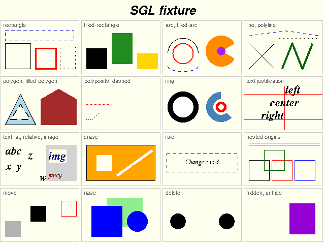
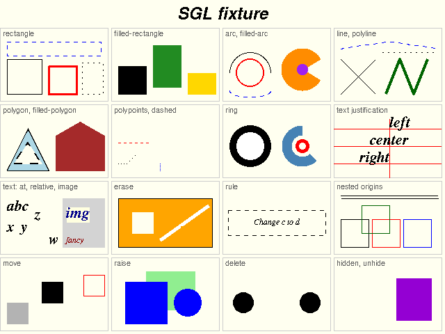
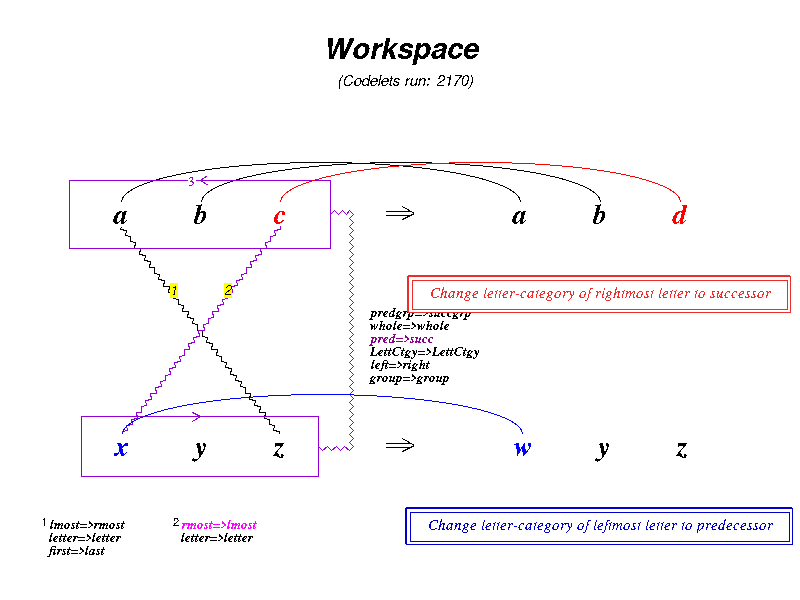
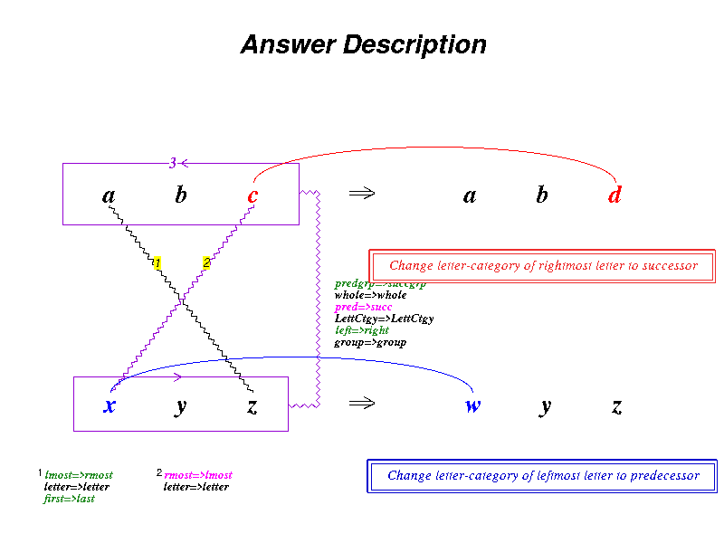
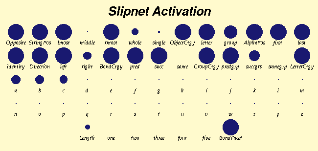
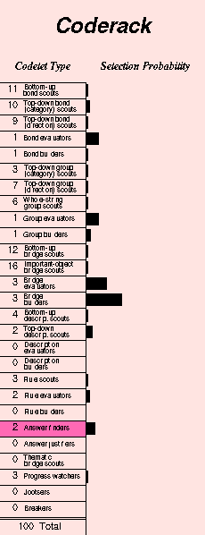
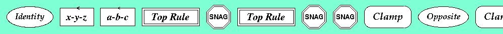
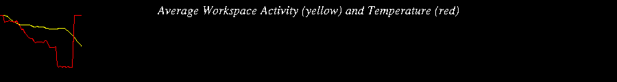

# `metacat/gui/`: the windows, on tkinter

The subpackage `metacat.gui` is the original's graphical interface, translated from its SWL
code to tkinter. It contains the SGL interpreter (Marshall's symbolic drawing language),
the fonts and colours, the window part of every `*-graphics.ss` panel, the control panel of
`gui.ss`, and the program that starts it all (`python3 -m metacat.gui`). The original drew
through SWL, which sent Tcl/Tk canvas commands. tkinter's Canvas is the same Tk canvas, so
the Python viewport sends the **same Tcl commands, argument for argument**, and a test
compares that command stream with one recorded from the original under Chez. The engine
([`metacat/`](../README.md)) never imports this package, and attaching windows never
changes a run.

<p>


</p>

*The SGL fixture (`python/oracle/sgl-fixture.scm`, every SGL form plus the tag
operations) drawn by `sgl.py` on a tkinter Canvas (left) and by the Racket port on
racket/draw (right).*

## Running

```bash
cd python
python3 -m metacat.gui          # or, once installed: metacat-gui
python3 -m metacat.gui 1.5      # scale every window by 1.5
```

How to use the control panel is in [`python/README.md`](../../README.md#the-gui).

## What's here

| Module | Lines | Origin | What it is |
|---|---:|---|---|
| `__main__.py` | 11 | | `python3 -m metacat.gui [SCALE]`: calls `app.main` |
| `app.py` | 250 | setup.ss's `setup` and `enable-resizing` | The Tk root (withdrawn, Tk scaling fixed at 96 dpi), `EngineThread`, the window layout (`arrange_windows`), `main` |
| `gui.py` | 1702 | gui.ss | The control panel, its command-line parser, buttons, speed slider, menus (Help, Demos, Windows, Options, Clear Memory) and dialogs, and the window controllers |
| `sgl.py` | 556 | sgl-interpreter.ss | `draw_bang`, `erase_bang`, `draw_exp`, the environment (`lookup`, `extend`), and `Viewport`, SWL's `<viewport>` |
| `swl.py` | 176 | (SWL) | `swl_tcl_eval`, `tcl_word` (Scheme values to Tcl words), `TkCanvas` (a tkinter Canvas as an SGL window), `ThreadSafeTk` |
| `fonts.py` | 299 | fonts.ss | `SwlFont`, `make_mfont`, `make_fixed_font`, `select_face`, `create_mcat_logo` (which also makes the hidden canvas that text is measured on) |
| `colors.py` | 817 | constants.ss (colours) | `swl_color`, `*color-names*`, `Rgb` |
| `constants.py` | 332 | constants.ss (graphics part) | Window sizes, the panels' colours, window titles |
| `hosts.py` | 319 | SWL `<toplevel>` + `<frame>`/`<scrollframe>` | Window hosts: `OffscreenHost` (the default: records, draws nothing) and `TkHost` (a real Toplevel and Canvas). `set_window_host_maker` chooses between them |
| `general_graphics.py` | 761 | general-graphics.ss (windows part) | Graphics windows and scrollable text windows. The pexp builders are the engine's `metacat/general_graphics.py` |
| `workspace_graphics.py` | 964 | workspace-graphics.ss | The Workspace (and the answer description drawn when answers are compared) |
| `slipnet_graphics.py` | 255 | slipnet-graphics.ss | The Slipnet and its 13×5 layout |
| `coderack_graphics.py` | 475 | coderack-graphics.ss | The Coderack. Each codelet type draws its own bar, urgency and count |
| `temperature_graphics.py` | 261 | temperature-graphics.ss | The thermometer |
| `theme_graphics.py` | 1008 | theme-graphics.ss | The Themespace's three windows (Top, Bottom and Vertical Themes) and their panels |
| `trace_graphics.py` | 486 | trace-graphics.ss | The Temporal Trace and its event icons |
| `memory_graphics.py` | 260 | memory-graphics.ss | The Episodic Memory and its answer icons |
| `commentary_graphics.py` | 134 | commentary-graphics.ss | The Commentary (Eliza and plain versions of every paragraph) |
| `eeg_graphics.py` | 173 | eeg-graphics.ss (window part) | The EEG window. The EEG object itself is the engine's |
| `views.py` | 152 | (racket/gui/views.rkt) | `load_views()`, `attach_views(scale)`, `attach_workspace_view()` |
| `help.txt` | | `chez_scheme/original/help.txt` | The Help text, unchanged (package data) |

Each module's docstring names its `.ss` file and the Racket file it was checked against.
Changes forced by SWL's absence are marked `port:` in the code.

## How it works

### SGL on a Tk canvas

Marshall wrote Metacat's graphics in SGL, a symbolic graphics language from SchemeXM, and
later wrote an SGL interpreter on SWL to keep that code. Panels build *pexps*, nested lists
such as

```scheme
(let-sgl ((origin (x y)) (foreground-color c) (font f))
  (rectangle (x1 y1) (x2 y2))
  (text (x y) "string"))
```

and hand them to a `<viewport>`. The forms are rectangles, arcs, lines, polylines,
polypoints, rings, polygons, text, erase, clear and rule. `sgl.py` is that interpreter,
definition for definition. Its `Viewport` methods turn coordinates into pixels and call
`swl_tcl_eval(window, "create", "rectangle", ...)` with the same arguments the original
passed. A *window* is any object with a `tcl(*args)` method:

- `swl.TkCanvas` turns each argument into a Tcl word (`tcl_word`: symbols, numbers, Scheme
  strings, `Rgb` colours, fonts) and calls the tkinter Canvas's widget command. So the
  items, tags, dashes, anchors and fonts on screen are the ones the original made.
- The tests use a recording window and compare its commands with
  `python/fixtures/sgl-tcl/`, which the original sent to a recording `swl:tcl-eval` under
  Chez ([`python/oracle/`](../../oracle/README.md)).

Text is measured as in the original: by creating a text item on a hidden canvas and asking
Tk for its `bbox`. `fonts.load()` picks the serif, sans-serif and fancy faces from Tk's
font families, so it needs a display. Call `fonts.load()` and then `sgl.load()` once Tk is
up.

### Engine and views

The model talks to its windows through globals such as `*workspace-window*`
(`setup.g_workspace_window`), by sending them messages, as the original does. Headless,
those globals hold null windows (`metacat/headless.py`). With the views:

1. `views.load_views()` loads these modules in metacat.ss's order. Their `load()` installs
   in the engine the colours, fonts and procedures the model reads (in
   `metacat/view_globals.py`, `#f` until then).
2. `views.attach_views(scale)` makes every window, as setup.ss's `(setup)` does, turns the
   graphics switches on, and returns the windows by name.

```python
from metacat import headless
from metacat.gui import views
headless.run_problem(["abc", "abd", "xyz"], 3852097033, 3000, views=views.attach_views)
```

This prints the same output and writes the same trace as a run without views. By default
the windows get `OffscreenHost`s, which need no display and count the items drawn on them.
The GUI and the picture scripts install `hosts.tk_host_maker(root)` to get real Toplevels.

### Threads

In the original, the model ran in the Chez REPL thread, and SWL serialized Tk calls on its
event thread. Here:

- **`app.EngineThread`** stands for the REPL thread. The control panel hands it thunks
  through `gui.thread_break` (SWL's `thread-break`): `init-mcat` and `run-mcat`, `go`, and
  so on. It runs them one at a time, each through `run.toplevel`. When run.ss's `break`
  parks the run (an answer, Stop, a breakpoint, step mode), control returns to the thread,
  and the next `go` resumes the run exactly where it stopped, even inside a codelet. That
  is why the engine has a thread of its own rather than stepping from Tk's `after`.
- **Tk's main thread** runs `mainloop` and only answers events, so the GUI stays
  responsive.
- **`swl.ThreadSafeTk`** wraps the root's Tcl interpreter before any widget exists. A Tk
  call from the engine thread is queued, the main thread is woken through a pipe that Tk's
  event loop watches, runs the call, and hands back plain Python values. tkinter's own
  cross-thread calls crashed under Xvfb; see
  [`docs/anomalies_and_quirks.md`](../../../docs/anomalies_and_quirks.md).

### What SWL provided, and what replaces it

SWL's widgets were Tk widgets under other names, so `gui.py` uses tkinter's own:
`<toplevel>` is a `Toplevel`, `<entry>` an `Entry`, `<scale>` a `Scale`, `<button>` a
`Button`, and so on. They are packed as gui.ss packs them, with the same options. On top of
that:

- `MenuItem`/`Menu` keep SWL's menu-item objects, which existed before their menu.
- `SwlToplevel` runs its destroy-request handler first, as SWL's did.
- `(pause 700)` in the GUI thread becomes a Tk timer.

The original left window placement to the window manager. `app.arrange_windows` places the
windows the way the Racket port does.

## Pictures

These were rendered by `python/tests/render_views.py` under Xvfb, at Run 7's answer `wyz`
(`abc abd xyz`, seed 3852097033). More renderings, of several scenes, are in
[`python/tests/snapshots/views/`](../../tests/snapshots/views/).

<p>


</p>

*The Workspace at the answer, with the top rule (red), the bottom rule (blue) and the
crossed bridges. Right: the same answer as an Answer Description, the Workspace's view of a
remembered answer.*

<p>


</p>

*The Slipnet's activations and the Coderack. Known flaw: under Xvfb, the Coderack's tiny
labels drop letters ("Bond bu ders" for "Bond builders"). This hasn't
been checked on a real screen yet.*



*The Temporal Trace of Run 7, in order: concept activations (ovals), groups, top rules,
snags and clamps, on the way to `wyz`.*



*The EEG after 800 codelets: average Workspace activity (yellow) and temperature (red).*

The other panels are in the same folder:
[temperature](../../../docs/screenshots/panels/temperature-run7-answer.png),
[top themes](../../../docs/screenshots/panels/top-themes-run7-answer.png),
[vertical themes](../../../docs/screenshots/panels/vertical-themes-run7-answer.png),
[memory](../../../docs/screenshots/panels/memory-run7-answer.png) and
[commentary](../../../docs/screenshots/panels/commentary-run7-answer.png).

## Testing

All GUI tests run without a display or under `xvfb-run`, never on the real screen. See
[`python/tests/README.md`](../../tests/README.md):

- `test_sgl.py`: the SGL battery, the Tcl command stream against the oracle's, fonts,
  colours and the viewport's mouse handling. Slow tier: the fixture drawn on a real Canvas
  (`render_sgl_fixture.py --check`).
- `test_graphics.py`, `test_panels.py`, `test_gui_windows.py`, `test_gui_panels_a.py`: the
  panels against the Chez batteries and against their `.ss` files.
- `test_views.py`: the 109 goldens with every window attached, plus eight scenes drawn on
  Tk.
- `test_gui.py`: the control panel's logic against Chez (`gui-battery.scm`). Slow tier:
  `drive_gui.py` drives the whole GUI through its widgets, and each run's trace must equal
  its golden.
