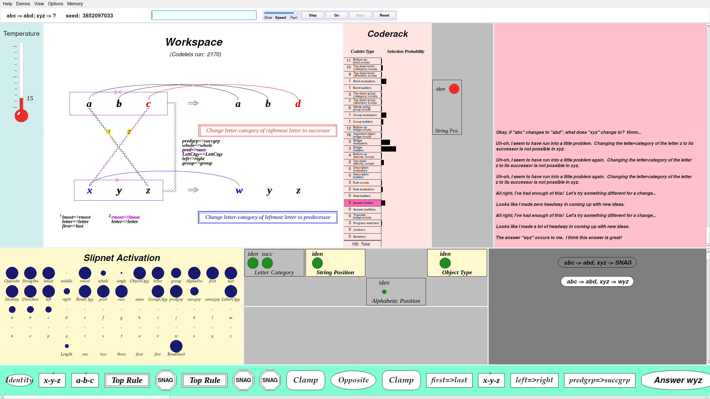

# `metacat/qt/`: Metacat in one window, on Qt

The subpackage `metacat.qt` is a second GUI for the Python port: the original's ten-odd
windows (Workspace, Slipnet, Coderack, Temperature, the three Themes, Temporal Trace,
Episodic Memory, Commentary, EEG) as **panes of a single PySide6 main window**, with the
control panel as a strip at the top and every menu of the original in a menu bar. The
panels are not redrawn by hand. Each one draws exactly as it does in the tkinter GUI, by
sending the original's Tk canvas commands, and `canvas.py` executes those commands on a
`QGraphicsScene`. The engine runs in a worker thread, and watching never changes a run:
a run in this window gives exactly its golden trace. The tkinter GUI
([`metacat/gui/`](../gui/README.md)) is still there, unchanged. The design and the
inventory of the tkinter GUI it was checked against are in
[`docs/qt-gui-plan.md`](../../../docs/qt-gui-plan.md).


*Run 7 of the dissertation (`abc abd xyz`, seed 3852097033) at its answer `wyz`, codelet
2170, in a 1920×1080 window (the default layout, grabbed offscreen with
`QWidget.grab()`). Top: the menu bar and the control strip. First row: the Temperature
(15), the Workspace with its crossed bridges and both rules, the Coderack, the Vertical
Themes and the Commentary (three snags, then "I think this answer is great!"). Second row:
the Slipnet, the Top and Bottom Themes, and the Episodic Memory (the snag and the answer).
Bottom: the Temporal Trace. The EEG is hidden by default, as its window was.*

> *"The answer "wyz" occurs to me. I think this answer is great!"*
>
> — Metacat, Run 7


> *"Aha! I see why this answer makes sense. I think it's a pretty dumb answer."*
>
> — Metacat, asked to justify `ijk → abd` for `abc → abd`

*Asked to justify the literal-minded answer `abd` (seed 1, codelet 1835), Metacat builds rules that turn each letter of `ijk` into `a`, `b` and `d`, sees why they work, and isn't impressed. Every pane is shown here, including the Bottom Themes and the EEG (bottom), which justify runs bring into play.*

## Running

PySide6 (6.5 or later) is an optional dependency. The engine and the tkinter GUI still
need only the standard library.

```bash
pip install -e 'python[qt]'   # the package plus PySide6; installs the metacat-qt command
metacat-qt                    # or, from python/ in a checkout: python3 -m metacat.qt
```

Without PySide6, `metacat-qt` prints `The Qt GUI needs PySide6: pip install -e
'python[qt]'` and exits with status 1.

The command line starts with Run 7, `abc abd xyz 3852097033`, so pressing **Enter** starts
it at once. `metacat-qt abc abd ijk 7` starts with another problem, and `metacat-qt
--empty` with an empty box, as the original does.

Type a problem into the command line and press Enter (`abc abd xyz`, `abc abd xyz 7` with
a seed, `abc abd xyz wyz` to justify an answer), then **Go**, **Step**, **Stop** or
**Reset**, as in the original. A click on the Workspace continues a run after an answer;
clicks on the Trace, the Memory and the Themes do what they did in the original's windows.
The menus are the original's, in its order: **Help** (the original's help text),
**Demos** (the 35 runs of the dissertation), **View** (in place of Windows), **Options**
(breakpoints, step interval, the switches, clamps, the commentary font, Save commentary)
and **Memory** (Clear Memory).

Options, for scripts and tests:

| Option | What it does |
|---|---|
| `--settings INI` | Save the layout in this INI file. Default: `$METACAT_QT_SETTINGS`, or else Qt's user settings for `fargonauts/metacat-qt` (on Linux, `~/.config/fargonauts/metacat-qt.conf`) |
| `--quit-after MS` | Close the window and quit after MS milliseconds |
| `--screenshot PNG` | With `--quit-after`: grab the window into PNG just before quitting |

Headless, with no display at all: `QT_QPA_PLATFORM=offscreen metacat-qt --quit-after
3000 --screenshot window.png`. Every test runs this way.

## The layout

The panes sit in a fixed tree of `QSplitter`s, not in docks: three rows (60 %, 31 % and
9 % of the height), each with panes that keep their original aspect ratio and one that
takes the rest of the width (the Commentary in the top row, the Memory in the middle row).

- **Resizing.** Drag a splitter handle. Each panel redraws at its pane's new size through
  the original's own resize protocol (`make-resizable` and the resize listener), so the
  pictures stay sharp. Panels that don't scroll keep their window's aspect ratio and are
  letterboxed in their background colour; the Trace, the Memory and the Commentary scroll.
- **Hiding and showing.** View has one checkable item per pane, plus Show all panes, Hide
  all panes and **Reset layout**. A hidden pane's space goes to its neighbours. Showing
  the EEG doubles the height of the bottom row.
- **Saving.** The splitter sizes (once a handle has been dragged), the hidden panes and
  the window's geometry are saved 500 ms after a change and at close, and restored at the
  next start. Reset layout forgets them.
- **Screens.** 1920×1080 is the minimum screen; the window's minimum size is 1600×800 (or
  the control strip's width, about 1692 px). On a larger screen the window opens maximised
  and every pane grows. At 200 % scaling (a 4K screen) the panes have 1080p's logical
  sizes, drawn at twice the resolution.



*The same moment at 2560×1440: the same proportions, every pane larger. The Commentary's
wider paragraphs leave more room, and the Trace's icons and the Coderack's labels are
easier to read.*

## The modules

| Module | What it is |
|---|---|
| `__init__.py` | `has_pyside6()`. Imports no Qt, so it can be asked without PySide6 |
| `__main__.py`, `app.py` | The program: `main` (the `metacat-qt` command), `make_application` (high DPI), `open_settings`, `open_window`, and `setup`, which is setup.ss's window part on Qt hosts |
| `displaylist.py` | Tk 8.6's canvas display list, with no Qt: item ids, stacking order, tags, `create`/`delete`/`move`/`scale`/`raise`/`lower`/`itemconfigure`, and `bbox` with Tk's own per-kind rules. Any thread may draw on it |
| `canvas.py` | `QtCanvas`: the canvas object the panels draw on (`tcl(*args)`, background colour). Its `sync()`, on the GUI thread, applies the display list's changes to the `QGraphicsScene`, whose items paint as X11 paints Tk's items. `HiddenCanvas` for text measurement |
| `fontspec.py`, `fonts.py` | Tk font words parsed as Tk parses them, made into `QFont`s, and measured with the same `QFont` (ascent and descent from the glyphs' ink, as X core fonts do) |
| `hosts.py` | `QtHost`: each graphics window becomes a `Pane` (a `QGraphicsView`), with the resize policy, scroll bars, mouse presses, and `collect_on_gui_thread()` |
| `engine_bridge.py` | `GuiInvoker` (post to the GUI thread; a blocking call with a timeout) and `EngineBridge` (the engine's REPL thread) |
| `controls.py` | `QtControlPanel`, gui.ss's control panel object: the control strip, the menu bar, the input, confirm, theme-edit and help dialogs |
| `mainwindow.py` | `MainWindow`: the splitter tree, `default_sizes`, the 50 ms sync timer, View's show/hide and Reset layout, and the saved layout (`QSettings`) |
| `icon.py` | The window icon: the original's Logo (`create-mcat-logo`), drawn by its own Tk command |
| `grab.py` | `grab_png(widget, path)`: `QWidget.grab()` into a PNG |

## How it works

- **The canvas.** Item 01 of loop0003 inventoried every Tk canvas command the panels send,
  from the code, the `sgl-tcl` fixtures and two full runs
  (`python/tests/data/tk-canvas-commands.json`): `create` of six kinds, `delete`, `move`,
  `itemconfigure`, `bbox`, `raise`, `scale` and `canvasx`/`canvasy`. `displaylist.py`
  implements exactly those. Replaying the same streams into tkinter and into the Qt canvas
  gives identical display lists: ids, stacking order, coordinates, every option, tags and
  every `bbox` (text extents within 2 px, from the different fonts).
- **Threads.** The engine draws from its worker thread on the display list. Every 50 ms
  the GUI thread syncs each changed item into its scene and paints, holding
  `canvas.PAINT_GATE`; a canvas command waits for that lock, never for a call into the GUI
  thread. Answers the panels need (`bbox`, text widths) come straight from the display
  list and the font metrics, so there is no blocking round trip to deadlock on. Widget
  changes from the worker (the control strip, dialogs) are posted to the GUI thread. Each scene item
  records its painter calls once after a change and replays them, because every PySide6
  call from Python waits for the GIL that the engine holds. Python's cyclic garbage
  collector runs only on the GUI thread (`hosts.collect_on_gui_thread`), because freeing a
  Qt widget on the worker thread deadlocked.
- **Speed.** Run 7 from Go to its answer, slider at Fast, takes 6.2–7.1 s in this window
  and 6.2–6.6 s in the tkinter GUI (same machine, interleaved; `docs/qt-gui-plan.md` 2.5).
- **Fonts.** Qt draws antialiased text from the same faces (Nimbus Sans for Helvetica,
  Liberation Serif for Times). The Coderack's 8-px labels keep their `i`s and `l`s, which
  Tk's 1-bit X core fonts drop
  ([`docs/screenshots/README.md`](../../../docs/screenshots/README.md), small text).

What differs from the original's GUI, and why, is in
[`docs/divergences.md`](../../../docs/divergences.md), in the "Python Qt GUI" sections.
Oddities found on the way (Qt offscreen, PySide6 and the GIL, pytest-qt) are in
[`docs/anomalies_and_quirks.md`](../../../docs/anomalies_and_quirks.md).

## Tests

The Qt tests are `python/tests/test_qt_*.py`. Each starts with
`pytest.importorskip("PySide6...")`, so they skip cleanly without PySide6, and they run
last, offscreen (`QT_QPA_PLATFORM=offscreen`, set by `run-tests.sh`), without any X
server. `bash python/run-tests.sh --qt` runs only them.

| File | What it checks |
|---|---|
| `test_qt_skeleton.py` | The package, the extra, the skip when PySide6 is missing, a window grab |
| `test_qt_canvas.py` | The display list against tkinter's for the same command streams; the scene; the SGL fixture's pixels |
| `test_qt_fonts.py` | Font words, metrics and colours against Tk's |
| `test_qt_panes.py` | Every panel in its pane; run 7 with every pane gives its golden; resizing during a run |
| `test_qt_engine.py` | Every scenario of the tkinter GUI's driver (full run, step, breakpoint, stop and restart, reset, a demo, a justify run, 50 rapid Go/Stop) gives its golden; responsiveness |
| `test_qt_menus.py` | Every menu item and control of the tkinter GUI's inventory, in each run state |
| `test_qt_clicks.py` | Clicks and keys give the same model states and traces as in the tkinter GUI |
| `test_qt_layout.py` | Saving and restoring the layout, Reset layout, the minimum size, high DPI, every pane after a run at 1920×1080 and 2560×1440 |
| `test_qt_audit.py` | The final audit: every entry of the tkinter inventory mapped to its Qt test; the windows as panes, the slider, the Input dialogs, the buttons; no GUI toolkit in a headless run |
| `test_install.py` | A fresh venv with `pip install -e 'python[qt]'` opens and closes `metacat-qt` headlessly; a venv without PySide6 still runs the engine and the tkinter GUI |

The screenshots above were made by `python3 python/tests/drive_qt_layout.py OUTDIR run7
--screen 1920x1080` (and `2560x1440`), which runs Run 7 in the window offscreen, checks
the codelet count and random state at the answer against the golden, and grabs the window
and every pane.
