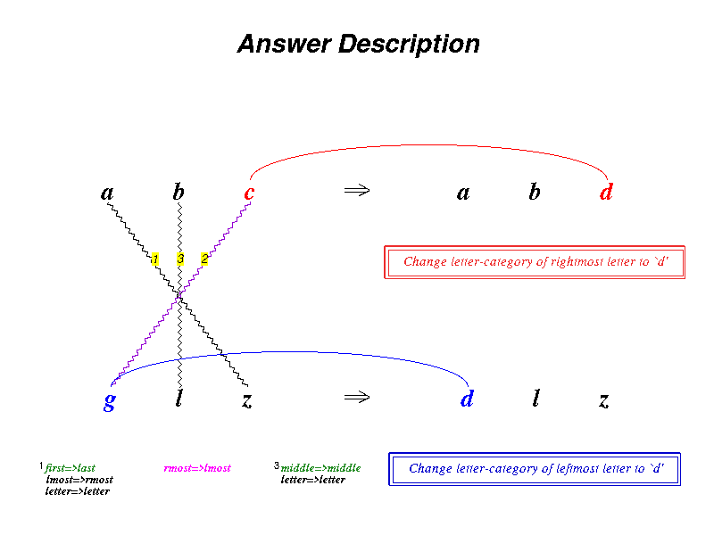
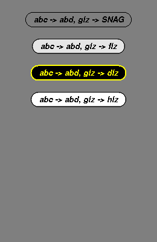

# `python/tests/`: the Python port's tests

These are pytest tests for the Python port, with their helpers. Almost every expected value
comes from Chez Scheme 10 running the unedited original. It reaches the tests either through
the frozen fixtures in [`python/fixtures/`](../fixtures/README.md), or live, by running the
oracle next to the Python. The checks range from Chez's random generator and printer up to
the 109 golden traces, 720 extra-seed runs, and the GUI driven through its own widgets.
Each test file was written before the code it checks, and failed first; that is recorded in
[`ralph_loops/loop0002/PROGRESS.md`](../../ralph_loops/loop0002/PROGRESS.md).

## Running

```bash
bash python/run-tests.sh            # full tier: all 1640 tests, about 10 min on 32 idle cores
bash python/run-tests.sh --fast     # fast tier: 1159 tests, about 25 s; no display
bash python/run-tests.sh --qt       # the Qt GUI's tests alone (test_qt_*.py)
bash python/run-tests.sh -k golden  # extra arguments go to pytest
cd python && python3 -m pytest tests/test_chez.py -q   # one file
```

`run-tests.sh` runs `python3 -m pytest -x -q` from `python/`, so it stops at the first
failure. The tier is the `slow` marker, declared in `pyproject.toml`: `--fast` adds
`-m "not slow"`. The gate `ralph_loops/loop0002/gate.py` runs the full tier. `conftest.py`
puts `python/tests/` and `python/oracle/` on `sys.path`, so tests can import the helpers and
`capture.py`.

Requirements:

- **Fast tier:** Python 3.12 and pytest. No display. Chez runs nothing here, but two
  freshness tests (`test_extra_seeds.py` and `test_sgl.py`, the `SOURCES` checks) ask
  `scheme --version`, so they fail without Chez.
- **Slow tier:** Chez Scheme 10 as `scheme` or `chezscheme` (the live-oracle comparisons
  and the re-captures), `xvfb-run` (every test that opens Tk windows), and many cores. The
  golden and extra-seed runs fork one process per run, in parallel.

GUI tests never open windows on the real screen. The Qt tests (`test_qt_*.py`, loop0003)
need PySide6 and skip without it; each starts with `pytest.importorskip("PySide6...")`, and
`run-tests.sh` exports `QT_QPA_PLATFORM=offscreen`, so they need no X server. The tkinter tests run their scripts under
`xvfb-run -a`, with `WAYLAND_DISPLAY` unset, and every script exits by itself.

## Test files

The counts are the tests pytest collects (fast + slow).

| File | Tests (fast + slow) | What it checks | Needs |
|---|---:|---|---|
| `test_fixtures.py` | 66 + 1 | The fixture pipeline: a folder per battery, one fixture per test (counted independently), the split/join round trip, `SOURCES` unchanged. Slow: every battery re-captured, byte-identical | slow: Chez |
| `test_name_mapping.py` | 29 | The Scheme → Python name mapping is valid and injective on the original's ~1,300 names | |
| `test_object_prototype.py` | 32 | Item 01's object-system candidates against the utilities battery's object tests, plus a micro-benchmark | |
| `test_chez.py` | 62 | `metacat/chez.py`: the PRNG (every draw and state), exactness, rounding, libm bits, the printer, `sort` and `map` orders (`chez-battery.scm` and the utilities battery) | |
| `test_utilities.py` | 213 | `objects.py`, `sugar.py`, `utilities.py`: all 197 tests of `utilities-battery.scm`, plus `utilities-extra` | |
| `test_coderack.py` | 53 | `constants.py`, `setup.py`, `coderack.py`, `descriptions.py`: `coderack-battery.scm` (bin choice at every temperature, `choose-codelet` over seeds...), plus `coderack-extra` | |
| `test_slipnet.py` | 58 | `slipnet.py`, `images.py`: the initial Slipnet, 20 activation updates to the last bit, images, plus `slipnet-extra` | |
| `test_workspace.py` | 106 | The Workspace modules and `formulas.py`: the initial workspace of every problem and seed, live queries, fakes, plus `workspace-extra` | |
| `test_codelets.py` | 22 + 67 | Bonds, groups, concept mappings, codelet by codelet: 400-codelet traces of every problem and seed (`codelet-battery.scm`). Fast: the first seed of problem 0 | |
| `test_bridges.py` | 11 + 48 | Bridges and breakers: 1000-codelet traces of every problem and seed, plus nine bridge matrices. Fast: 300 codelets of problem 0 | |
| `test_rules.py` | 29 + 51 | Rules and answers: traces up to the first answer, the first-answers summary, twelve rule matrices, plus `rule-extra` (the `caddr`-of-`#f` crash) | |
| `test_golden.py` | 28 + 110 | The 109 golden traces, byte for byte, through the package's headless driver. Fast: `a b z` seed 1, plus `trace-extra` and structural checks of item 10's files. Slow: all 109, and the original's crash on `abc ccbbaa ijk` seed 3 against the live oracle (the 1062 trace lines before it) | slow: Chez |
| `test_run.py` | 14 | `run.py`: break, go and step mode, each scenario in a fresh process (`run_scenarios.py`). A run stopped at 150, 300 and 450 codelets and resumed equals the run never stopped | |
| `test_cli.py` | 6 + 24 | `python3 -m metacat` next to the live oracle's `run.ss`: same stdout and exit code on an answer, no cap, a cap, justify, keep-going, verbose, the halt run, the crash run, twelve bad argument lists, `--trace`, a clock seed. Fast: the usage errors alone | slow: Chez |
| `test_extra_seeds.py` | 3 + 2 | The 720 extra-seed runs, each in a fresh fork: exit code, stdout, first stderr line, trace hash and length (about 2 min). Then the oracle's side re-captured, byte-identical (about 1.5 min). Fast: the fixture's sources and job list | slow: Chez |
| `test_sgl.py` | 67 + 2 | `gui/sgl.py`, `gui/fonts.py`: `sgl-battery.scm`, the Tcl command stream against `fixtures/sgl-tcl/`, fonts, colours, mouse handling. Slow: the stream re-captured, and the fixture drawn on a real Canvas (`render_sgl_fixture.py --check`) | slow: Chez, xvfb |
| `test_graphics.py` | 71 | The engine's part of the graphics files (`graphics-battery.scm`, flonum coordinates to the last bit), the EEG object, structure and no tkinter | |
| `test_panels.py` | 47 | The panels against `panels-battery.scm`, on offscreen views | |
| `test_gui_windows.py` | 17 | Graphics and text windows against a recording canvas (transforms, caching, erase, clear, flash, text metrics), the Workspace window, and structure | |
| `test_gui_panels_a.py` | 25 | The Slipnet, Temperature, Coderack, Commentary and EEG windows against their `.ss` files and a recording window | |
| `test_views.py` | 1 + 112 | Watching changes nothing: goldens with every window attached give the golden traces, and every window was drawn into. Fast: one short golden. Slow: all 109, the crash run, and eight scenes drawn on Tk (`render_views.py`) | slow: xvfb |
| `test_gui.py` | 20 + 1 | The control panel: `gui-battery.scm` (parser, Step/Go/Reset decisions, speed settings, titles, demos, clamp patterns), structure, and that a headless run loads no tkinter or `metacat.gui` module. Slow: `drive_gui.py` drives the GUI, and each run's trace must equal its golden | slow: xvfb |
| `test_tk_gui_inventory.py` | 5 + 1 | The inventory of the tkinter GUI (`data/tk-gui-inventory.json`, loop0003 item 00) lists every window, its mouse handlers, every menu item `gui.py` defines (read from its source), the run states, the dialogs and the bindings. Slow: `tk_gui_inventory.py` regenerates it under Xvfb, and it must equal the committed one (font keys aside) | slow: xvfb |
| `test_tk_canvas_inventory.py` | 8 + 2 | The Tk canvas commands the panels send (`data/tk-canvas-commands.json`, loop0003 item 01, made by `tk_canvas_inventory.py`): every command, item kind, option, enumerated value, target form, tag and canvas method, from the code (read with `ast`; a computed command outside the known forwarders fails), the `sgl-tcl` fixtures and, slow, recording canvases in run7 and a justify run with every view attached. A command a module sends that the list lacks fails | |
| `test_qt_skeleton.py` | 11 | The Qt GUI's harness (loop0003 item 01): `MainWindow` opens and closes offscreen, `python3 -m metacat.qt --quit-after` exits by itself, `metacat.qt.grab.grab_png` writes a PNG of the widget's size, every `test_qt_*.py` skips cleanly in a fresh pytest with PySide6 hidden and runs after every other test file (conftest.py; the `QApplication` starts a thread, and other tests fork), the `qt` extra, and no PySide6 in the engine or the tkinter GUI | PySide6 (skips without) |
| `test_qt_canvas.py` | 14 + 1 | The Qt canvas (loop0003 item 02, `metacat/qt/displaylist.py` and `canvas.py`). The two `sgl-tcl` streams and a synthetic one (arrows, smoothing, justification, raise/lower, scale, ids, tag lists, hidden items, colour forms, 160 random arcs, lines, polygons and rectangles) are replayed into it and compared with a tkinter Canvas's display list (`data/tk-display-lists.json`, made by `canvas_streams.py`). With Tk's text metrics, ids, order, kinds, coordinates, options, tags and every `bbox`/`canvasx` answer are identical. With Qt's fonts, only text extents differ, by 2 pixels at most. Also: every inventoried command and option is accepted, Tk's errors, ids never reused, drawing from 8 threads, the scene following the display list, and the SGL fixture drawn through `sgl.py` (render_sgl_fixture's pixel checks, more than 97% of pixels like the tkinter picture). Slow: `canvas_streams.py` under Xvfb regenerates the reference, which must equal the committed one (text extents within the tolerance) | PySide6; slow: xvfb |
| `test_qt_fonts.py` | 63 + 1 | The Qt GUI's fonts and colours (loop0003 item 03, `metacat/qt/fontspec.py` and `fonts.py`). The font mapping table (list, Tcl-string and `-option` forms, styles, points at 96 dpi, `TkDefaultFont`, size 0) and Tk's error messages; the `QFont` carrying it; against Tk under Xvfb (`data/tk-fonts-colors.json`, made by `tk_fonts_colors.py`): sample widths (97% exact), ascent within 1 pixel and linespace within 3; a text item's `bbox` is the measured width and linespace, the drawn ink lies inside it, and fonts.ss measures on the Qt hidden canvas after `install()`; `families()`; the 5- to 11-pixel Coderack labels keep their `i`s and `l`s; all colour names of `colors.py` read as Tk reads them and painted so. Slow: `tk_fonts_colors.py` under Xvfb gives the committed reference | PySide6; slow: xvfb |
| `test_qt_panes.py` | 21 + 8 | Panels in panes (loop0003 item 04, `metacat/qt/hosts.py`, `mainwindow.py`, `app.py`). The default sizes of `docs/qt-gui-plan.md` 2.2; the splitter tree, non-collapsible, EEG hidden; a Qt host is a `QGraphicsView` of its canvas's scene and opens no window of its own; letterboxing at Tk's (w+2):(h+2) (the Temperature at the top) with the margins in the panel's background; scrolling panes beside their scroll bar; configures only once resizable, never for tiny panes, fed one at a time so that every window resized at once redraws, and sent again for a pane that came back to its size; scroll region and scrolling from other threads wait for `sync`; `canvasx` follows the scroll bar; fonts.ss measures from four threads at once without losing items; `python3 -m metacat.qt` opens every pane; `a b z` seed 1 in the panes (`render_qt_panes.py`) gives its golden. Slow: run7 at 300 and 800 codelets and at the answer gives its golden (prefixes for the capped runs), every pane has items, the panes keep the main colours of `snapshots/views/`, and run7 with 14 window resizes gives its golden | PySide6 |
| `test_qt_engine.py` | 16 + 1 | The engine thread and run control in the Qt GUI (loop0003 item 05, `metacat/qt/engine_bridge.py`, `controls.py`). The bridge: `post` runs on the GUI thread later, `call` waits for the GUI thread's value (directly on the GUI thread; a timeout instead of a hang). The control panel: it starts disabled with its prompt; the run, input and disabled modes enable the widgets as gui.py's `_enable_all` does; a message from another thread changes nothing until the GUI thread runs it; "Invalid input!" for 700 ms; the speed slider sets the pauses as gui.py's slider does; Stop sets `*interrupt?*`; the breakpoint and step interval dialogs read their input as gui.ss's `input-dialog` does; an engine error goes back to input mode. Painting: no Python `boundingRect` in the scene items, and a view repaints while another thread runs Python and draws (`qt_paint_probe.py`, a fresh process). `drive_qt_gui.py` drives a full run whose trace equals its golden. Slow: every scenario of `drive_qt_gui.py` | PySide6 |
| `test_qt_menus.py` | 21 | The Qt GUI's control strip, menus and dialogs against `data/tk-gui-inventory.json` (loop0003 item 06). `drive_qt_menus.py` (a fresh process) records the menu bar and the control panel in the inventory's five states. Every menu item is in the Qt menu bar with its label, kind, font, check state and demo problem; the item states and the control panel's widgets (states, texts, colours, fonts, Enter) match in each state, mapped as `docs/divergences.md` says (View for Windows, …); every demo inits its problem; self-watching off hides the Themes panes; the Help window, the Clear Memory and theme-edit dialogs and Save commentary; a real run enables only Stop; the strip fits a 1920-pixel window | PySide6 |
| `test_qt_audit.py` | 22 | The final audit (loop0003 item 11): the Qt GUI against `data/tk-gui-inventory.json`, entry by entry, for what the other Qt tests don't compare. `drive_qt_audit.py` (a fresh process) reads every graphics window (each is a pane in a splitter with a View item, with the inventory's title, panel class, drawing module, scrolling, scroll bars, aspect, resize method, visibility at start, press handlers and background), the Logo as the window icon, the speed slider's settings at each recorded value, both Input dialogs (place, bad input, empty, a number, one dialog at a time), the buttons' actions and the close. `COVERAGE` maps every inventory key and dialog to the tests that check it, and fails on a new key. A short headless run imports neither PySide6 nor tkinter | PySide6 |
| `test_qt_clicks.py` | 10 + 2 | Mouse and keyboard parity with the tkinter GUI (loop0003 item 07). The panes give `Viewport.mouse_press` the modifiers of Tk's binding rules (Shift-left, any other left, any right; other buttons nothing), at the view pixel (canvasx adds the scroll); a double click is two presses; a margin press, the wheel and a broken handler change nothing; the entries take Return with any modifiers, not the keypad's Enter. Slow: `drive_qt_gui.py OUT clicks` runs `click_scenario.py` through QTest's events and gives the 27 model snapshots and 4 traces of `data/tk-clicks.json`; `drive_gui.py OUT invalid_input clicks` under xvfb-run regenerates that reference | PySide6; slow: xvfb-run |
| `test_qt_layout.py` | 15 + 2 | Layout polish (loop0003 item 08), each case in a fresh process (`drive_qt_layout.py`) on an offscreen screen: the default layout; a handle drag resizes the panes and is saved 500 ms later; hiding a pane closes the gap; the settings file's keys; save and restore round-trip the geometry, hidden panes (and View checkmarks) and splitter sizes; Reset layout restores the default panes and sizes and removes the saved layout, and the sizes follow the window again; an old layout version is ignored; the EEG doubles the bottom row; the window fills a 1080p screen, has a minimum size that keeps the strip whole, lays out in logical pixels at 200 % (grabs at 2x); the icon is the original's logo. Slow: after `abc abd ijk abd 1` at 1920×1080 and 2560×1440, every pane is visible, has items and pixels, and the run ends at its golden's codelet count and random state | PySide6 |
| `test_install.py` | 6 + 6 | Packaging. Fast: the declared commands (`metacat`, `metacat-gui`, `metacat-qt`), the `qt` extra (PySide6 only), packages and help text. Slow: a clean copy of `python/`, `pip install -e` and a regular install into fresh venvs, each running Run 7 (stdout equal to the live oracle's, trace equal to the golden) and opening the GUI. Loop0003 item 09: `pip install -e 'python[qt]'` (offline, PySide6 from the system site-packages) gives a `metacat-qt` that opens, grabs and closes the window offscreen; a wheel installed into a venv without system site-packages (no PySide6) runs Run 7 and the tkinter GUI, and its `metacat-qt` says it needs PySide6 (status 1) | slow: Chez, xvfb (PySide6 for the qt extra) |
| `test_engine_modules.py` | 3 | Each engine module imports alone in a fresh interpreter (no load, no random draw). Cross-module `from`-imports are limited to the allowed ones | |
| `test_quirk_sites.py` | 2 | The list of `# chez:` and `# 1.2:` sites in `docs/python-translation-plan.md` equals the code's | |

Totals: 1640 tests, 1198 fast and 442 slow.

## Helpers

| File | What it is |
|---|---|
| `conftest.py` | Puts `tests/` and `oracle/` on `sys.path`. Qt fixtures (loop0003): `qapp`, the session's `QApplication`, always offscreen, quit at the end; `grab(widget, name)`, a PNG in `tests/screenshots-qt/<test>/` (not committed) for inspection |
| `chez_fixtures.py` | `chez(battery, test)`: what Chez printed for that test. Also `manifest`, `values` |
| `scheme_canon.py` | `helpers.scm`'s `b:canon` and `b:num` for Python values, so a Python result can be compared with a fixture's text |
| `scheme_reader.py` | A small Scheme reader for quoted data in batteries and `sgl-fixture.scm` |
| `scheme_forms.py` | A minimal datum scanner. It counts a battery's `(test ...)` forms independently of Chez |
| `engine_stubs.py` | `engine_module(name, **attrs)`: stand-ins for globals of engine modules that weren't translated yet when a battery was. Everything is restored afterwards |
| `codelet_harness.py` | `tests/diff/codelet-harness.scm` in Python: a run-mcat loop restricted to some codelet types, the `b:compact` trace printer, and the bridges and rules settings |
| `golden_harness.py` | Reads `tests/problems.txt` as `make-golden.ss` does, and runs problems in parallel, each in a fresh fork of a fresh process where `headless.prepare()` has run. `oracle/bench_runs.py` uses it too |
| `run_scenarios.py` | The break/go scenarios of `test_run.py`. `python3 run_scenarios.py NAME` prints a result as JSON |
| `name_mapping.py` | Every name the original defines, for `test_name_mapping.py` |
| `object_prototypes.py` | Item 01's four object representations (six variants) and the micro-benchmark |
| `quirk_sites.py` | Lists the `# chez:`/`# 1.2:` sites. `--write` rewrites the list in the plan |
| `render_sgl_fixture.py` | `xvfb-run -a python3 python/tests/render_sgl_fixture.py OUT.png [--check]`: draws the SGL fixture on a 640×480 Canvas, grabs it from the X server, and checks pixels |
| `render_views.py` | `xvfb-run -a -s "-screen 0 3000x2000x24" python3 python/tests/render_views.py OUTDIR [SCENE ...]`: draws the windows at points of golden runs on Tk and grabs each one as `WINDOW-SCENE.png` |
| `drive_gui.py` | `env -u WAYLAND_DISPLAY xvfb-run -a -s "-screen 0 2560x1600x24" python3 python/tests/drive_gui.py OUTDIR`: builds the GUI as `python3 -m metacat.gui` does and drives it from a second thread. It covers a full run, step mode, Stop and Go, a demo, a breakpoint, a click on the Workspace, Reset, the menus and dialogs (clamps included), saving the commentary and a resize, and grabs the screen. `timing` (only when named) times run 7 from Go to its answer, for the Qt GUI's comparison. A watchdog ends it after 10 minutes |
| `tk_gui_inventory.py` | `env -u WAYLAND_DISPLAY xvfb-run -a -s "-screen 0 1920x1200x24" python3 python/tests/tk_gui_inventory.py python/tests/data/tk-gui-inventory.json`: builds the GUI as `python3 -m metacat.gui` does and walks it: windows, control-panel widgets and their states in each run mode, menus, dialogs (opened and closed), bindings and the speed table. Writes the JSON that `docs/qt-gui-plan.md` summarises |
| `canvas_streams.py` | `env -u WAYLAND_DISPLAY xvfb-run -a python3 python/tests/canvas_streams.py python/tests/data/tk-display-lists.json`: reads the `sgl-tcl` streams, defines the synthetic stream, replays streams into any canvas and dumps normalised display lists (through `find`, `type`, `coords`, `itemcget`, `gettags`, `bbox`). Run as a script, it writes the tkinter reference, with Tk's own text metrics (under a second, exits by itself) |
| `tk_fonts_colors.py` | `env -u WAYLAND_DISPLAY xvfb-run -a python3 python/tests/tk_fonts_colors.py python/tests/data/tk-fonts-colors.json`: Tk's `font metrics`, `font actual -family` and `font measure` of sample strings for 252 font words (Helvetica, Times, Courier; 21 sizes; 4 styles), and `winfo rgb` of every colour name of `colors.py` (exits by itself) |
| `render_small_text.py` | `xvfb-run -a python3 python/tests/render_small_text.py tk OUT.png`, or `python3 python/tests/render_small_text.py qt OUT.png` (offscreen Qt): the Coderack's labels in 5- to 11-pixel Helvetica, drawn by Tk or by the Qt canvas (`docs/screenshots/panels/small-text-*.png`) |
| `qt_paint_probe.py` | `QT_QPA_PLATFORM=offscreen python3 python/tests/qt_paint_probe.py [--without-fix]`: 2 s of Qt's event loop with a 600-item pane changed every 50 ms while another thread runs Python and draws; prints the timer ticks and paint passes (about 40; 2 ticks with the GIL fixes undone) |
| `drive_qt_gui.py` | `QT_QPA_PLATFORM=offscreen python3 python/tests/drive_qt_gui.py OUTDIR [SCENARIO...]`: builds the Qt window as `python3 -m metacat.qt` does, with trace.ss's writer, and drives it from a second thread through the bridge (`drive_gui.py`'s counterpart): a full run, step mode, a demo stopped and restarted (the GUI must answer within 0.5 s and the panes repaint while it runs), a breakpoint, Reset, a justify run, 50 Go/Stop toggles and run 7's timing, each trace compared with its golden; grabs `window-run7.png`; the last line is a JSON object of measurements. A watchdog ends it after 10 minutes |
| `drive_qt_menus.py` | `python3 python/tests/drive_qt_menus.py OUTDIR`: builds the Qt window offscreen on a screen of the inventory's size, records `report.json` (the menu bar and the five control-panel states, as `tk_gui_inventory.py` recorded the tkinter GUI) and drives every menu item and dialog: the 35 demos, View (each pane, show/hide all, an empty splitter, Reset layout), the Options check items, the codelet clamps, the commentary fonts, Help, Clear Memory (Cancel, close, Yes), the theme-edit dialog (Cancel, Clamp Themes, no problem), Save commentary and a real run. Prints "ok NAME" per scenario; grabs the window, each menu and each dialog into OUTDIR. A watchdog ends it after 10 minutes |
| `drive_qt_audit.py` | `python3 python/tests/drive_qt_audit.py OUTDIR`: imports `drive_qt_menus.py` (its window and helpers) and records `audit.json` for `test_qt_audit.py`: the windows as panes, the icon, the speed slider, the two Input dialogs, the buttons and the close. Prints "ok NAME" per step; a watchdog ends it after 5 minutes |
| `click_scenario.py` | The mouse and keyboard scenario shared by `drive_gui.py` and `drive_qt_gui.py` (`clicks`, only when named): Enter and keypad Enter, a run stopped at a breakpoint and resumed by a Workspace click, Trace and Memory selections and the answer comparison, clicks that do nothing, and a theme-pattern clamp made by left, right and shift clicks on the Themes panes with the run that follows. Each click aims at a model object through the model's own hit test; the result is the model snapshots, the trace lines and the pixels used. Grabs three screenshots |
| `drive_qt_layout.py` | `python3 python/tests/drive_qt_layout.py OUTDIR SCENARIO --screen WxH[@DPR] [--settings INI]`: opens the window as `python3 -m metacat.qt` does (`app.make_application`, `app.open_window`) on an offscreen screen of WxH logical pixels (DPR 2: a 2W×2H screen and `QT_SCALE_FACTOR=2`) and runs one scenario from a driver thread: `save`, `restore`, `minimum`, `start`, `run` or `run7` (Run 7 in the default layout, for the README screenshots); grabs the window and each pane; the last line is a JSON object. A watchdog ends it after 5 minutes |
| `render_qt_panes.py` | `QT_QPA_PLATFORM=offscreen python3 python/tests/render_qt_panes.py OUTDIR SCENE [WxH] [--resize]`: a golden run (run7-300, run7-800, run7-answer, abz-1000) driven directly with every window in a pane of the Qt main window; writes the trace, the window and each pane as PNGs, and a JSON summary; `--resize` resizes the window every 150 codelets |
| `tk_canvas_inventory.py` | `python3 python/tests/tk_canvas_inventory.py python/tests/data/tk-canvas-commands.json`: the Tk canvas commands the panels send, from the code, the `sgl-tcl` fixtures and recorded runs (about 4 s, no display). `--record OUT problem... seed` records one run |

## How a battery test works

Take `test_utilities.py`. `CASES` maps each test name of `utilities-battery.scm` to a
Python function. The function rebuilds the battery's expression in Python, with the same
order of random draws and side effects. Its value goes through `scheme_canon.canon` and
must equal `chez("utilities", NAME)`. A separate test checks that `CASES` has exactly the
battery's names. Batteries whose forms share state (coderack, slipnet, workspace, panels)
run their cases in battery order, in one engine. The battery's top-level forms between
tests run first. The codelet-level batteries (codelet, bridge, rule) run their cases in a
pool of processes forked after the engine and harness are set up. On a failure, they name
the first differing trace line (problem, seed, codelet).

## `snapshots/`

Renderings kept for inspection, not compared by any test. Tests that draw write their
pictures to temporary directories. These were made by the scripts above under Xvfb:

| File | Made by |
|---|---|
| `sgl-fixture.png` | `render_sgl_fixture.py`, to set next to `racket/tests/snapshots/sgl-fixture.png` |
| `views/WINDOW-SCENE.png` | `render_views.py`: 56 pictures of the windows (workspace, slipnet, coderack, temperature, top/bottom/vertical themes, trace, memory, commentary, EEG) in the scenes `run7-300`, `run7-800`, `run7-answer`, `run7-answer-description`, `run7-snag-event`, `run7-clamp-click` (Run 7 = `abc abd xyz`, seed 3852097033), `xyd-justify` (a justify run) and `glz-compare` (two answers compared in the Memory) |
| `gui-run7.png`, `gui-final.png` | `drive_gui.py`: the whole screen at Run 7's answer, and at the end of the drive (`abc abd ijk`, seed 1, after a manual clamp) |

<p>


</p>

*The `glz-compare` scene: in the Memory (right), a snag and three answers to
`abc → abd; glz → ?`, with `dlz` selected, and the Workspace drawing that answer's
description (left).*

Known flaw: in these Xvfb renderings, the Coderack's tiny labels drop letters
("Bond bu ders"). This hasn't been checked on a real screen yet. Curated copies of some
pictures are in [`docs/screenshots/`](../../docs/screenshots/).
