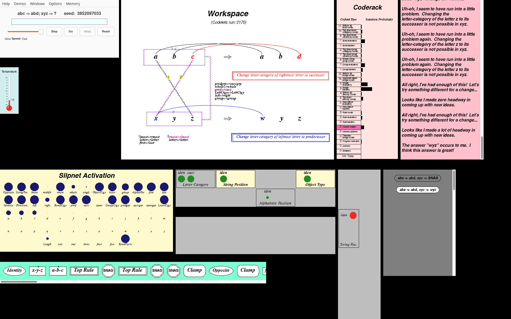
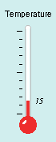
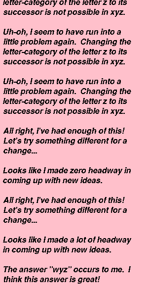
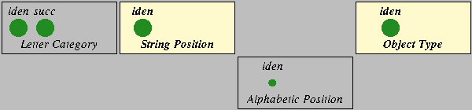
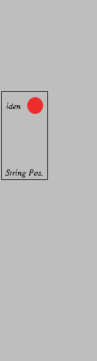
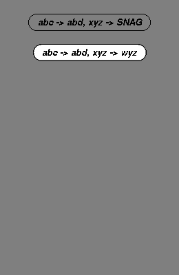

# racket/gui/: Metacat's windows and control panel

This folder holds the port's graphics. The original drew everything in **SGL**, a small
symbolic drawing language that Marshall interpreted onto Tk canvases through SWL
(`sgl-interpreter.ss`). Here the same interpreter draws on `racket/draw`, and an
emulation of the Tk canvas records what it draws. The original's window code
(Workspace, Slipnet, Coderack, Temperature, Themes, Temporal Trace, Episodic Memory,
Commentary, EEG) is included almost verbatim on top of it. The control panel (gui.ss)
is rebuilt on `racket/gui`. The windows only watch: attaching them changes nothing in a
run, and the 109 golden runs give the same traces with every window attached.



*`abc → abd; xyz → ?`, seed 3852097033 (Run 7 of the dissertation), at its answer `wyz`
after 2170 codelets. Top row: the control panel with the Temperature under it, the
Workspace, the Coderack and the Commentary. Bottom rows: the Slipnet, the Top and Bottom
Themes, the Vertical Themes, the Episodic Memory and the Temporal Trace.*

## Three layers

| Layer | Files | Needs | What it is |
| --- | --- | --- | --- |
| SGL on racket/draw | `sgl.rkt`, `fonts.rkt`, `colors.rkt` | racket/draw | The interpreter, a Tk-canvas emulation (`viewport%`), fonts and colours |
| The views | `views.rkt`, `engine-route.rkt`, `constants.rktl`, `general-graphics.rktl` and the `*-graphics.rktl` panels | racket/draw | The original's windows, drawn into display lists. Works offscreen, without a display |
| The GUI | `gui.rkt`, `gui.rktl`, `setup.rktl`, `one-window.rkt` | racket/gui | The control panel, on-screen frames (or panes of one frame), the engine thread |

Only `gui.rkt` and `one-window.rkt` require `racket/gui`. The engine ([`../engine.rkt`](../engine.rkt))
requires none of these files. [`../tests/no-gui-test.rkt`](../tests/no-gui-test.rkt)
walks the compiled imports to check both rules.

## Files

| File | Original | What it does |
| --- | --- | --- |
| `sgl.rkt` | sgl-interpreter.ss | The SGL interpreter (`draw!`, `erase!`, `draw-exp`, environments, dash patterns), line for line, plus `viewport%`, which stands for SWL's `<viewport>` (a Tk canvas). |
| `fonts.rkt` | fonts.ss | `swl-font%` (a Tk font as a racket/draw `font%`), `make-mfont`, face selection, text measuring on a private bitmap. |
| `colors.rkt` | constants.ss (colours) | `swl-color` and Tk's table of colour names (752 entries) as racket/draw `color%`s, and the common colours `=white=`, `=black=`, ... |
| `views.rkt` | (port) | One module that includes the graphics files in `metacat.ss`'s load order, on top of the engine. It provides the window host, SWL thread stand-ins, `attach-views!`, `attach-workspace-view!`, `window->bitmap` and `save-window-png`. |
| `engine-route.rkt` | (port) | The `define` and `set!` used by the included files. A definition or `set!` of a name the engine owns becomes `(set-global! 'name value)`, so the graphics files stay verbatim. |
| `constants.rktl` | constants.ss (graphics part) | Window sizes (`set-window-size-defaults`, scaled), panel colours, window titles. |
| `general-graphics.rktl` | general-graphics.ss (windows) | `make-graphics-window` and its scrollable variants, the scrollable text window, the resize listener. The pexp builders of the same file are in the engine. |
| `slipnet-graphics.rktl` | slipnet-graphics.ss | The Slipnet window: a 13×5 grid of nodes, activation as filled circles. |
| `workspace-graphics.rktl` | workspace-graphics.ss | The Workspace window: strings, bonds, groups, bridges, concept mappings, rules, answers, snags; its mouse handler resumes a stopped run. |
| `temperature-graphics.rktl` | temperature-graphics.ss | The thermometer. |
| `coderack-graphics.rktl` | coderack-graphics.ss | Codelet counts per type with selection-probability bars; the last codelet's type is highlighted. |
| `theme-graphics.rktl` | theme-graphics.ss | The Themespace windows (Top, Bottom and Vertical Themes) and their mouse handlers for editing themes. |
| `trace-graphics.rktl` | trace-graphics.ss | The Temporal Trace window: one icon per event. Clicking an event shows it in the other windows. |
| `memory-graphics.rktl` | memory-graphics.ss | The Episodic Memory window. Clicking answers shows their descriptions and compares two of them. |
| `commentary-graphics.rktl` | commentary-graphics.ss | The Commentary window (a scrollable text window). |
| `eeg-graphics.rktl` | eeg-graphics.ss (window) | The EEG window (Workspace activity and temperature over time). The EEG object itself is in the engine. |
| `gui.rkt` | (port) | The racket/gui module: `screen-host%` (a frame, or in pane mode a canvas in a parent panel, letterboxed at its window's aspect ratio), the refresh timer, the engine thread, `create-mcat-logo`, `arrange-windows!`. It includes `gui.rktl` and `setup.rktl`. |
| `one-window.rkt` | (port, loop0003) | The one-window GUI (`racket racket/one-window.rkt`): `setup-one-window` is setup.rktl's `setup` with the windows as panes (`make-pane-host-maker`) and the control panel built in the same frame (`set-control-panel-frame-maker!`) and moved into a strip. `pane-rects` lays the panes out as the Python Qt GUI does. |
| `gui.rktl` | gui.ss | The control panel: command-line parser, buttons, speed slider, menus, dialogs, help window, window controllers. |
| `setup.rktl` | setup.ss's `setup`, `enable-resizing` | Creates every window, the control panel and the engine thread; makes windows resizable; starts the refresh timer. |

Changes from the original are marked `port:` in the code and explained in
[`docs/porting-notes.md`](../../docs/porting-notes.md), items 12 to 15. What looks or
behaves differently is in [`docs/divergences.md`](../../docs/divergences.md).

## How it works

### SGL and the Tk canvas emulation

Panels build SGL expressions ("pexps"), such as
`(let-sgl ((origin (x y)) (foreground-color "red")) (text "abc"))`, and hand them to
`draw!`. The interpreter's code is the original's, so it sends the viewport the same
`draw-...` messages it sent SWL's viewport. Where SWL turned each message into a Tk
canvas item, `viewport%` records an `item` (kind, coordinates, options, tags) in a
**display list**, and `render` paints the list on any racket/draw `dc<%>`. It reproduces
the Tk behaviour the windows rely on:

- items are painted in creation order;
- tags work for `move`, `raise`, `delete`, `retag`, `rescale` and hidden items;
- Tk's dash patterns are reproduced;
- text is anchored at its bottom centre, as Tk drew it;
- there is a scroll region and a scroll position, and mouse presses go to the window's
  handlers with the scroll offset added.

The message stream is checked against the original's (`sgl-diff-test.rkt`). The
pixels are pinned by a snapshot of a fixture with every SGL form:


### Fonts and colours

`fonts.rkt` keeps fonts.ss's interface. A Tk size is points when positive and pixels
when negative. Points are converted at a fixed 96 dpi, so renderings don't depend on the
display. The original's face preferences are kept: serif is Times New Roman or Times,
sans-serif is Helvetica or Arial, and "fancy" is Palatino Linotype, Palatino and so on,
falling back to `times`/`helvetica` (fontconfig picks the actual face). Text is drawn
**aliased** (`'unsmoothed`). The windows erase text by drawing it again in the
background colour, which leaves grey fringes around antialiased text; X11's core fonts,
seen in the dissertation's screenshots, were aliased too. `colors.rkt` turns Tk colour
names into `color%`s.

### Views, hosts and how they watch the engine

The model talks to its windows exactly as the original did. It sends messages to
globals such as `*workspace-window*`, `*slipnet-window*` and `*trace-window*` when the
switches `%workspace-graphics%`, `%slipnet-graphics%` and so on are on. A window is
"attached" by putting a window object in those globals with `set-global!`. There is no
separate subscription mechanism. Headless, the globals hold null windows
([`../headless.rkt`](../headless.rkt)).

`views.rkt` loads the graphics files into one module, like `engine.rkt` does for the
model, and `engine-route.rkt` sends their definitions of engine-owned names (colours,
fonts, `*fg-color*`, `restore-current-state`, ...) to the engine. Those names are `#f`
in the engine until then (`../engine/view-globals.rktl`).

The original's `make-graphics-window` made a Tk toplevel. Here it asks for a **window
host**:

- By default the host is offscreen (`window-host%` in views.rkt). It keeps a title and
  geometry and shows no scrollbars. `attach-views!` builds every window this way, sets
  the graphics switches, and returns the windows by name. `window->bitmap` and
  `save-window-png` render one. The tests and screenshots use this path, with no
  display.
- `setup` installs a maker of **on-screen** hosts (`set-window-host-maker!`).
  `screen-host%` (gui.rkt) is a racket/gui frame with a canvas whose `on-paint` renders
  the viewport's display list. A 50 ms timer repaints the windows whose display list
  changed and keeps the scrollbars in step with the scroll region; scrollbars appear
  only when needed, like Tk's scrollframe. Mouse presses go to the original press
  handlers. Resizing a frame goes through the original resize handler and its listener
  thread.

The hosts only read display lists. The panels in Run 7 (at its answer `wyz`, except
the EEG):

| | |
| --- | --- |
|  |  |
| Workspace: both rules (top in red, bottom in blue), the crossed bridges mapping `a`–`z` and `c`–`x`, the concept mappings and slippages | Slipnet: node activations |
|   |  |
| Coderack (last codelet type highlighted) and Temperature (15) | Commentary: the snags, the jootsing and the answer |
|  |   |
| Top Themes | Vertical Themes and the Episodic Memory (a snag and the answer `wyz`) |


*The Temporal Trace: themes, rules, snags and clamps, in order.*


*The EEG window (hidden at first; the Windows menu shows it): average Workspace activity
(yellow) and temperature (red) in Run 7.*


*The Workspace showing the answer's description from the Episodic Memory.*

### The control panel and the engine thread

`gui.rktl` is gui.ss. The command-line parser, the actions of the Step, Go, Stop and
Reset buttons, the breakpoint, step interval, speed and save-commentary actions, every
message of the control panel object, the window controllers and the clamp-menu logic
are the original's. SWL's widgets are replaced by racket/gui's: a frame titled "Metacat
Control Panel", a text field for the problem, the buttons, the speed slider, and the
menus **Help**, **Demos** (the dissertation's runs, from `demos.rktl`), **Windows**
(hide and show each window), **Options** (breakpoint, step mode interval, Eliza mode,
graphics switches, self-watching, verbose mode, the clamp patterns, Undo last clamp,
the Commentary's font face and size, Save commentary to file) and **Memory** (Clear
Memory). Dialogs are frames, not modal windows.

The original ran the model in the SWL REPL thread and interrupted it with
`thread-break` to run a thunk. The port has an **engine thread** instead (`gui.rkt`).
The control panel hands it thunks (`init-mcat` plus `run-mcat`, `go`, ...), and each
runs until run.ss's `break` calls `(reset)`, which returns to the thread's loop.
`(go)` resumes the run through the continuation `break` captured, so a run stopped and
resumed is the same run. An error in the model returns the panel to input mode and
shows "Error: ..." in it.

`arrange-windows!` tiles the windows (the original left placement to the window
manager). Its layout is three rows: the control panel with the Temperature under it,
then the Workspace, Coderack and Commentary; next the Slipnet, the Top and Bottom
Themes, the Vertical Themes and the Memory; last the Temporal Trace (and the EEG,
hidden at first) under the Slipnet.

## Running

```bash
racket racket/main.rkt          # the control panel and every window
racket racket/main.rkt 1.5      # windows scaled by 1.5 (setup's scale argument)
```

Type a problem in the command line and press Enter (`abc abd xyz`, `abc abd xyz 7` for
seed 7, `abc abd xyz wyz` to justify `wyz`), then Go or Step. See the
[top-level README](../../README.md#running-it) and the Help menu.

To render the windows without a display, use `attach-views!` from a script, or the test
harness: `racket racket/tests/views-harness.rkt SCENE DIR` writes a PNG per window of a
scene (see [`../tests/README.md`](../tests/README.md)).

## Testing

- [`../tests/sgl-diff-test.rkt`](../tests/sgl-diff-test.rkt): the interpreter's viewport
  messages against the original's `sgl-interpreter.ss` under Chez.
- [`../tests/sgl-test.rkt`](../tests/sgl-test.rkt): the viewport, fonts, colours and a
  pixel snapshot of the SGL fixture.
- [`../tests/panels-diff-test.rkt`](../tests/panels-diff-test.rkt): the panels' pexp
  builders, layouts and mouse handlers against the original.
- [`../tests/views-test.rkt`](../tests/views-test.rkt): all 109 golden runs with every
  window attached give the golden traces; 48 pixel snapshots of the windows.
- [`../gui-tests/`](../gui-tests/README.md): the control panel driven through its own
  widgets on a virtual display (Xvfb). Never run GUI tests on a real screen; see that
  README for the `xvfb-run` command.
