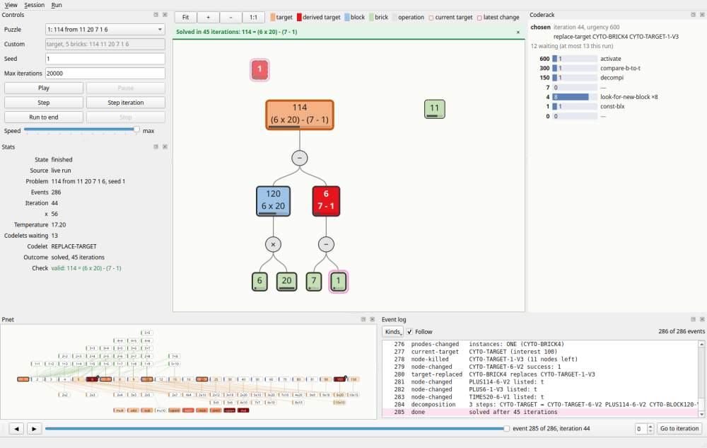
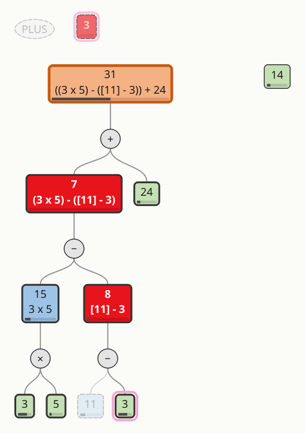

# Numbo (Defays, 1987) in Python

This directory holds a Python translation of Daniel Defays' Numbo. The SBCL
port in [`../lisp/src/`](../lisp/src/README.md) is the **oracle**: the translation was
written test-first against it, and it reproduces it run for run. With the
same seed, the Python and the SBCL port in oracle mode make the same codelet
choices, create and kill the same nodes, print the same text and write the
same JSON-lines event trace. That includes the 1987 flaws the port keeps:
the `kill-block` gap, the `reactivate-cyto` race, `(max)` = 0, and
truncating division.

The layout follows the Lisp: one module per Lisp file and one function per
Lisp function, with the same names (`look-for-new-block` is
`look_for_new_block`). Each docstring names its Lisp origin
(`codelets.lisp: look-for-new-block`), so the two can be read side by side.
Each place that reproduces a 1987 quirk has a `# 1987:` comment citing
`lisp/src/PORTING_NOTES.md`.

## Screenshots

The GUI (`python3 -m numbo.gui`) after puzzle 1 with seed 1 is solved,
114 = (6 × 20) − (7 − 1). The center shows the tree canvas. Controls and stats
are on the left, the coderack on the right, and the Pnet, event log and
timeline along the bottom:



The canvas at the end of puzzle 3 with seed 8, the `kill-block` gap run. Its
"Done :" goes through the block 11, which was killed earlier (dashed, faded,
under `8 = [11] - 3`), so the window's banner and the check say the solution
is invalid:



## Requirements

- **Python 3.12** (`python3`). The engine and the CLI use only the standard
  library.
- **PySide6 6.6 or later** (tested with 6.11) for the GUI only. It is an
  optional dependency: without it the engine, its models and the CLI work
  the same, `python3 -m numbo.gui` says what to install, and the GUI tests
  are skipped.
- **pytest 7.4** to run the tests, and **pytest-qt 4.5** for the GUI tests.
- **SBCL 2.6.0** to run the differential tests and to regenerate fixtures.
  Tests that need it are skipped when `sbcl` is not on `PATH`.

Nothing needs to be installed to run Numbo: run it from this directory, or
put this directory on `PYTHONPATH`. An install also works, and adds two
commands, `numbo` (the CLI) and `numbo-gui`:

```text
python3 -m pip install -e python                # the engine and the CLI
python3 -m pip install -e 'python[gui]'         # and the GUI (PySide6)
python3 -m pip install -e 'python[gui,test]'    # and pytest, pytest-qt
```

## Running a puzzle

Puzzle 1 of the chapter: reach 114 from the bricks 11 20 7 1 6. From
Software/Numbo/:

```sh
cd python
python3 -m numbo 114 11 20 7 1 6 --seed 1
```

The output ends with:

```
Done : Operation PLUS114-6-V2 has been applied
to CYTO-TARGET-6-V2 ( 6) and to CYTO-BLOCK120-V1 ( 120)
to get CYTO-TARGET
Operation PLUS6-1-V3 has been applied
to CYTO-BRICK3 ( 7) and to CYTO-BRICK4 ( 1)
to get CYTO-TARGET-6-V2
Operation TIMES20-6-V1 has been applied
to CYTO-BRICK5 ( 6) and to CYTO-BRICK2 ( 20)
to get CYTO-BLOCK120-V1
outcome: solved, 45 iterations (seed 1)
check: valid: 114 = (6 x 20) - (7 - 1)
```

Everything up to "to get CYTO-BLOCK120-V1" is what the 1987 `config` prints,
character for character as the SBCL port prints it in oracle mode. The last
two lines are the CLI's summary. The first gives the outcome and the number
of main-loop iterations. The second gives the solution checker's verdict.
Read 114 = (6 x 20) - (7 - 1) as the chapter's Fig. III-3: 20 x 6 - (7 - 1).

Options:

| Option | Meaning |
|---|---|
| `--seed N` | seed of the shared RNG (default 1). The same seed gives the same run, in Python and in the oracle. |
| `--max-iterations N` | stop after N main-loop iterations (default 20000), or `none` for no cap |
| `--quiet` | print only the two summary lines |
| `--verbose` | set `%verbose%`: print the "About to post codelet" lines, as in trace3.31 |
| `--trace FILE` | write the JSON-lines event trace (`lisp/src/oracle.lisp`'s format) to FILE |
| `--rng-events` | add every RNG draw to the trace |

The outcome is `solved` ("Done :" was printed), `gave-up` (the coderack was
empty after the last retry), `capped`, or `error` (a Lisp error, with its
message). The exit status is 0 when the run printed a valid solution and 1
otherwise.

"Done :" is not always a valid solution. Puzzle 3 with seed 8 runs into the
1987 `kill-block` gap: its decomposition goes through a block that was killed
earlier, and the checker says so:

```sh
cd python
python3 -m numbo 31 3 5 24 3 14 --seed 8 --quiet; echo "exit status $?"
```

```
outcome: solved, 225 iterations (seed 8)
check: invalid: CYTO-BLOCK11-V5 (11) is used but never derived, and is not a brick
exit status 1
```

### From Python

`numbo.harness.run_config` is the port of `lisp/src/harness.lisp`'s `run-config`.
`numbo.solution_checker.check_solution` is the port of
`lisp/src/solution-checker.lisp`:

```sh
cd python
python3 -c '
import io
from numbo import harness, solution_checker
out = io.StringIO()
problem = [6, 3, 3, 17, 11, 22]
print(harness.run_config(problem, seed=1, max_iterations=500, out=out))
print(solution_checker.check_solution(out.getvalue(), problem))
'
```

This prints:

```
{'outcome': 'solved', 'iterations': 30, 'seed': 1, 'problem-solved': 1, 'error': None}
(True, None, '6 = 3 + 3')
```

`run_config(problem, seed=1, max_iterations=500, verbose=False, trace=None,
rng_events=False, out=None, observers=())` makes each run in a fresh `World`,
the object that holds the 1987 globals. `trace` is a file name or a text
stream. `observers` get the run's typed events (see
[Architecture](#architecture)).

## The GUI

`python3 -m numbo.gui` (or `numbo-gui` once installed) opens a window where
you pick a puzzle and a seed, press Play, and watch the cytoplasm's
arithmetic trees being built, killed and rebuilt, one event at a time
(see [Screenshots](#screenshots)):

- **The canvas** (center) draws the cytoplasm as trees: the target with
  its derived targets, the blocks, and the free bricks. Each node shows its
  value and, under it, its expression. Colors follow the node's type, a
  thicker border means linked, the bar is the activation, a magenta halo
  marks what the latest event changed, and the orange border is the current
  target. Killed nodes fade out, dashed, in a band above. Wheel or +/− to
  zoom, drag to pan, F to fit. When the run ends, a banner gives the
  outcome and the solution check.
- **Controls and Stats** (left): one of the chapter's 11 puzzles or a
  custom target and 5 bricks, the seed, the iteration cap; Play, Pause,
  Step (one event), Step iteration, Run to end, Stop; the speed (a delay
  per event, from 1 s down to "max"). Stats shows the iteration, x, the
  temperature, the codelet chosen, the outcome and the check.
- **Coderack** (right): the urgency bins, the codelets waiting, and the
  codelet just chosen. **Pnet** (bottom): the 88 pnodes, shaded by
  activation, with a thick border on those that have cytoplasm instances.
- **Event log** (bottom): one row per event, filtered by kind. Double-click
  a row to go to that event. **The timeline** (bottom bar): a slider over
  the run's events, one event back and forward, and Go to iteration.
- **Session** menu: *Save* writes the run's events as a session file;
  *Open* replays a session file, or an oracle trace (`--trace`'s JSON
  lines), which is re-run and checked line by line as it is drawn. Every
  view follows the slider in a replay.

Every event is drawn: after each one, every view is redrawn before the run
goes on. Speed "max" means as fast as the window can draw (about 700 events
a second for the whole window). Keys (the Run menu): Space play/pause,
→ step, Shift+→ step an iteration, Esc stop, ← one event back. The window's
size, docks, inputs and speed are remembered between sessions (QSettings
`numbo`/`numbo-gui`).

Options: `--puzzle N` (1–11) or `--custom "T B B B B B"`, `--seed S`,
`--max-iterations N`, `--play` to start at once. `--smoke` runs the puzzle
to the end with every event drawn, offscreen (no display needed), and
prints the CLI's two summary lines. Its exit status is the CLI's: 0 for a
valid solution, 1 otherwise, 2 for a usage error. It reads and writes no
settings. From Software/Numbo/:

```sh
cd python
python3 -m numbo.gui --smoke --puzzle 1 --seed 1
```

```
outcome: solved, 45 iterations (seed 1)
check: valid: 114 = (6 x 20) - (7 - 1)
```

The same run in the CLI gives the same lines:

```sh
cd python
python3 -m numbo 114 11 20 7 1 6 --seed 1 --quiet
```

```
outcome: solved, 45 iterations (seed 1)
check: valid: 114 = (6 x 20) - (7 - 1)
```

`python/scripts/docs_screenshots.py` regenerates the two screenshots above,
offscreen.

## Tests

From Software/Numbo/:

```text
./run-tests.sh                 # everything: the Lisp tests, then pytest
python3 -m pytest python/tests -q    # the Python tests only (about 100 s)
```

The GUI tests (`python/tests/gui/`) use pytest-qt and draw offscreen
(`conftest.py` sets `QT_QPA_PLATFORM=offscreen` unless it is set already).
Without PySide6 or pytest-qt they are skipped.

The Python tests compare the Python with the oracle at every level:

| Test file | What it checks against the oracle |
|---|---|
| `test_rng.py`, `test_franz.py`, `test_franz_census.py` | the shared RNG, bit for bit; the Franz Lisp semantics (truncating `/`, `mod` = rem, `(max)` = 0, `sortcar`, print names), on 1090 oracle cases |
| `test_pnet_def.py`, `test_pnet_functions.py` | the 88 pnodes, field by field; spreading activation and the posts after 1, 2 and 10 cycles. Doubles must be equal, with no epsilon. |
| `test_coderack.py`, `test_cyto_def.py` | coderack picks and draws; the cytoplasm methods |
| `test_codelets_a.py`, `_b.py`, `_c.py` | each codelet on World states captured from real runs: the full state after the call, output, RNG draws and globals. All 53 `codelets.lisp` functions are covered. |
| `test_main_loop.py` | full event streams of 7 runs |
| `test_full_runs.py` | **11 puzzles × seeds 1–20, plus 2 error seeds.** Each run's event stream (with RNG draws), printed text, outcome and checker verdict must equal the oracle's, which is run in a fresh SBCL process. It also rebuilds `RESULTS.md`'s tables from the oracle's runs. |
| `test_solution_checker.py` | the checker on 126 oracle cases |
| `test_cli.py`, `test_readme.py` | the CLI's output and trace against the oracle's; every `sh` block of this README, run from a fresh shell |

The observers, models and GUI (loop0003) have their own tests. They check
the events against the World, and the models and views against the events,
after every event of real runs:

| Test file | What it checks |
|---|---|
| `test_observe.py` | the oracle trace written by an observer, byte for byte; observers change nothing; a cytoplasm rebuilt from the events equals the World after every event |
| `test_tree_model.py`, `test_tree_layout.py`, `test_pnet_coderack_models.py` | the models built from the events equal those built from the World, after every event of the 11 puzzles; layouts have no overlaps and move little |
| `test_session.py`, `test_event_log.py` | session files round-trip; replays drive the models as live runs do; SBCL oracle traces replay and verify |
| `test_run_controller.py`, `test_run_stats.py` | the worker thread's gate (pause, step, stop, no event before the last is acknowledged); results equal unobserved runs |
| `gui/test_*.py` | each view's items against its model after every event; every event painted before the next; save, reopen and scrub; window state and shortcuts |
| `test_packaging.py` | the `gui` extra and the console scripts; the engine, the CLI and the models with PySide6 hidden; the GUI tests skipped without it; an install into a fresh virtualenv |

## Fixtures

`python/fixtures/*.json` (18 MB, committed) are written by the capture
scripts `lisp/tests/oracle/*.lisp`, which load the SBCL port in oracle mode.
Regenerate them with:

```text
python/scripts/regen_fixtures.sh            # into python/fixtures/
python/scripts/regen_fixtures.sh /tmp/fx    # or anywhere else
```

`test_fixtures_current.py` regenerates them into temporary directories on
every test run. It checks that two regenerations are byte-identical, and that
they equal the committed files. A fixture that no longer matches the oracle
is an error, not something to update by hand.

Full traces are too big to commit. The full-run test makes them on the fly:
`lisp/tests/oracle/lib/full-run.lisp` runs one oracle run in a fresh SBCL process.
For a sweep by hand:

```text
python3 python/tests/full_runs.py --puzzles 1-11 --seeds 1-20   # Python vs. oracle
python3 python/scripts/chapter_runs.py --write                  # regenerate RESULTS.md
```

## How the translation was verified

It was built in 13 test-first steps (`iterations.md`; the log is
`PROGRESS.md`). Each step first captured the oracle's behaviour as fixtures
and wrote failing tests, then wrote the Python until they passed. Mutation
controls followed: deliberate bugs, such as Python `%` for `mod`, a local
variable for a 1987 global, or fixing the `kill-block` gap, must each make a
test fail.

- **Oracle mode** (`lisp/src/oracle.lisp`, opt-in) makes the SBCL port
  comparable. It reads the sources with double floats, replaces `random` with
  the shared splitmix64 RNG, makes `sortcar` copy before sorting, and writes
  the JSON-lines trace. Default mode is unchanged.
- **Trace equality is the criterion.** All 220 chapter runs (184 solved, 34
  gave up, 2 capped, up to 65706 events each) and the two error runs have
  equal event streams, printed texts and verdicts. The comparison is of
  parsed JSON, where 3 and 3.0 differ.
- **Results**: [`RESULTS.md`](RESULTS.md) has the 11 puzzles × 20 seeds and
  compares them with `lisp/src/RESULTS.md` (default mode, another RNG).

## Architecture

The engine does not know it is being watched. A run publishes **typed
events** through one `Subject`, and everything else subscribes to it as an
observer:

```text
  engine (numbo/*.py, the 1987 code, unchanged)
     │  hooks in events.py
     ▼
  Subject ── one per run; observers get each event in subscription order
     ├──▶ OracleTraceWriter   the --trace JSON lines (the oracle's subset)
     ├──▶ SessionRecorder     a session file (every event)
     ├──▶ any observer        e.g. TreeModel, PnetModel, CoderackModel
     └──▶ RunController gate  (worker thread) waits while paused, then
             │                deliver(Delivery) and wait for acknowledge(ticket)
             │ queued Qt signal
             ▼
          MainWindow (GUI thread): a GUI-side Subject
             ├──▶ EventLog      history   ─▶ LogView, TimelineBar
             ├──▶ RunStats                ─▶ StatsPanel, the outcome banner
             ├──▶ TreeModel + TreeLayout  ─▶ TreeView (the canvas)
             ├──▶ PnetModel               ─▶ PnetView
             └──▶ CoderackModel           ─▶ CoderackView
             then each view's redraw(now=False), paint_all(), acknowledge(ticket)
```

**Events.** `numbo/observe.py` holds the `Subject`, the `Observer` protocol
(one method, `on_event`) and 26 frozen event dataclasses holding plain data
only (strings, numbers, tuples), never engine objects. `numbo/events.py`
publishes them from the oracle's 10 hook points (`lisp/src/oracle.lisp`), plus a
few hooks where the oracle has no event: node changes and kills (through
`send`), target replacement, pnode changes, the Pnet's initialization and the
coderack's creation. The events are a superset of the oracle trace. The
oracle trace is just one observer, `trace.OracleTraceWriter`, which writes
exactly the old subset, byte for byte. Observers only watch: they draw no
random numbers, change no World state and print nothing. An observer that
raises is reported (on stderr by default) and the run goes on unchanged.
With no trace and no observers, the hooks call straight through. A run
watched by the GUI gives the same outcome, iterations, printed text and
trace as the same run unwatched (tested).

**Models and views.** The models in `numbo/models/` are Qt-free and tested
with plain pytest. Each model can be built from a `World` (`from_world`) or
kept up to date from the events, and the tests check that the two agree
after every event of real runs. The views in `numbo/gui/` are thin PySide6
layers over them: a view's `on_event` updates its model only, and its
`redraw()` brings its items in line with the model. Nothing in the engine
or the models imports Qt.

**Threading and the redraw handshake.** `RunController` runs Numbo (a live
run, a session file, an oracle trace or a list of events) on a worker
thread. Its gate is the last observer of the run's Subject. For each event
the gate:

1. waits while the run is paused (Step lets one event through, Step
   iteration lets events through up to the next iteration);
2. calls `deliver`, which only emits a signal connected **queued**, so the
   event crosses to the GUI thread;
3. blocks until the GUI thread calls `acknowledge(ticket)`;
4. waits the speed's delay (none at "max").

On the GUI thread, `MainWindow` publishes the event to the GUI-side Subject
of models and views, calls every view's `redraw(now=False)`, which marks it
dirty, and then `paint.paint_all()`, which paints the whole window once.
Only then does it acknowledge the event. So every event is drawn before the
next is published, and no event is skipped or coalesced. The models live on
the GUI thread, never on the worker. `stop()` wakes the worker from any of
its waits, and the gate raises `RunStopped` (a `BaseException`, which the
engine doesn't catch), so the run unwinds through its `finally` clauses.
Closing the window stops and joins the worker, and each run's signals carry
a generation number so that a stopped run's queued events never reach the
next run's views.

**Replay.** Replays use the same path as live runs. A session file's events
are published through the gate. An oracle trace is re-run from its `start`
line's problem and seed (runs are deterministic), and each line its own
`OracleTraceWriter` writes is compared with the trace's next line. The
window keeps every event it drew (`EventLog`). Scrubbing re-feeds the
models from there and draws once. The canvas's layout depends on the one
before it (so that trees don't jump), so `LayoutHistory` keeps a layout
every 64 events. A scrub then shows exactly what the live run showed.

## Layout

| Module | Port of |
|---|---|
| `numbo/franz.py` | `lisp/src/franz-compat.lisp`: the Franz Lisp built-ins (symbols, print names, division, `sortcar`, ...) |
| `numbo/flavors.py` | `send` from `lisp/src/flavors-compat.lisp` |
| `numbo/rng.py` | the shared RNG of `lisp/src/oracle.lisp` |
| `numbo/world.py` | the 1987 globals (`lisp/src/globals.lisp`), as a `World` object; symbol values and plists |
| `numbo/pnet_def.py`, `numbo/pnet_functions.py` | `pnet-def.lisp` (generated from it by `scripts/gen_pnet_def.py`), `pnet-functions.lisp` |
| `numbo/cyto_def.py`, `numbo/codelets.py` | `cyto-def.lisp`, `codelets.lisp` |
| `numbo/coderack.py` | `coderack.lisp` (RECONSTRUCTED in the port) |
| `numbo/init.py`, `numbo/start.py` | `init.lisp`, `start.lisp` (`init-chiffre`, `config`) |
| `numbo/harness.py` | `harness.lisp` (`run-config`, the iteration cap) |
| `numbo/observe.py` | no Lisp counterpart: the `Subject`, the `Observer` protocol and the typed events of a run |
| `numbo/events.py` | the trace hooks of `oracle.lisp`, publishing the typed events (plus node changes, kills, target replacement, pnode changes, Pnet initialization and the coderack's creation) |
| `numbo/trace.py` | the JSON-lines trace of `oracle.lisp`, as an observer of the events |
| `numbo/session.py` | no Lisp counterpart: session files (every typed event, versioned JSON lines), their recorder and reader, replay to observers, and the replay of an oracle trace by a re-run checked against it line by line |
| `numbo/models/tree_model.py` | no Lisp counterpart: the cytoplasm as arithmetic trees (target, blocks, free bricks, ghosts) and their expressions, from the World or from the events |
| `numbo/models/tree_layout.py` | no Lisp counterpart: a tidy (Reingold–Tilford) layout of that forest, sized by a measure function, stable from one event to the next |
| `numbo/models/pnet_model.py` | no Lisp counterpart: the Pnet's 88 nodes, typed links and a cached grid layout, with activations and instances from the World or from the events |
| `numbo/models/coderack_model.py` | no Lisp counterpart: the coderack's urgency bins and waiting codelets, and the codelet just chosen, from the World or from the events |
| `numbo/models/run_controller.py` | no Lisp counterpart: a live run, a session replay, an oracle trace replay or a list of events from any index on a worker thread, each event gated (pause, step, step to the next iteration, run to the end, a per-event delay, stop, restart) and acknowledged by its consumer before the next is published |
| `numbo/models/run_stats.py` | no Lisp counterpart: the GUI's inputs (the chapter's 11 puzzles, parsers for a custom problem, seed and cap) and its stats (iteration, x, temperature, outcome and the solution check) from the events, a replay's solution check, rebuilt from its end event (it has no printed text), and the run's verdict for the canvas's banner (naming the reactivate-cyto race and the kill-block gap when a run hits them) |
| `numbo/models/event_log.py` | no Lisp counterpart: the event log's model and the run's history (every event, counts by kind, where each iteration starts, the rows shown by a kind filter), and each event in one line of text |
| `numbo/models/layout_history.py` | no Lisp counterpart: the tree canvas's layout at any event, as the live run drew it (snapshots every 64 events, and walks from the nearest one), so that scrubbing shows what the live run showed |
| `numbo/gui/` | no Lisp counterpart: the PySide6 GUI, `python3 -m numbo.gui` (optional; nothing else imports it). `main_window.py` (dockable panes, the worker's events crossing to the GUI thread through queued signals, each acknowledged after the views have drawn it; the Run menu's shortcuts, Space play/pause and the arrows to step; the window's size, docks and inputs remembered with QSettings), `paint.py` (every view marks itself dirty, then the window is painted once an event), `controls.py`, `stats_view.py`, `tree_view.py` (the AST canvas, the central view: the tree model's forest laid out and redrawn after every event, styled by type, status, activation and the latest change; zoom, pan, fit; the outcome banner), `pnet_view.py` (the 88 pnodes on the Pnet model's grid, shaded by activation, pnodes with cyto-node instances marked, the latest pnode change highlighted), `coderack_view.py` (the urgency bins: counts, the codelets waiting, the codelet just chosen), `log_view.py` (the event log: a row per event, filterable by kind, painting only the rows in view and scrolling by blitting; double-click a row to go there), `timeline.py` (the slider, one event back and forward, go to an iteration), Session > Open (a session file, or an oracle trace re-run and verified as it is drawn) and Save, `render.py` (a scene to PNG), `app.py` (arguments, and `--smoke`: run offscreen to the end and print the CLI's summary lines; `run()` is the `numbo-gui` entry point) |
| `numbo/solution_checker.py` | `solution-checker.lisp` |
| `numbo/__main__.py` | the CLI (no Lisp counterpart; the `numbo` entry point) |
| `docs/` | the README's screenshots, made by `scripts/docs_screenshots.py` |

## Known limitations

- **Oracle mode only.** The Python has no default mode. SBCL's own
  `random` (MT19937 with SBCL's seeding) is not reproduced, so the Python
  cannot replay `lisp/src/README.md`'s default-mode runs, such as puzzle 3 with
  seed 18 in 1328 iterations. Its runs are the oracle-mode ones.
- **The 1987 flaws are kept.** The `kill-block` gap can print an invalid
  "Done :" (2 of the 220 chapter runs; the checker flags them). The
  `reactivate-cyto` race can end a run with an error at iteration 29: in
  oracle mode, puzzle 1 seeds 40 and 323, and 2 more of seeds 21–400.
- **Error messages.** The two errors real runs reach have SBCL's texts:
  "SEND: NIL does not handle the message ..." and "The variable X is
  unbound.". Other Lisp errors, which no chapter run reaches, carry Python's
  messages.
- **No graphics.** `WINDOW_GFX` must be unset or empty. With it set, the
  graphics calls raise `GraphicsNotPorted`.
- **Fresh state per run.** Each run gets a fresh `World`, as each oracle run
  gets a fresh SBCL process. Several `config` calls in one SBCL image can
  see state left by earlier ones (see `RESULTS.md`). The Python does not
  model that.
- **Speed.** About 20000 iterations per second; the 220 chapter runs take a
  few seconds on a multi-core machine.
