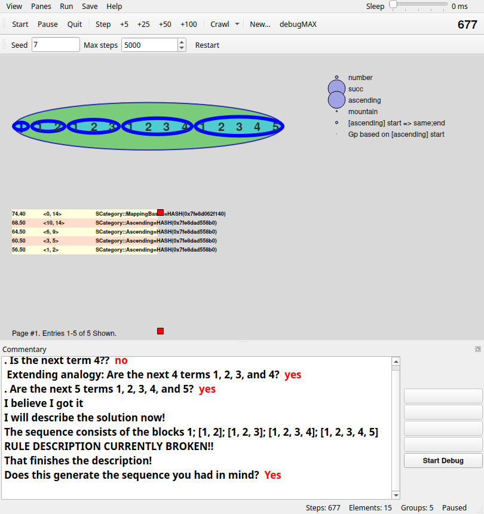

# Seqsee, in Python

A Python 3 port of **Seqsee**, Abhijit Mahabal's model of how people perceive and extend
integer sequences (Mahabal & Hofstadter; see the dissertation in [`/Literature`](/Literature)).
It translates the Perl original, module by module, and adds a Qt (PySide6) GUI that redraws
the original Perl/Tk GUI's views.

**The original:** [github.com/amahabal/Seqsee](https://github.com/amahabal/Seqsee) (Perl,
by Abhijit Mahabal). This folder doesn't include the Perl code.



*The Python port's Qt GUI on `1 1 2 1 2 3` with seed 7, after 677 steps. It has asked about
the next terms, been told yes, and seen the sequence as the blocks 1, 1 2, 1 2 3, 1 2 3 4 and
1 2 3 4 5. The [original Perl/Tk GUI](screenshots/seqsee-perl-tk.png) on the same sequence
is shown for comparison.*

## In this folder

| | What |
|---|---|
| [`python/`](python/README.md) | the port: the model (`src/seqsee/`), the Qt GUI (`src/seqsee/gui/`), the tests, and the Perl oracle scripts that produced the tests' golden data |
| [`config/`](config/) | Mahabal's configuration files from the Perl Seqsee, unchanged. The port reads them at run time: the start codelets, `seqsee.conf`, the GUI layouts and the sequence menu. |
| [`screenshots/`](screenshots/) | the Perl/Tk original and the Qt port, each at the moment it describes its solution |
| [`LICENSE`](LICENSE) | the Artistic License 2.0, the original Seqsee's license, which the port also uses |

## How faithful it is

The port was translated test-first, against the running Perl program:

- **Module by module.** For each Perl module, an oracle script (`python/oracle/*.pl`, 69 of them)
  ran the original Perl and recorded what it does as golden JSON (`python/tests/golden/`).
  The Python tests check the port against that data. Perl quirks and bugs are ported as they
  are, marked `PERL-QUIRK` in the code. `python/PORTING_MAP.md` maps every Perl module to its
  Python counterpart. There are 6531 tests.
- **Randomness.** Perl's `rand()` (drand48) is reproduced exactly, so seeded Perl code can be
  matched draw for draw.
- **Whole runs.** Unlike the Metacat and Numbo ports, a Python run does *not* repeat a Perl run
  step for step. Seqsee's choices also depend on Perl's hash order and object addresses. So
  whole runs are compared statistically, over the 13 sequences of Mahabal's test list with 40
  seeds each. The port solves the same sequences about as often as Perl does, in a similar
  number of steps. For example, `1 1 2 1 2 3 …` is solved 40/40 by both, and
  `1 2 3 17 4 5 6 17 …` 38/40 by Python and 35/40 by Perl.
- **The GUI.** Each view (Workspace, Attention, Slipnet, Coderack, Stream, Relations, the
  lists, and the 11 combined views) is checked against the shapes, positions, colours and text
  that the original Perl/Tk GUI draws for the same model state.

Two things that look like bugs come from the original. The Groups list prints categories as
`SCategory::Ascending=HASH(0x…)`. The solution description says "RULE DESCRIPTION CURRENTLY
BROKEN!!", because Mahabal switched the rule description off in 2010.

## Running it

From `python/` (Python 3.12; the GUI needs `pip install PySide6`):

```sh
PYTHONPATH=src python3 -m seqsee --gui --seq "1 1 2 1 2 3" --seed 7     # the Qt GUI
PYTHONPATH=src python3 -m seqsee.gui                                     # GUI, asks for a sequence
PYTHONPATH=src python3 -m seqsee --seq "1 1 2 1 2 3" --seed 7 --answer ask   # headless, asks y/n on the terminal
python3 -m pytest                                                        # the tests
```

[`python/README.md`](python/README.md) covers the options, the GUI's controls and the code.

Six audit tests compare against the Perl source (`../lib`) and are skipped here. The golden
data can only be regenerated with the original Perl program. Clone
[amahabal/Seqsee](https://github.com/amahabal/Seqsee), put `python/` inside it next to `lib/`
and `config/`, and install its CPAN dependencies. `python/README.md` explains the rest.
