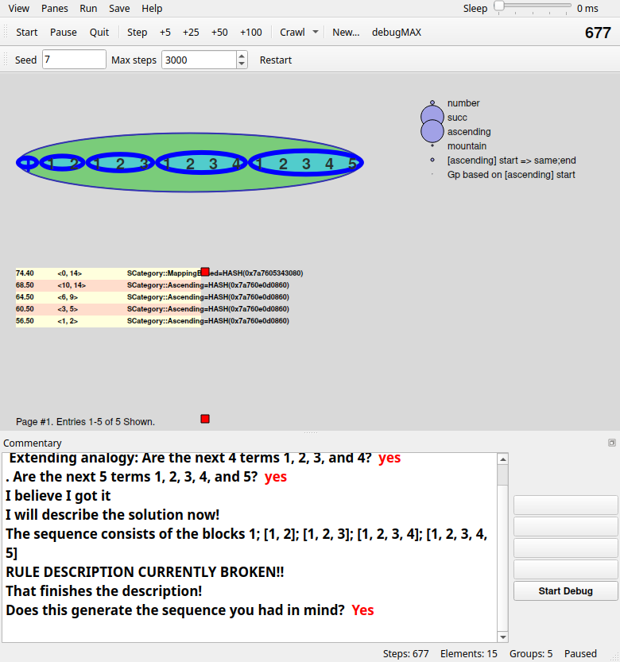
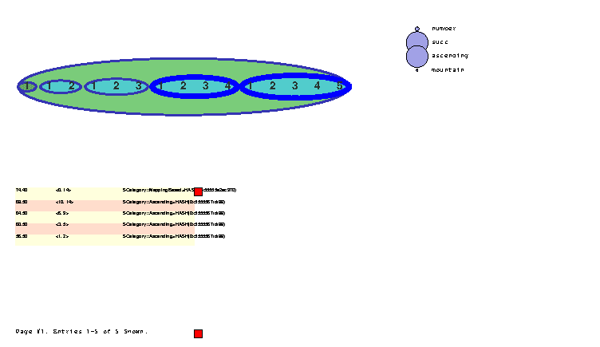
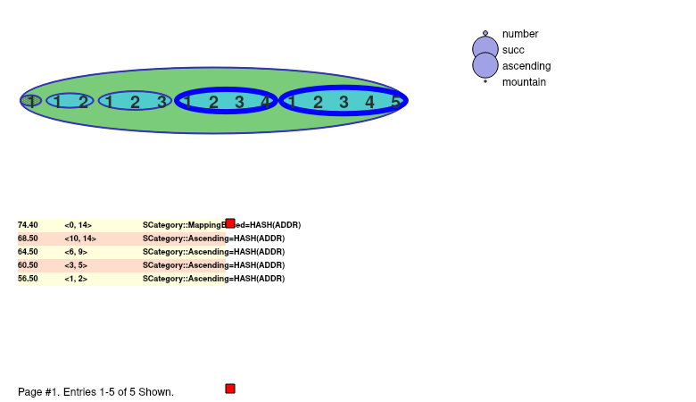
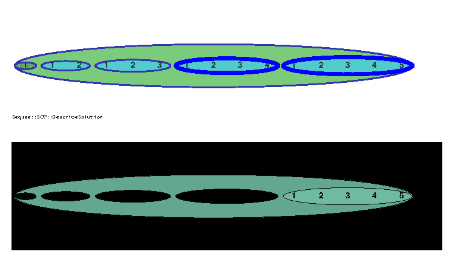
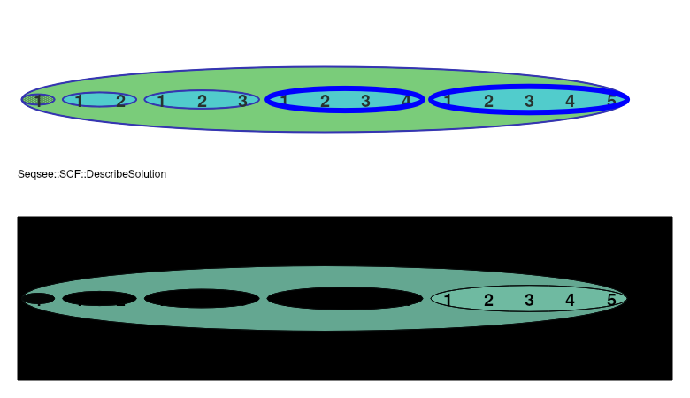
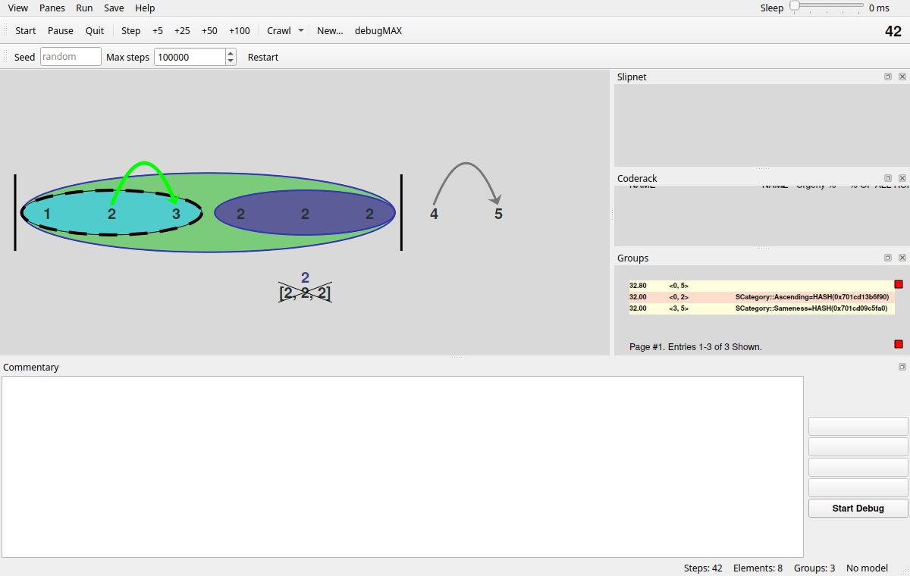

# Seqsee — Python port

A headless, test-driven Python port of Seqsee, Abhijit Mahabal's integer-sequence extrapolation
program. The Perl original is in `../lib/` (entry point `../Seqsee.pl`). This is a faithful port, not a
redesign: where the Perl behaves oddly, the port does the same and marks the spot with a
`# PERL-QUIRK:` comment. `PORTING_MAP.md` maps every Perl module to its Python module, its tests, and
its status. The Tk GUI (`SGUI*`, `Tk/*`, `Themes/*`, `SColor.pm`, `UI/Graphical.pm`) is ported
to an optional Qt (PySide6) GUI in `seqsee/gui/` (see [GUI](#gui)).

Requires Python ≥ 3.12. The headless runtime uses only the standard library; the GUI needs
PySide6 (`pip install -e .[gui]`). Tests need `pytest`, `hypothesis` and, for the GUI tests,
`pytest-qt` (without PySide6 the GUI tests are skipped).

## Running Seqsee

From this directory (`python/`), either install the package (`pip install -e .`) or set `PYTHONPATH=src`:

```sh
PYTHONPATH=src python3 -m seqsee --seq "1 1 2 1 2 3 1 2 3 4" --seed 3 --max-steps 3000 \
    --continuation "1 2 3 4 5"
```
```
Sequence: 1 1 2 1 2 3 1 2 3 4
Extension found: 1 2 3 4 5
Status: accepted (solution accepted) after 520 steps, seed 3
  asked: Extending analogy: Is the next term 5??
  asked: . Are the next 5 terms 1, 2, 3, 4, and 5?
```

Options (see `src/seqsee/cli.py`):

- `--seq "…"` (required): the sequence, space-separated.
- `--seed N`: seeds the central RNG (`seqsee.util`, a port of Perl's drand48). Runs are
  reproducible for a given seed. Perl and Python trajectories still differ, because of hash order.
- `--max-steps N` (or `--max_steps`): the codelet-step budget.
- How Seqsee's questions get answered:
  - `--continuation "…"`: the true next terms. A question is answered yes iff it proposes exactly
    these terms. Asking beyond them ends the run with status `out_of_terms`.
  - `--answer yes|no|ask`: used when there is no continuation. The default is `yes`; `ask` reads
    y/n from stdin.
- `--json`: print one JSON object (status, steps, elements, extension, questions asked) instead
  of the text report.
- Seqsee.pm options such as `--update_interval` and feature flags (`-f LTM`) pass through as in
  Perl. Defaults come from `../config/seqsee.conf`.

Exit status: 0 for a finished run, 1 if Seqsee died (status `error`), 2 for a usage error.

## GUI

A Qt (PySide6) port of the Perl/Tk display. The drawings (Workspace, Attention, Slipnet,
Coderack, Stream, Relations, and the Groups/Categories/Rules/Stream lists) have the same
shapes, positions, colours and text as Perl's for the same model state; they are checked
against canvas dumps of the real Perl/Tk GUI. Around them is a modern Qt window: menus,
toolbars, dockable panes, a sleep slider, PNG/SVG export and a remembered layout.

```sh
PYTHONPATH=src python3 -m seqsee --gui --seq "1 1 2 1 2 3" --seed 7
PYTHONPATH=src python3 -m seqsee.gui            # no --seq: a window asks for the sequence
```

It takes Seqsee.pl's command line: `--seq "…"`, `--seed N`, `--max-steps N` (`--max_steps`, `-n`),
`--update-interval N` (steps between redraws), `--view N` (the first view, 0–10),
`--gui_config NAME` (default `GUI_sparse`, the only window layout in `../config/`) and
`-f FEATURE`. The headless options `--continuation`, `--answer` and `--json` are refused.
Without PySide6, the command prints how to install it and exits with status 1. As in Perl,
nothing runs until you press Start or a key.



### Controls

The keys are GUI_sparse.conf's bindings. They are also in the **Run** menu and on the toolbar:

| Key | Action |
|---|---|
| `s` | one step |
| `h` `j` `k` `l` | 5, 25, 50, 100 steps |
| `d` `f` `g` | crawl: sleep 30, 300 or 700 ms between steps, redraw after every step, until max steps or a pause |
| `c` | continue (Start) until max steps, a question that stops the run, or a pause |
| `p` | pause (`$Global::Break_Loop`); the run stops after the current step |
| `x` | new sequence (the sequence window, with `config/sequence.list` as a menu) |
| `m` | toggle debugMAX |
| `q` | quit |

- **View**: the 11 composite views of `Tk/Seqsee.pm` (`--view N` picks one at start):
  0. Workspace + Groups + Relations + Slipnet
  1. Workspace
  2. Workspace + Attention
  3. Workspace + Slipnet
  4. Workspace + Categories
  5. Workspace + Coderack
  6. Workspace + Rules
  7. Workspace + Relations
  8. Workspace + Groups
  9. Workspace + Stream
  10. Workspace + Stream2

  As in Perl, Workspace + Rules dies on most states. The error shows in the status bar and
  the last good picture stays.
- **Panes**: each drawing module (Workspace, Attention, Slipnet, Coderack, Stream, Relations,
  Groups, Categories, Rules, Stream list) as a dock of its own, and the Commentary.
- **Run**: the key bindings above, and Restart (a fresh run of the last sequence with the
  Seed and Max steps fields of the second toolbar row; an empty seed means a random one).
- **Save**: the canvas as PNG or SVG (Perl saved EPS).
- **Help**: About.
- **Sleep** (top right): `$Global::InterstepSleep`, 0–40 ms between steps.
- The step count is at the right of the toolbar; the status bar shows steps, elements, groups
  and the run state.
- The **Commentary** (below the canvas) logs Seqsee's messages. Its questions ("Is the next
  term 4?") are answered with the four buttons on its right or the keys 1–4. Start Debug
  toggles debugMAX. When Seqsee asks for more terms, a small window takes them.
- In the lists, a click on a red square turns the page and a click on a row opens its actions
  popup (it also pauses the run). Hovering over a workspace object shows what it is.
- On close, the window stores its geometry, toolbars, docks, view and fields (QSettings)
  and restores them next time. The command line wins over the stored settings.

The model runs on a worker thread. The window draws immutable snapshots, so it stays
responsive while Seqsee runs, and an exception in the model is shown in the window without
closing it.

### Screenshots

Perl/Tk (left) and Qt (right), drawing the same deterministic state (view 0, the `solution`
recipe of `tests/gui_recipes.py`). The PostScript export of Perl uses a small fallback font,
so its text looks smaller:

| Perl/Tk | Qt |
|---|---|
|  |  |
|  |  |

The window with the Slipnet, Coderack and Groups panes docked:



`docs/gui/screens/` (Qt) and `docs/gui/perl/` (Perl/Tk) have one screenshot per drawing test
state. The GUI tests (`tests/test_gui_*.py`) run headless (`QT_QPA_PLATFORM=offscreen`, set by
`tests/conftest.py`) with pytest-qt. The drawing oracles are `oracle/gui_<name>.pl`, run on a
private Xvfb display by `oracle/run_perl_gui.sh`; `python3 oracle/regen.py gui_<name>`
regenerates their golden files.

Code layout: `seqsee/gui/snapshot.py` (the snapshot), `seqsee/gui/draw/` (pure Python, no Qt:
each Perl drawing module as a function from a snapshot and a rectangle to Tk-like draw ops),
`seqsee/gui/runner.py` (the worker thread, the questions), `seqsee/gui/qt/` (the renderer, the
widgets and the main window), `seqsee/gui/app.py` (the command line). The core `seqsee`
package never imports `seqsee.gui`.

## Using it from Python

```python
from seqsee import s, util
from seqsee.testing import harness

s.reset_all()          # fresh global state (workspace, coderack, LTM, …)
s.load()               # load categories, codelet families, thoughts
harness.load()
util.srand(42)
result = harness.run_seqsee([1, 1, 2, 2, 3, 3], [4, 4, 5, 5], 10000, 3, 3)
print(result.get_status().get_status_string(), result.get_steps())   # Successful 191
```

The run prints Seqsee's own progress lines ("Initializing SLTM…").

`harness.run_seqsee(seq, continuation, max_steps, max_false, min_extension)` is the port of
Test::Seqsee's RunSeqsee. It returns a `ResultOfTestRun` (`seqsee/objects/result_of_test_run.py`).
`seqsee.testing.e2e` runs whole grids of sequences × seeds in separate processes and compares them with
the Perl baseline:

```sh
PYTHONPATH=src python3 -c "from seqsee.testing import e2e; e2e.main(['--seeds', '10'])"
```

## Tests

```sh
python3 -m pytest                 # full suite (~2 min; includes the end-to-end grid)
python3 -m pytest -m "not slow"   # skip the end-to-end statistical tests
```

- Most test modules compare the port against **golden data recorded from the real Perl**. Oracle
  scripts are in `oracle/<name>.pl` and the golden files in `tests/golden/<name>.json`. Never edit
  the golden files by hand. Regenerate them with `python3 oracle/regen.py <name>`; this needs Perl
  and the CPAN deps, run through `oracle/run_perl.sh`.
- Seeded randomness matches Perl draw for draw where no hash-iteration order is involved.
  Whole runs are compared statistically: success counts and step medians per sequence
  (`tests/test_e2e_parity.py`, golden `e2e_baseline`).
- `tests/test_porting_audit.py` checks that every `lib/*.pm` has a `PORTING_MAP.md` row marked
  done/skipped and that no `NotImplementedError("TODO…")` stubs remain.

## Layout

| Path | Contents |
|---|---|
| `src/seqsee/` | the port. Module names mirror the Perl hierarchy in snake_case (`SCategory::Ascending` → `categories/ascending.py`, `Seqsee::SCF_MX::General` → `codelets/general.py`) |
| `src/seqsee/cli.py`, `__main__.py` | headless Seqsee.pl |
| `src/seqsee/seqsee_main.py` | Seqsee.pm: main loop, config, command line |
| `src/seqsee/testing/` | Test::Seqsee (`harness.py`), Test::Stochastic, e2e runner |
| `src/seqsee/gui/` | the Qt GUI (SGUI*, Tk/*, Themes/Std2.pm, SColor.pm, UI/Graphical.pm); see [GUI](#gui) |
| `docs/gui/` | GUI screenshots: `screens/` (Qt), `perl/` (Perl/Tk) |
| `tests/` | pytest suite. Each module's docstring names the Perl file(s) it mirrors |
| `oracle/` | Perl oracle scripts, `run_perl.sh`, `regen.py`, `e2e_compare.py` |
| `PORTING_MAP.md` | Perl module → Python module, tests, status, PERL-QUIRKs |

Global Perl state (`$Global::…`, the workspace, coderack, stream, LTM) is held in module-level
singletons with `reset()` functions. `s.reset_all()` resets all of them, and `tests/conftest.py`
does it before each test. The main loop runs in a deep-stack worker thread
(`util.call_with_deep_stack`), because some FindMapping recursions go thousands of levels deep.
