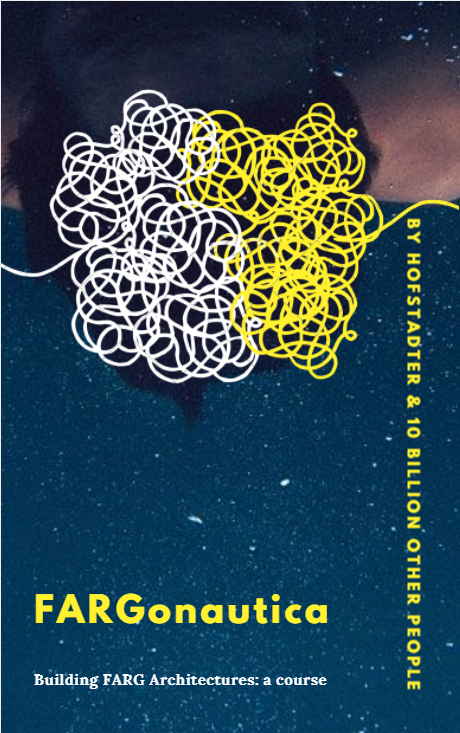

# REPOSITORY VERSION

As of right now, this repo is considered, in open-source fashion, to be in version 0.1.0.

# REPOSITORY GOALS
---

**Goals for version 1.0.0**:
- Each project should contain:
    - **Source code** of all major projects, complete and running
    - **Literature** of all major projects, complete with links to books
    - **Exercises** for undergraduate courses
    - **Programming challenges** large or small
    - **Research challenges** for graduate students (each challenge being able to lead to a publication, in principle)

So here is a table of what version 1 could be:

| Project | Sourcecode | Literature | Exercises | Programming challenges | Research challenges |
|---------| --------- | ----------| ----------|  ----------| ----------|
| Seek-Whence & SeqSee | Yes | Yes | 15 | 3 | 2 |
| Numbo | Yes | Yes | 5 | 1 | 1 |
| Copycat & Metacat | Yes | Yes | 35 | 8 | 5 |
| Tabletop | Yes | Yes | 17 | 3 | 1 |
| Letter Spirit | Yes | Yes | 15 | 10 | 2 |
| Phaeaco | Yes | Yes | 15 | 10 | 3 |
| Musicat | Yes | Yes | 15 | 5 | 9 |
| Capyblanca | Yes | Yes | 15 | 4 | 4 |
| George | Yes | Yes | 25 | 3 | 8 |

Do you see how cool this could be?  Not only a library but also a course and a set of research questions... don't you wish your teachers, say, at kindergarten, had something like this?  And [here's where we are!](repo-version.md)

Long ways to go to get there, hah?  Please help; if you would like to contribute please see [how you can contribute to this repository](how-to-contribute.md). You do **not** necessarily have to be someone who has earned the Ph.D. working with Hofstadter:  Hofstadter
gracefully conceded the honorable title of "Associate FARGonaut" to me (Linhares), of which I am truly proud.  If you have ideas for
exercises, research questions, programming challenges, or something else altogether... please get in touch!  

Because when we get there, here's what we can do:

That's right: we can do a full-blown book/free e-book with *a course on the computer science of building FARG architectures*.  But two things:  First, this book would be the subject of *another* repository; and second, Don't worry about the details now... Whether or not Hofstadter will join... whether or not it will be published anywhere fancy: if you're like me and you feel that this is something that should exist, join us and let's make it happen!  

#0.1.0
---
Here is how this repository stands:

- What we yearn for has reached the outer limits of the googleverse.  We have collected the projects that are available across the web (i.e., anyone is able to get this material by googling for it). Our yearnings now take us to the email spamming phase of authors of other projects.

- version 0.0.9 (coming up shortly)
     - This version will include the key references of the Copycat project:  anyone that reads those articles should have a great understanding of what the project is about, what are easy and hard problems, how the architecture is mostly organized and why perception and analogy are inseparable.
- version 0.1.0 (coming up soon)
     - This version will include exercises to be conducted on an undergraduate course, and challenges for graduates students that, if completed sucessfully, could lead to copycat-related original results worthy of publication in AI / cognitive science journals.

| Project | Sourcecode | Literature | Exercises | Programming challenges | Research challenges |
|---------| --------- | ----------| ----------|  ----------| ----------|
| Seek-Whence & SeqSee | Yes (SeqSee) | Yes | 0 | 0 | 0 |
| Numbo | Yes (Coming soon) | Yes | 0 | 0 | 0 |
| Copycat & Metacat | Yes | Yes | **6** | **3** | **2** |
| Tabletop | No | Yes | 0 | 0 | 0 |
| Letter Spirit | No | Yes | 0 | 0 | 0 |
| Phaeaco | No | Yes | 0 | 0 | 0 |
| Musicat | Yes | Yes | 0 | 0 | 0 |
| Capyblanca | Yes | Yes | **8** | **2** | **1** |
| George | No | Partially | 0 | 0 | 0 |

#0.0.8
---
Here is how this repository stands:

- What we yearn for has reached the outer limits of the googleverse.  We have collected the projects that are available across the web (i.e., anyone is able to get this material by googling for it). Our yearnings now take us to the email spamming phase of authors of other projects.

- version 0.0.9 (coming up shortly)
     - This version will include the key references of the Copycat project:  anyone that reads those articles should have a great understanding of what the project is about, what are easy and hard problems, how the architecture is mostly organized and why perception and analogy are inseparable.
- version 0.1.0 (coming up soon)
     - This version will include exercises to be conducted on an undergraduate course, and challenges for graduates students that, if completed sucessfully, could lead to copycat-related original results worthy of publication in AI / cognitive science journals.

| Project | Sourcecode | Literature | Exercises | Programming challenges | Research challenges |
|---------| --------- | ----------| ----------|  ----------| ----------|
| Seek-Whence & SeqSee | Yes (SeqSee) | Yes | 0 | 0 | 0 |
| Numbo | Yes (Coming soon) | Yes | 0 | 0 | 0 |
| Copycat & Metacat | Yes | Yes | 0 | 0 | 0 |
| Tabletop | No | Yes | 0 | 0 | 0 |
| Letter Spirit | No | Yes | 0 | 0 | 0 |
| Phaeaco | No | Yes | 0 | 0 | 0 |
| Musicat | Yes | Yes | 0 | 0 | 0 |
| Capyblanca | Yes | Yes | 0 | 0 | 0 |
| George | No | Partially | 0 | 0 | 0 |
    
